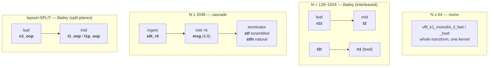

# The Codelet Set — what actually runs

*Working reference, gitignored. State as of 2026-08-06, after the zil/hybrid
deletions. Everything below is verified against the dispatch in `src/core`,
not inferred from filenames.*

**The one rule:** the directory `codelets/zil/` is a *historical name*, not an
emitter. Nothing in it is zil-emitted any more. `pure_il/` is **cil**
(`codelet_cil.ml`), `boundary_split/` is **zsplit** (`codelet_zsplit.ml`).
Only the provenance header at the top of a `.c` tells you the emitter.

---

## The live set, in one view

Four engines, no overlap. Order changes exactly one kernel (the cascade
terminator). Placement changes none.

---

## A · Cascade — `boundary_split/`, N ≥ 2048

Always **ingest → mid × (chain−2) → terminator**. Backward runs the same
kinds' `_bwd` twins in reverse (terminator first, ingest last).

| slot | codelet | radices | dirs | status |
|---|---|---|---|---|
| ingest | **`s0t_r4`** | 4 | fwd + bwd | ✅ production |
| mid | **`msg`** | 4, 8 | fwd + bwd | ✅ production |
| terminator — scrambled | **`stf_r4`** | 4, 8 | fwd + bwd | ✅ production |
| terminator — natural | **`stfn_r4`** | 4, 8 | fwd + bwd | ✅ production |
| terminator — unroll twin | `stf2_r4` | **8 only** | fwd | ⚠️ **unreachable** |
| store-sink variant | `stf_r4sk_bwd` | 4 | bwd | ✅ |

⚠️ `stf2` cannot fire today: every banked chain ends in radix 4, and no r4
twin exists (the emitter refuses one — the +vw instance-B offset equals a
section-record group only when `r0 == vw`). The `t2q` race that selects
between `stf` and `stf2` therefore cannot change the outcome on any current
cell. Same for `sterm2` on the legacy route.

**Legacy route** — reachable only via `VFFT_NO_ZTURN` or
`VFFT_FORCE_ZROUTE=legacy`, and as the degrade path if zturn create fails:

| slot | codelet | radices |
|---|---|---|
| ingest | `s0s` | 4, 8 (fwd + bwd) |
| mid | `msg` — **the same kernel as production**, only the table repacks | 4, 8 |
| terminator | `sterm` / `sterm2` | 8 only |

**DIT probes** — present, gated, but reachable *only* from
`build_tuned/benches/`, never from `vfft.c`: `dts_r4`, `dtsn_r4`, `dtso_r4`,
`dtt_r4`, `msd`. (DIT was refuted: D/N = 1.05–1.18 across three runs.)

---

## B · Bailey, interleaved — `pure_il/`, N = 128–1024

| slot | forward | backward |
|---|---|---|
| leaf | **`n1t`** — corner-turn fused into the stores | **`t2t`** — post-twiddle + bwd butterfly + turned store |
| mid | **`t2`** — streamed VTW2, BYTW2 apply | **`n1`** — flat, untwiddled |
| 3-stage chain, backward middle | — | **`t2tg`** — turned store with `OGs` as leg stride |

Radices 3…64 (40 files each for `n1t` and `t2`). Backward is **not**
conjugated twins — they are separate kernels.

---

## C · Bailey, split planes — `codelets/oop/`, `layout=SPLIT` + classic OOP

| slot | codelet |
|---|---|
| leaf | `n1_oop` · `n1_oop_ugul` (UnitGroup load / UnitLane store) |
| mid | `t1_oop` (per-**group** twiddles, arbitrary-K correct) · `t1p_oop` (per-**block** broadcast, requires `K % GROUPW == 0`) · `t1_oop_ul` · `t1_oop_ul_twl` · `t1_dif_oop` · `_log3` and `_spec1024/4096` bakes |

---

## D · Mono — whole-N, no stages

| codelet | note |
|---|---|
| `vfft_k1_mono64_il_fwd` / `_il_bwd` | **the only interleaved mono** — which is exactly why the IL band boundary sits at 64 |
| `vfft_k1_mono64`, `mono128_{16x8,8x16}`, `mono256_16x16` | split-plane only; the pair is part of the symbol identity |

---

## E · Substitutes — alternatives for a slot, chosen per cell

Not extra stages: they replace the default kernel in an existing slot. The
verdict is banked in kind-3 wisdom as `il_kv` (mid | leaf<<4); absent ⇒ the
monolithic default.

| slot | default | blocked alternative | numeric class |
|---|---|---|---|
| IL leaf | `n1t` | `n1tb` (2·16) | **bitwise-identical** to `n1t` |
| | | `n1tb48` (4·8) | ~e-16, tolerance-gated |
| IL mid | `t2` | `t2b` (2·16 at R=32, 2·8 at R=16) | bitwise-identical class |
| | | `t2b48` (4·8 at R=32) | ~e-16, tolerance-gated |

Contract: blocked kernels have **no odd-count tail**. The mid runs at
`count = R2`, the leaf at `count = R1` — so a blocked mid needs even R2 and a
blocked leaf even R1.

---

## F · Does placement / order / direction add codelets?

| axis | extra codelets? |
|---|---|
| **in-place ↔ out-of-place** | **NO — none, anywhere.** Identical kernel, called with `zout == zin` |
| **scrambled ↔ natural, N ≥ 2048** | **YES — exactly one: the terminator.** `stf` ↔ `stfn`. Ingest and mids byte-identical. This is why natural order costs no reorder pass |
| **scrambled ↔ natural, N < 2048** | **NO** — the identity rule: same kernels, same bits |
| **forward ↔ backward** | **YES** — genuinely different kernels, not conjugated twins |

---

## G · Present but not wired

Correct kernels with no consumer today. These are assets with a TODO, **not
dead weight** — the intent is to wire them.

| codelet | files | why it has no caller yet |
|---|---|---|
| `n1` forward | 35 | every forward route needs the *turned* leaf (`n1t`); an un-turned forward leaf has no consumer. Backward `n1` **is** live |
| `t2_log3` | 24 | sparse twiddle sourcing (load pow2 legs, derive the rest) — not declared in `il2p.h` |
| `t2b_log3` | 14 | blocked ∧ log3 composed — not declared |
| `n1b` | 14 | blocked flat leaf, odd radices, cil-emitted |
| `t2b` odd radices + all bwd twins | ~10 of 16 | the registry names only R=16/32 forward |

---

## H · Removed

| what | when | note |
|---|---|---|
| all 32 zil-family files — `t2c`, `t2s`, `t2ss`, `t2sp`, `t2sq`, `t2st`, `t2spt`, `t2sqt`, `t2d`, zil `n1`/`n1b`/`n1b2` | 2026-08-06 | `codelet_zil.ml` is retired to `old-lib/`; none were regenerable. cil emits replacements on demand |
| `ms`, `ms_bwd`, `msz` | 2026-08-06 | zil cascade mids, superseded by zsplit's `msg` |
| `t2p` (17 files) | 2026-07-29 | pre-twiddle backward; lost the bwd race at every R1 ≤ 32 |
| `il_in` / `il_out` hybrids (whole `codelets/il/` dir) | 2026-07-23 | the banned family: IL edge + split interior *inside one kernel* |

Build verified clean after each removal. Two stale references remain and are
harmless but noisy: `CMakeLists.txt:179` and `build.py:60` still glob the
deleted `il` directory — the Python one warns on every build.

---

## Live totals

**3 cascade kernels · 4 interleaved Bailey · 2 split Bailey · 1 interleaved
mono**, plus **4 blocked substitutes** and **1 order swap** (`stf` ↔ `stfn`).

Everything else in the tree is unwired (§G) or removed (§H).
