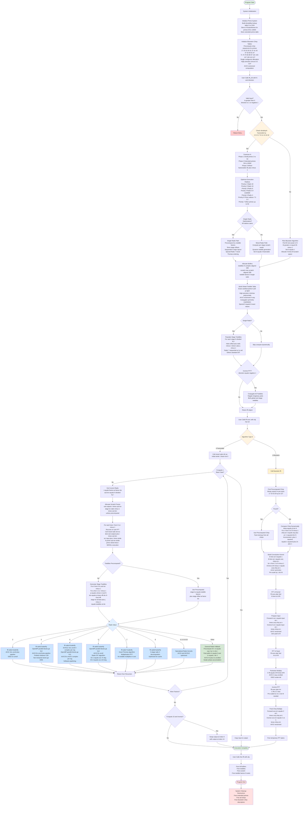

```mermaid

graph TB
    Start([Program Start]) --> Init[System Initialization]
    
    Init --> InitPrimes[Initialize Prime System<br/>Build divisibility lookup table 0 to 1024<br/>Sieve of Eratosthenes for primes 59 to 10000<br/>Store extended prime table]
    
    InitPrimes --> InitChirp[Initialize Bluestein Chirp Tables<br/>Precompute chirp sequences for primes<br/>17 19 23 29 31 37 41 43 47 53 59 61 67<br/>71 73 79 83 89 97 101 103 107 109 113 127<br/>Single contiguous allocation<br/>High precision sincos 0.5 ULP<br/>AVX2 vectorized computation]
    
    InitChirp --> UserCall[User Calls fft_init with N and direction]
    
    UserCall --> ValidateInput{Valid Input?<br/>N greater than 0<br/>direction is 1 or negative 1}
    ValidateInput -->|No| Error1[Return NULL]
    ValidateInput -->|Yes| CheckDivisible{Check dividebyN<br/>Factorable by<br/>2 3 4 5 7 8 11 13 16 32}
    
    CheckDivisible -->|No| PlanBluestein[Plan Bluestein Algorithm<br/>Find M next power of 2<br/>M greater or equal 2N minus 1<br/>Set lt equals 1<br/>Allocate 4 times M scratch space]
    
    CheckDivisible -->|Yes| Factorize[Factorize N<br/>Phase 1 Small primes 2 to 53<br/>Phase 2 Extended primes 59 to 10000<br/>Phase 3 Wheel factorization 6k plus minus 1]
    
    Factorize --> OptimizeRadices[Optimize Execution Radices<br/>Priority 1 Radix 32<br/>Priority 2 Radix 16<br/>Priority 3 Radix 8<br/>Priority 4 Radix 9 if available<br/>Priority 5 Radix 4<br/>Priority 6 Prime radices 7 5 3 2<br/>Priority 7 Other primes up to 53]
    
    OptimizeRadices --> CheckSingleRadix{Single Radix<br/>Optimization?<br/>All radices same}
    
    CheckSingleRadix -->|Yes| SingleRadixPlan[Single Radix Path<br/>Precompute ALL twiddle factors<br/>Store stage offsets<br/>Sequential k major layout<br/>Special Radix 7 Good Thomas ordering]
    
    CheckSingleRadix -->|No| MixedRadixPlan[Mixed Radix Path<br/>Compute per stage scratch needs<br/>Dynamic twiddle generation<br/>Set lt equals 0 factorable]
    
    SingleRadixPlan --> AllocBuffers
    MixedRadixPlan --> AllocBuffers
    PlanBluestein --> AllocBuffers
    
    AllocBuffers[Allocate Buffers<br/>twiddles N complex aligned 32B<br/>scratch max scratch aligned 32B<br/>twiddle factors if single radix]
    
    AllocBuffers --> BuildTwiddles[Build Global Twiddle Table<br/>Exact cardinal points 0 pi/2 pi 3pi/2<br/>High precision minimax polynomials<br/>AVX2 vectorized 4 way<br/>Conjugate symmetry exploitation<br/>Special N equals 8 exact values]
    
    BuildTwiddles --> PopulateStageTwiddles{Single Radix?}
    
    PopulateStageTwiddles -->|Yes| BuildStageTwiddles[Populate Stage Twiddles<br/>For each stage N divided by r<br/>Index offset plus radix minus 1 times k plus j minus 1<br/>Radix 7 sequential w1 to w6<br/>Others standard DIT]
    
    PopulateStageTwiddles -->|No| SkipStage[Skip compute dynamically]
    
    BuildStageTwiddles --> AdjustInverse
    SkipStage --> AdjustInverse
    
    AdjustInverse{Inverse FFT?<br/>direction equals negative 1}
    AdjustInverse -->|Yes| ConjTwiddles[Conjugate All Twiddles<br/>Negate imaginary parts<br/>Both global and stage twiddles]
    AdjustInverse -->|No| ReturnObj
    ConjTwiddles --> ReturnObj[Return fft object]
    
    ReturnObj --> UserExec[User Calls fft exec with obj inp out]
    
    UserExec --> DispatchAlgo{Algorithm Type lt}
    
    DispatchAlgo -->|0 Factorable| MixedRadixEntry[Call mixed radix dit rec<br/>Initial stride 1 factor idx 0]
    
    DispatchAlgo -->|1 Bluestein| BluesteinEntry[Call bluestein fft]
    
    MixedRadixEntry --> RecurseCheck{N equals 1<br/>Base Case?}
    RecurseCheck -->|Yes| CopyData[Copy input to output]
    RecurseCheck -->|No| GetRadix[Get Current Radix<br/>r equals factors at factor idx<br/>sub len equals N divided by r]
    
    GetRadix --> AllocScratch[Allocate Scratch Frame<br/>sub outputs r times sub len<br/>stage tw radix minus 1 times sub len<br/>unless precomputed]
    
    AllocScratch --> RecurseLoop[For each lane i from 0 to r minus 1<br/>Recurse on sub FFT<br/>Call mixed radix dit rec<br/>dest sub outputs plus i times sub len<br/>src input plus i times stride<br/>N prime sub len stride prime stride times r<br/>SERIAL execution]
    
    RecurseLoop --> PrepTwiddles{Twiddles Precomputed?}
    
    PrepTwiddles -->|No| GenTwiddles[Generate Stage Twiddles<br/>For k from 0 to sub len minus 1<br/>For j from 1 to r minus 1<br/>p equals j times k mod N<br/>idx equals p times nfft div N mod nfft<br/>stage tw at base plus j minus 1<br/>equals twiddles at idx]
    
    PrepTwiddles -->|Yes| UsePrecTwiddles[Use Precomputed<br/>stage tw equals twiddle factors<br/>plus stage offset at factor idx]
    
    GenTwiddles --> DispatchRadix
    UsePrecTwiddles --> DispatchRadix
    
    DispatchRadix{Radix Value}
    
    DispatchRadix -->|2| R2[fft radix2 butterfly<br/>AVX2 16x unroll plus pipeline<br/>SSE2 2x unroll]
    
    DispatchRadix -->|3| R3[fft radix3 butterfly<br/>OpenMP parallel blocks ge 512<br/>AVX2 8x unroll plus pipeline<br/>Prefetch distance 128<br/>Non temporal stores ge 4096]
    
    DispatchRadix -->|4| R4[fft radix4 butterfly<br/>AVX512 16x unroll 4 complex per reg<br/>OpenMP parallel blocks ge 512<br/>AVX2 8x unroll 2 complex per reg<br/>Software pipelining]
    
    DispatchRadix -->|5| R5[fft radix5 butterfly<br/>OpenMP parallel blocks ge 512<br/>AVX2 8x unroll<br/>Rader DIT algorithm<br/>C5 1 equals cos 72 deg<br/>C5 2 equals cos 144 deg]
    
    DispatchRadix -->|7| R7[fft radix7 butterfly<br/>Good Thomas algorithm<br/>Multiplicative FFT<br/>No twiddle multiplies in core]
    
    DispatchRadix -->|8| R8[fft radix8 butterfly<br/>3 stage radix 2 decomposition<br/>Optimized for cache]
    
    DispatchRadix -->|11 13 16 32| RSpecial[Specialized Radix Kernels<br/>AVX2 and AVX512 optimized]
    
    DispatchRadix -->|Other| RGeneral[General Radix Fallback<br/>Precompute W r m equals exp 2 pi i m div r<br/>Fast paths m equals 0 and m equals r div 2<br/>AVX2 4x plus 2x unrolled<br/>Scalar phase accumulation]
    
    R2 --> ReturnRec
    R3 --> ReturnRec
    R4 --> ReturnRec
    R5 --> ReturnRec
    R7 --> ReturnRec
    R8 --> ReturnRec
    RSpecial --> ReturnRec
    RGeneral --> ReturnRec
    
    ReturnRec[Return from Recursion] --> CheckMore{More Factors?}
    CheckMore -->|Yes| RecurseCheck
    CheckMore -->|No| SpecialFix{N equals 15 and Inverse?}
    SpecialFix -->|Yes| SwapOut[Swap output at index 9<br/>with output at index 14]
    SpecialFix -->|No| Done
    SwapOut --> Done
    CopyData --> Done
    
    BluesteinEntry --> FindChirpIdx[Find Precomputed Chirp<br/>Binary search in pre sizes<br/>17 19 23 29 up to 127]
    
    FindChirpIdx --> ChirpFound{Found?}
    
    ChirpFound -->|Yes| UsePrecChirp[Use Precomputed Chirp<br/>Fast memcpy from all chirps]
    
    ChirpFound -->|No| ComputeChirp[Compute Chirp Dynamically<br/>theta equals pi div N<br/>For n from 0 to N minus 1<br/>chirp at n equals exp plus pi i n squared div N<br/>Incremental n plus 1 squared<br/>equals n squared plus 2n plus 1]
    
    UsePrecChirp --> BuildKernel
    ComputeChirp --> BuildKernel
    
    BuildKernel[Build Convolution Kernel<br/>B time at 0 equals 1<br/>B time at n equals conj chirp at n<br/>for n from 1 to N minus 1<br/>B time at M minus n equals conj chirp at n<br/>mirror symmetry<br/>Pre scale by 1 div M]
    
    BuildKernel --> FFTKernel[FFT of Kernel<br/>fft exec plan fwd<br/>B time to B fft]
    
    FFTKernel --> PrepInput[Prepare Input<br/>Forward A at n equals input at n<br/>times conj chirp at n<br/>Inverse A at n equals input at n<br/>times chirp at n<br/>AVX2 vectorized<br/>Zero pad to M]
    
    PrepInput --> FFTInput[FFT of Input<br/>fft exec plan fwd<br/>A to A fft]
    
    FFTInput --> Convolve[Pointwise Multiply<br/>C fft equals A fft times B fft<br/>AVX2 2 way unrolled<br/>SSE2 scalar tail]
    
    Convolve --> IFFTResult[Inverse FFT<br/>fft exec plan inv<br/>C fft to C time<br/>Pre scaled so no 1 div M needed]
    
    IFFTResult --> FinalChirp[Final Chirp Multiply<br/>Forward out at k equals C at k<br/>times conj chirp at k<br/>Inverse out at k equals C at k<br/>times chirp at k<br/>AVX2 vectorized]
    
    FinalChirp --> CleanupPlans[Free temporary FFT plans]
    CleanupPlans --> Done
    
    Done([Execution Complete]) --> UserFree[User Calls free fft with obj]
    
    UserFree --> FreeBuffers[Free All Buffers<br/>Free twiddles<br/>Free scratch<br/>Free twiddle factors if exists]
    
    FreeBuffers --> ProgramEnd([Program End])
    
    ProgramEnd --> Cleanup[System Cleanup Destructors<br/>Free extended primes<br/>Free all chirps<br/>Free bluestein chirp descriptors]
    
    style Start fill:#e1f5e1
    style ProgramEnd fill:#ffe1e1
    style Cleanup fill:#ffe1e1
    style Error1 fill:#ffcccc
    style CheckDivisible fill:#fff4e1
    style DispatchAlgo fill:#fff4e1
    style DispatchRadix fill:#e1f0ff
    style R2 fill:#cce5ff
    style R3 fill:#cce5ff
    style R4 fill:#cce5ff
    style R5 fill:#cce5ff
    style R7 fill:#cce5ff
    style R8 fill:#cce5ff
    style RSpecial fill:#cce5ff
    style RGeneral fill:#d5e8d4
    style BluesteinEntry fill:#fff2cc
    style Done fill:#e1f5e1
```

    ## Usage
- View on GitHub (renders automatically)
- Use with VSCode + Mermaid extension
- Generate images using mermaid-cli

