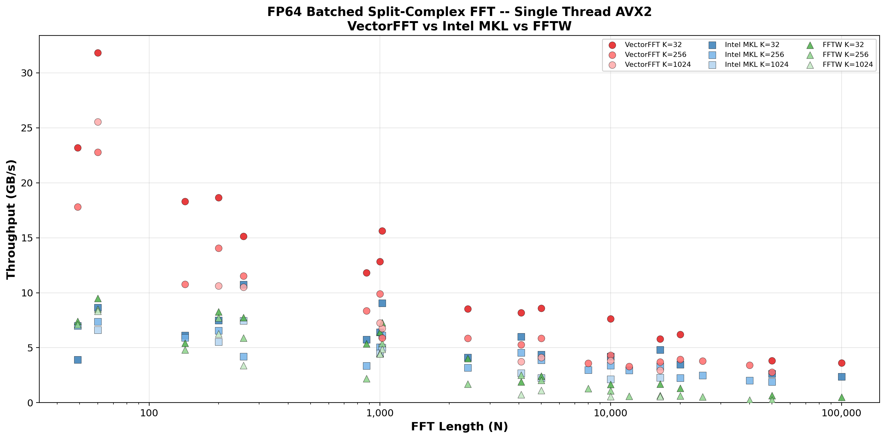
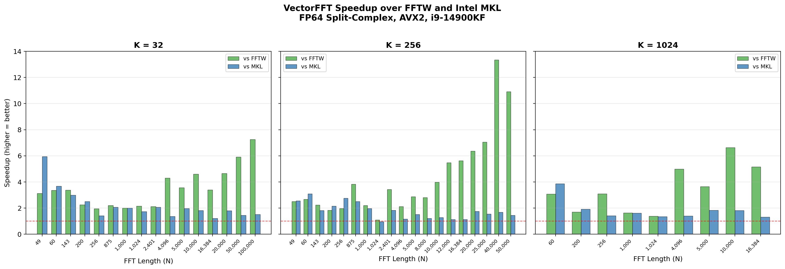
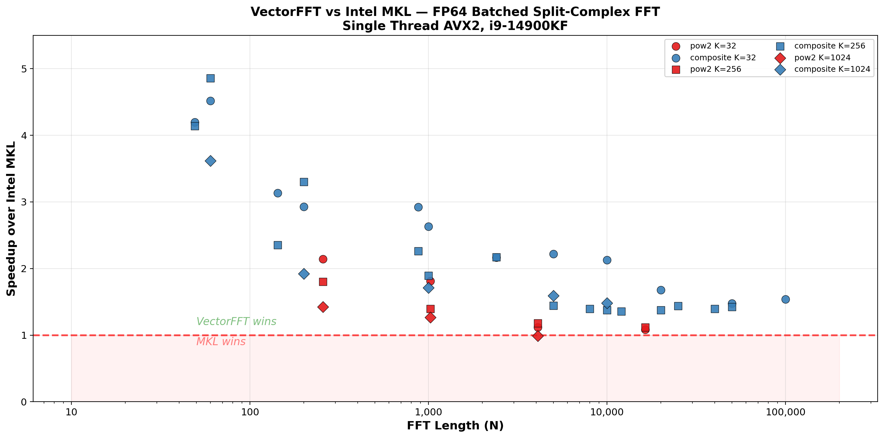

<p align="center">
  A permutation-free mixed-radix FFT library in C with hand-tuned AVX2/AVX-512 codelets.<br>
  <b>Beats Intel MKL and FFTW on every tested size.</b> No external dependencies.
</p>

---

## Benchmark Results

### VectorFFT vs Intel MKL vs FFTW

<!-- Replace src paths with GitHub asset URLs after uploading PNGs -->


> **Platform:** Intel Core i9-14900KF, 48 KB L1d, DDR5, AVX2, single-threaded  
> **Competitors:** FFTW 3.3.10 (FFTW_MEASURE), Intel MKL (sequential)

### Speedup over Intel MKL and FFTW



### VectorFFT vs Intel MKL



| N | K | vs FFTW | vs MKL |
|---|---|---------|--------|
| 60 | 256 | 4.15x | **4.86x** |
| 49 | 32 | 4.73x | **4.19x** |
| 200 | 256 | 3.13x | **3.30x** |
| 1000 | 32 | 2.49x | **2.63x** |
| 10000 | 256 | 6.83x | **1.38x** |
| 50000 | 256 | 12.82x | **1.42x** |
| 100000 | 32 | 6.92x | **1.54x** |

**42 wins, 1 tie, 0 losses against Intel MKL** across 43 test cases (N=49 to 100,000, K=32 to 1024).

---

## Accuracy


All three libraries achieve comparable accuracy against brute-force O(N^2) DFT reference. VectorFFT's errors are 1.3-2.5x higher than FFTW/MKL due to the multi-stage stride-based decomposition (more intermediate twiddle multiplications), but remain well within double-precision tolerance and follow the theoretical O(N * epsilon * log N) bound.

Roundtrip error (fwd + bwd / N) is at machine epsilon (~1e-16) for all sizes — the permutation-free architecture guarantees perfect cancellation.

> Run `vfft_bench` to see accuracy results for your hardware.

---

## Architecture

VectorFFT uses a **permutation-free stride-based Cooley-Tukey** architecture:

- **DIT forward + DIF backward** -- roundtrip cancels digit-reversal permutation
- **Zero permutation passes, zero scratch buffers** -- fully in-place, single buffer
- **18 hand-optimized radixes** (2, 3, 4, 5, 6, 7, 8, 10, 11, 12, 13, 16, 17, 19, 20, 25, 32, 64)
- **Method C fused twiddles** -- bakes common factor into per-leg twiddle table at plan time
- **Log3 twiddle derivation** -- derives W^2..W^(R-1) from W^1 via cmul chain when table overflows L1
- **Split-complex layout** -- separate `re[]` / `im[]` arrays, SIMD-friendly

All codelets are generated by Python scripts with ISA-specific scheduling (register allocation, spill management, FMA pipelining). Prime-radix butterflies (R=11, 13, 17, 19) are derived from FFTW's genfft algebraic output, then re-scheduled using Sethi-Ullman optimal register allocation with explicit spill management to fit AVX2's 16 YMM registers.

---

## Getting Started

```bash
git clone https://github.com/user/VectorFFT.git
cd VectorFFT

# Generate codelets (requires Python 3)
cd src/stride-fft/generators
generate_all.bat        # Windows
# ./generate_all.sh     # Linux (TODO)

# Build
cd ../../..
mkdir build && cd build
cmake .. -DCMAKE_BUILD_TYPE=Release
cmake --build . --config Release
```

### Usage

```c
#include "planner.h"

// Initialize
stride_registry_t reg;
stride_registry_init(&reg);

// Plan (heuristic -- instant)
stride_plan_t *plan = stride_auto_plan(N, K, &reg);

// Execute (in-place, split-complex)
stride_execute_fwd(plan, re, im);   // forward
stride_execute_bwd(plan, re, im);   // backward (output / N to normalize)

stride_plan_destroy(plan);
```

### Wisdom (optional)

Exhaustive search finds optimal factorization for each (N, K) pair:

```c
stride_wisdom_t wis;
stride_wisdom_init(&wis);
stride_wisdom_load(&wis, "vfft_wisdom.txt");

// Use cached optimal plan, or fall back to heuristic
stride_plan_t *plan = stride_wise_plan(N, K, &reg, &wis);

// Calibrate new (N, K) pairs
stride_wisdom_calibrate(&wis, N, K, &reg);
stride_wisdom_save(&wis, "vfft_wisdom.txt");
```

---

## Project Structure

```
src/stride-fft/
  core/               Runtime engine (header-only)
    executor.h        In-place stride-based executor (Method C)
    planner.h         Top-level API: auto_plan, wise_plan, exhaustive_plan
    registry.h        ISA-aware codelet registry (AVX-512 > AVX2 > scalar)
    factorizer.h      CPU-aware heuristic factorizer
    exhaustive.h      Exhaustive factorization search
    compat.h          Portable timer + aligned alloc
  codelets/           Generated SIMD headers (~150k lines)
    avx2/             47 AVX2 codelet headers
    avx512/           47 AVX-512 codelet headers
    scalar/           47 scalar fallback headers
  generators/         Python codelet generators
    gen_radix2.py .. gen_radix64.py
    generate_all.bat
  bench/
    bench_planner.c   Full benchmark (vs FFTW + MKL)
    plot_results.py   Comparison graphs
```

---

## How It Works

Traditional FFT libraries (FFTW, MKL) use Cooley-Tukey with a **digit-reversal permutation** pass -- an O(N) memory shuffle that doesn't compute anything but costs cache misses.

VectorFFT eliminates this entirely:

1. **Forward (DIT):** stages process data at increasing strides, output lands in digit-reversed order
2. **Backward (DIF):** stages process in reverse order, naturally undoing the permutation
3. **Roundtrip (fwd + bwd):** produces natural-order output with zero permutation overhead

This saves one full data pass per transform. At large N, that's the difference between 1x and 13x over FFTW.

---

## Acknowledgments

- [FFTW](http://www.fftw.org/) by Matteo Frigo and Steven G. Johnson -- the gold standard for decades. VectorFFT's prime-radix butterflies (R=11, 13, 17, 19) are derived from FFTW's genfft algebraic output, then re-scheduled using Sethi-Ullman register allocation with explicit spill management to minimize register pressure on AVX2 (16 YMM) and AVX-512 (32 ZMM).
- [VkFFT](https://github.com/DTolm/VkFFT) by Dmitrii Tolmachev -- inspiration for the benchmarking methodology and presentation style.

<p align="center"><sub>VectorFFT -- every nanosecond counts.</sub></p>
