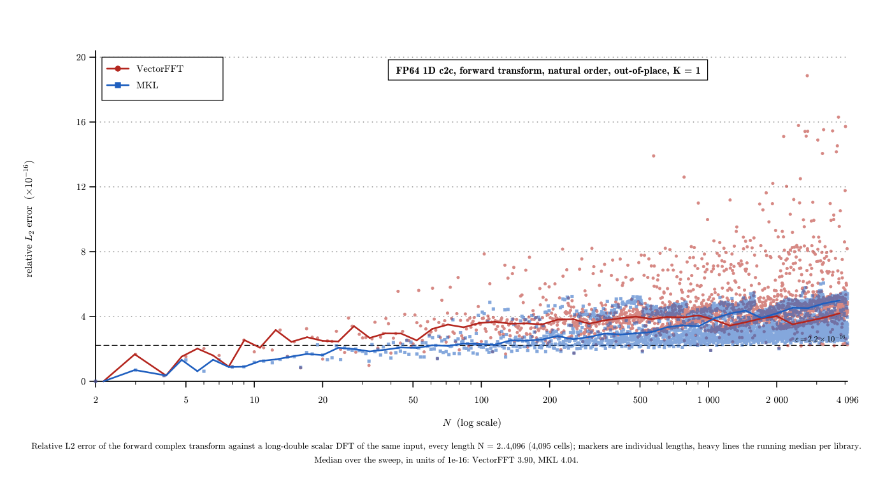
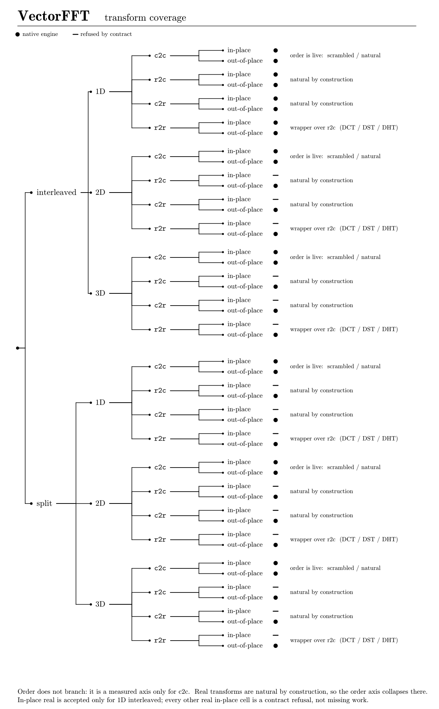

**VectorFFT** is a double-precision FFT library in C for x86 with AVX2 and
AVX-512, built for workloads that run many transforms of modest length. It serves
complex (c2c), real (r2c, c2r) and real-to-real (DCT, DST, DHT) transforms in 1D,
2D and 3D, in place or out of place, in both complex layouts, interleaved and
split, batched and threaded. Its kernels are emitted by its own DAG FFT compiler
for each instruction set; the split layout has its AVX-512 kernels today, the
interleaved layout's follow from the same compiler. You never pick an algorithm:
a call names a contract, the planner races the engines that serve it on your
machine, and the winner is kept as wisdom, so the first create measures and
every later one replays. Its speed is measured against Intel MKL below, at every
length from 2 to 4,096.

---

## Benchmark Results

> **Full performance record** — every gauntlet run, multi-threaded scaling, the
> 2D/3D tiers, accuracy and hardware caveats — is
> [`docs/performance/v1_0_results.md`](docs/performance/v1_0_results.md).
> The runs themselves (csv, calibration logs, banked wisdom) are in
> [`gauntlet/results/`](gauntlet/results/), and [`gauntlet/`](gauntlet/) is the
> tool that reproduces them on your own machine.

> **Platform:** Intel Core i9-14900KF (P-core, AVX2), DDR5, GCC 15.2, single thread  
> **Competitor:** Intel oneMKL 2025.3 (sequential, `mkl_set_num_threads(1)`)  
> **Contract:** 1D complex-to-complex FP64, interleaved, natural order, out of place, K = 1  
> **Cells:** every length N from 2 to 4,096 — 4,095 transforms, no size skipped

### 1D throughput, every N from 2 to 4,096 — VectorFFT vs Intel MKL

One line per engine, one point per length, joined in N. Each point is the median
of two timing arms with the engine order flipped; every ratio below takes the
**worse** of the two arms, so a win is never an artefact of order. The saw-tooth is
the arithmetic of the lengths themselves: powers of two and smooth composites reach
60-77 GFLOPS, primes and rough composites run at 5-10 GFLOPS on both engines, and on
those VectorFFT sits above MKL by a steady offset (log scale: equal speed ratios are
equal vertical gaps).

| Lengths | Cells | Median speedup | At or above parity | Best |
|---|---|---|---|---|
| 2..16 | 15 | 1.39x | 87% | 2.83x (N=2) |
| 17..64 | 48 | 1.53x | 94% | 4.18x (N=61) |
| 65..256 | 192 | 1.53x | 97% | 6.88x (N=89) |
| 257..1,024 | 768 | 1.28x | 90% | 4.02x (N=508) |
| 1,025..2,048 | 1,024 | 1.20x | 88% | 3.74x (N=1946) |
| 2,049..4,096 | 2,048 | 1.16x | 84% | 3.73x (N=3827) |
| **all, 2..4,096** | **4,095** | **1.23x** | **87%** | 6.88x (N=89) |

| Family | Cells | Median speedup | At or above parity |
|---|---|---|---|
| Powers of two | 12 | 1.13x | 75% |
| Primes | 563 | 1.17x | 87% |
| Other composites | 3,520 | 1.24x | 87% |

## Accuracy

The forward transform of every length N from 2 to 4,096, VectorFFT and MKL on the
same random input, against a scalar DFT accumulated in 80-bit long double
(the gauntlet's `verify` verb, [`gauntlet/k1_fwd_ref_probe.c`](gauntlet/k1_fwd_ref_probe.c);
the records are in [`gauntlet/results/`](gauntlet/results/)). The error is the
relative L2 norm ||y - X|| / ||X||, in units of 1e-16 (FP64 epsilon = 2.2).

Both libraries deliver 14 to 15 correct digits at every length, and MKL is the
tighter of the two: its error stays within 3 epsilon everywhere, VectorFFT's median
is 1.5x MKL's and its worst lengths reach 13 epsilon. The radix-2, 4 and 8 kernels
and ZTURN-T are level with MKL at every power of two; the gap comes from the
odd-radix kernels, whose error grows with the radix (a solo radix-37 transform reads
8x MKL), and every mixed-radix or prime length uses one, alone, as a stage or as
the prime cell's inner transform. Those kernels are where it will be worked on; it
is measured here so it can be, not hidden.

| Lengths | Cells | VectorFFT median | MKL median | VectorFFT max | MKL max |
|---|---|---|---|---|---|
| 2..16 | 15 | 1.67 | 1.15 | 6.74 | 1.52 |
| 17..64 | 48 | 5.32 | 1.97 | 18.00 | 2.79 |
| 65..256 | 192 | 6.67 | 2.50 | 25.07 | 5.24 |
| 257..1,024 | 768 | 6.95 | 3.14 | 25.66 | 5.22 |
| 1,025..2,048 | 1,024 | 6.01 | 3.99 | 28.94 | 5.45 |
| 2,049..4,096 | 2,048 | 6.09 | 4.62 | 27.46 | 6.07 |
| **all, 2..4,096** | **4,095** | **6.11** | **4.04** | **28.94** | **6.07** |

| Family | Cells | VectorFFT median | MKL median | VectorFFT max | MKL max |
|---|---|---|---|---|---|
| Powers of two | 12 | 1.80 | 1.45 | 2.73 | 2.36 |
| Primes | 564 | 6.15 | 4.64 | 28.94 | 5.58 |
| Other composites | 3,520 | 6.11 | 3.56 | 27.46 | 6.07 |

Elementwise maximum error, relative to the largest output, same reference: VectorFFT
median 8.3, max 41.4; MKL median 4.2, max 8.5. Roundtrip, backward of the forward
divided by N against the input, elementwise maximum: VectorFFT median 15.6, max 103;
MKL median 12.4, max 24.7 (all in units of 1e-16).

---

## Features

A request names a contract: transform, layout, placement, order, length, batch,
threads. A cell either has a native engine for it or refuses at create; a dot in
the tree is a native engine, a dash a refusal by contract.

- **Interleaved and split are two libraries**, each with its own engines and
  wisdom; nothing is converted between them.
- **Both placements in each layout**, in place and out of place, for the complex
  transforms; real transforms run in place only under 1D interleaved.
- **Order is a contract of c2c**: natural by default, scrambled on request, each
  served by its own writers. Real and trigonometric transforms are natural by
  construction.
- **Any length, 1D to 3D, batches, threads.** Every plan is a measured verdict
  kept in wisdom, never an estimate.

The contracts in full: [`include/vfft.h`](include/vfft.h) (support matrix and
buffer signatures) and [`docs/design/design_contracts.md`](docs/design/design_contracts.md).

---

