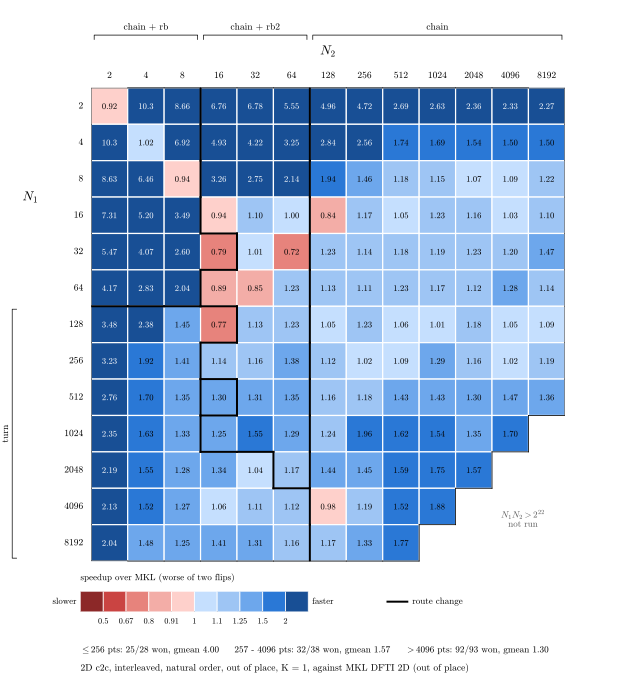
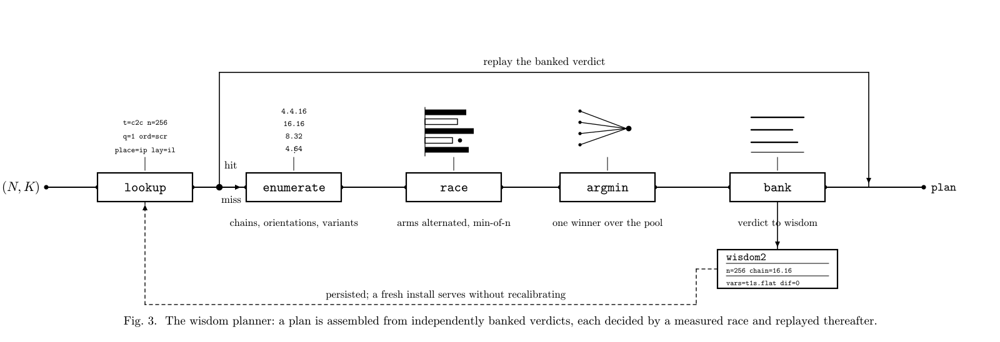
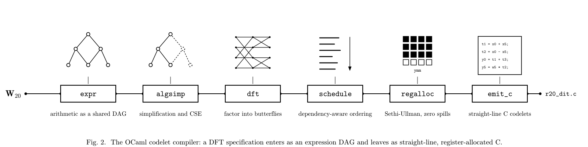

**VectorFFT** is a double-precision FFT library in C for x86 with AVX2 and
AVX-512, built for workloads that run many transforms of modest length. It serves
complex (c2c), real (r2c, c2r) and real-to-real (DCT, DST, DHT) transforms in 1D,
2D and 3D, in place or out of place, in both complex layouts, interleaved and
split, batched and threaded. Its kernels are emitted by its own DAG FFT compiler
for each instruction set; the split layout has its AVX-512 kernels today, the
interleaved layout's follow from the same compiler. You never pick an algorithm:
a call names a contract, the planner races the engines that serve it on your
machine, and the winner is kept as wisdom, so the first create measures and
every later one replays. Its speed is measured against Intel MKL below, at every
length from 2 to 4,096.

---

## Benchmark Results

> **Full performance record** — every gauntlet run, multi-threaded scaling, the
> 2D/3D tiers, accuracy and hardware caveats — is
> [`docs/performance/v1_0_results.md`](docs/performance/v1_0_results.md).
> The runs themselves (csv, calibration logs, banked wisdom) are in
> [`gauntlet/results/`](gauntlet/results/); this section's record is
> [`gauntlet_2_4096_2026-09-23`](gauntlet/results/gauntlet_2_4096_2026-09-23/), and
> [`gauntlet/`](gauntlet/) is the tool that reproduces it on your own machine.

> **Platform:** Intel Core i9-14900KF (P-core, AVX2), DDR5, GCC 15.2, single thread  
> **Competitor:** Intel oneMKL 2025.3 (sequential, `mkl_set_num_threads(1)`)  
> **Contract:** 1D complex-to-complex FP64, interleaved, natural order, out of place, K = 1  
> **Cells:** every length N from 2 to 4,096 — 4,095 transforms, no size skipped

### 1D throughput, every N from 2 to 4,096 — VectorFFT vs Intel MKL

One line per engine, one point per length, joined in N. Each point is the median
of two timing arms with the engine order flipped; every ratio below takes the
**worse** of the two arms, so a win is never an artefact of order. The saw-tooth is
the arithmetic of the lengths themselves: powers of two and smooth composites reach
60-77 GFLOPS, primes and rough composites run at 5-10 GFLOPS on both engines, and on
those VectorFFT sits above MKL by a steady offset (log scale: equal speed ratios are
equal vertical gaps).

| Lengths | Cells | Median speedup | At or above parity | Best |
|---|---|---|---|---|
| 2..16 | 15 | 1.39x | 80% | 2.83x (N=2) |
| 17..64 | 48 | 1.56x | 96% | 4.17x (N=61) |
| 65..256 | 192 | 1.64x | 98% | 7.04x (N=89) |
| 257..1,024 | 768 | 1.40x | 93% | 4.15x (N=508) |
| 1,025..2,048 | 1,024 | 1.27x | 91% | 3.74x (N=1946) |
| 2,049..4,096 | 2,048 | 1.23x | 86% | 4.00x (N=2209) |
| **all, 2..4,096** | **4,095** | **1.29x** | **89%** | 7.04x (N=89) |

| Family | Cells | Median speedup | At or above parity |
|---|---|---|---|
| Powers of two | 12 | 1.13x | 75% |
| Primes | 564 | 1.18x | 89% |
| Other composites | 3,520 | 1.30x | 89% |

### 2D throughput, every power-of-two plane up to 4M points — VectorFFT vs Intel MKL

Every plane N1 x N2 with both sides a power of two from 2 to 8,192 and at most 2^22
points: 159 transforms, 2D complex-to-complex, interleaved, natural order, out of
place, single thread, against MKL DFTI 2D. Each cell is the speedup, worse of the two
engine orders; blue is faster, red slower, and the heavy rules mark where the planner
served a different route. Four routes appear: the column chain with a per-row child
(*chain*), the same chain with the rows batched through one kernel call (*+ rb*) or
through the row child's own two stages batched (*+ rb2*), and for the tall narrow
planes the *turn* route, which runs the whole plane through the 1D engine with the
rows stored transposed. Every route is raced per plane by the planner and banked in
wisdom; the design is in
[`docs/design/il2d_c2c_strategy.md`](docs/design/il2d_c2c_strategy.md). The record is
[`gauntlet_2d-pow2grid5`](gauntlet/results/gauntlet_2d-pow2grid5/).

| Plane size | Cells | Median speedup | At or above parity | Best |
|---|---|---|---|---|
| up to 256 points | 28 | 4.57x | 89% | 10.28x (4x2) |
| 257..4,096 | 38 | 1.55x | 84% | 4.72x (2x256) |
| 4,097..65,536 | 48 | 1.23x | 100% | 2.33x (2x4096) |
| 65,537..4M | 45 | 1.29x | 98% | 1.96x (1024x256) |
| **all, 159 planes** | **159** | **1.34x** | **94%** | 10.28x (4x2) |

The ten planes below parity are the tiny squares (2x2, 8x8, 16x16 at 0.92-0.94, where
the call itself is the cost), 128x16 (0.77) and a few 16-to-64-row cells within a
run-to-run swing of parity.

## Accuracy

Forward transform of every length 2..4,096, both libraries on the same input,
against a long-double scalar DFT (the gauntlet's `verify` verb); relative L2
error in units of 1e-16, FP64 epsilon = 2.2. Both hold 14 to 15 digits at every
length. The medians are level, VectorFFT 3.9 against MKL 4.0, and VectorFFT is
at or below MKL at 49% of the lengths. Every twiddle, chirp and stage record
the library builds is the correctly rounded value of its exact angle
(`src/core/oop/tw_exact.h`). What remains is the worst-length spread, 8.5
epsilon against MKL's 2.7, set by the flat route's execute-time twiddle
derivation.

| Lengths | Cells | VectorFFT median | MKL median | VectorFFT max | MKL max |
|---|---|---|---|---|---|
| 2..16 | 15 | 1.67 | 1.15 | 3.17 | 1.52 |
| 17..64 | 48 | 2.80 | 1.97 | 5.75 | 2.79 |
| 65..256 | 192 | 3.65 | 2.50 | 8.16 | 5.24 |
| 257..1,024 | 768 | 3.90 | 3.14 | 13.91 | 5.22 |
| 1,025..2,048 | 1,024 | 3.86 | 3.99 | 12.21 | 5.45 |
| 2,049..4,096 | 2,048 | 3.97 | 4.62 | 18.86 | 6.07 |
| **all, 2..4,096** | **4,095** | **3.90** | **4.04** | **18.86** | **6.07** |

Every length above 10e-16 is on the flat DIT route, a chain of two large odd
radices (2x29x47, 3x29x43, 2x41x43). A tail stage of that route derives most
of its twiddle legs from one loaded record instead of loading up to
forty-six, and the derived legs carry the loaded value's rounding times their
distance from it. That is what makes these lengths fast: the 33 above 10e-16
run at 2.2x MKL's speed at the median and none below 1.2x, the flat route as
a whole at 1.7x. The library makes that trade once, for speed, and offers no
accuracy modes. A build configuration that takes the loaded form instead may
be added later.

---

## Features

A request names a contract: transform, layout, placement, order, length, batch,
threads. A cell either has a native engine for it or refuses at create; a dot in
the tree is a native engine, a dash a refusal by contract.

- **Interleaved and split are two libraries**, each with its own engines and
  wisdom; nothing is converted between them.
- **Both placements in each layout**, in place and out of place, for the complex
  transforms; real transforms run in place only under 1D interleaved.
- **Order is a contract of c2c**: natural by default, scrambled on request, each
  served by its own writers. Real and trigonometric transforms are natural by
  construction.
- **Any length, 1D to 3D, batches, threads.** Every plan is a measured verdict
  kept in wisdom, never an estimate.

How a plan is chosen: lookup, enumerate, race, argmin, bank. A hit replays the
banked verdict; a miss races once and banks it.

Where the kernels come from: the DAG FFT compiler takes a DFT as an expression
DAG and emits straight-line, register-allocated C per instruction set.

The contracts in full: [`include/vfft.h`](include/vfft.h) (support matrix and
buffer signatures) and [`docs/design/design_contracts.md`](docs/design/design_contracts.md).

---

