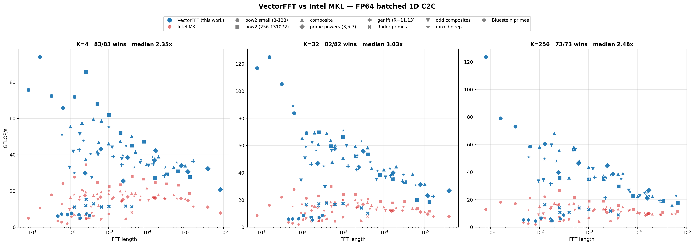
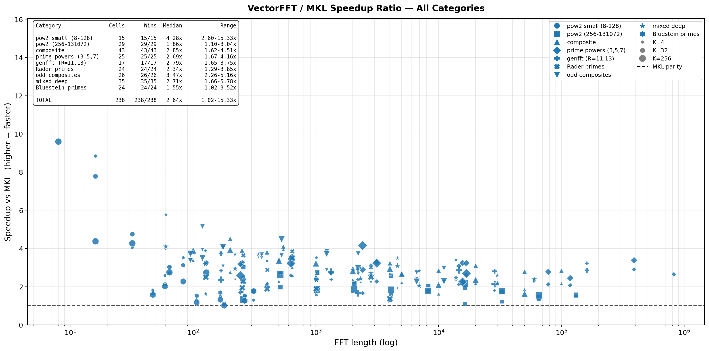
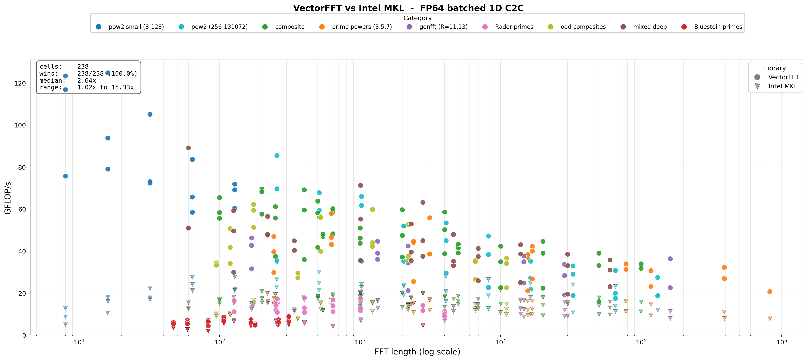
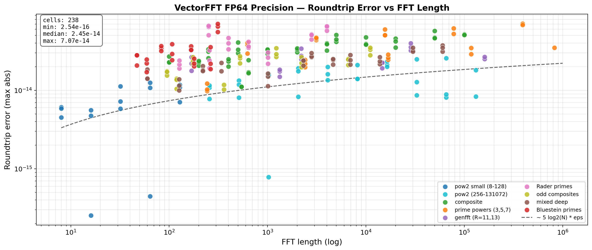

---

## Benchmark Results

> **For the full v1.0 performance picture** — vs MKL, vs FFTW3, multi-threaded
> scaling, DCT/DST/DHT, cost-model accuracy, per-codelet VTune profiles, hardware
> caveats — see [`docs/performance/v1_0_results.md`](docs/performance/v1_0_results.md).

> **Platform:** Intel Core i9-14900KF, 48 KB L1d, DDR5, AVX2, single-threaded  
> **Competitor:** Intel MKL 2025 (sequential, `mkl_set_num_threads(1)`)  
> **238 data points** across 9 categories, 3 batch sizes (K=4, K=32, K=256), N=8 to N=823,543

### 1D FFT Throughput — VectorFFT vs Intel MKL

Three panels showing GFLOP/s at each batch size. Blue = VectorFFT, Red = MKL. Different marker shapes per category. VectorFFT sits above MKL across the board.

| Category | Cells | Median | Best Win | Closest MKL Gets |
|----------|-------|--------|----------|-------------------|
| **Small pow2** (8-128) | 15 | **4.28x** | **15.33x** (N=8, K=4) | 2.60x (N=128, K=4) |
| **Power-of-2** (256-131K) | 29 | **1.86x** | **3.04x** (N=256, K=32) | 1.10x (N=16384, K=4) |
| **Composite** | 43 | **2.85x** | **4.51x** (N=200, K=32) | 1.62x (N=10000, K=4) |
| **Prime powers** (3,5,7) | 25 | **2.69x** | **4.16x** (N=2401, K=256) | 1.67x (N=2401, K=4) |
| **Prime powers** (R=11,13) | 17 | **2.79x** | **3.75x** (N=169, K=32) | 1.65x (N=2197, K=256) |
| **Rader primes** | 24 | **2.34x** | **3.85x** (N=641, K=32) | 1.29x (N=4001, K=32) |
| **Bluestein primes** | 24 | **1.55x** | **3.52x** (N=83, K=4) | 1.02x (N=179, K=256) |
| **Odd composites** | 26 | **3.47x** | **5.16x** (N=119, K=32) | 2.26x (N=6615, K=256) |
| **Mixed deep** | 35 | **2.71x** | **5.78x** (N=60, K=32) | 1.66x (N=126, K=4) |

### Speedup over Intel MKL — All Categories

Every point above the dashed line is a VectorFFT win. Marker size indicates batch count (small=K=4, medium=K=32, large=K=256). **All 238 points are above parity.**

### Combined Dense Scatter — All Sizes & Batch Counts

All 238 data points overlaid. Blue cloud (VectorFFT) consistently above red cloud (MKL). Peak throughput at small N with large K where codelets run entirely from L1.

### Highlight Results

| N | K | Category | Factors | VectorFFT | MKL | Speedup |
|---|---|----------|---------|-----------|-----|---------|
| 8 | 4 | small | 8 | 75.7 GF/s | 4.9 GF/s | **15.33x** |
| 60 | 32 | mixed_deep | 5x12 | 89.2 GF/s | 15.4 GF/s | **5.78x** |
| 119 | 32 | odd_comp | 17x7 | 50.7 GF/s | 9.8 GF/s | **5.16x** |
| 200 | 32 | composite | 5x8x5 | 69.6 GF/s | 15.4 GF/s | **4.51x** |
| 2401 | 256 | prime_pow (7^4) | 7x7x7x7 | 44.7 GF/s | 10.7 GF/s | **4.16x** |
| 169 | 32 | genfft (13^2) | 13x13 | 46.3 GF/s | 12.3 GF/s | **3.75x** |
| 641 | 32 | rader | (override) | 16.8 GF/s | 4.4 GF/s | **3.85x** |
| 83 | 4 | bluestein | (override) | 7.0 GF/s | 2.0 GF/s | **3.52x** |
| 256 | 32 | pow2 | 4x8x8 | 69.7 GF/s | 22.9 GF/s | **3.04x** |
| 390625 | 4 | prime_pow (5^8) | 25x25x25x25 | 32.3 GF/s | 11.1 GF/s | **2.91x** |
| 16384 | 4 | pow2 | 8x8x16x16 | 27.2 GF/s | 24.7 GF/s | 1.10x |

### 2D FFT — Tiled SIMD Transpose

VectorFFT's 2D FFT uses a tiled gather/scatter approach with cache-oblivious SIMD transpose kernels (8x4 line-filling + 4x4 AVX2). Beats MKL at all tested sizes.

| Size | VectorFFT | MKL | Speedup |
|------|-----------|-----|---------|
| 32x32 | 0.9 us | 1.5 us | **1.63x** |
| 64x64 | 5.5 us | 6.5 us | **1.18x** |
| 128x128 | 30.3 us | 33.4 us | **1.10x** |
| 256x256 | 127.3 us | 145.6 us | **1.14x** |
| 512x512 | 875.1 us | 948.1 us | **1.08x** |
| 1024x1024 | 3,900 us | 5,512 us | **1.41x** |
| 100x200 | 40.7 us | 60.9 us | **1.50x** |

Multi-threaded 2D is tile-parallel on the row pass + K-split on the columns (per-thread scratch, zero
barriers). A full single- and multi-threaded 2D benchmark — all sizes, head-to-head vs MKL — is in
progress; those numbers will be published with that run.

## Accuracy

Strict **roundtrip** error — `max |fwd→bwd / N − x| / max|x|`, the worst single element across all
N·K outputs after a full forward + backward — across all tested 1D cells. Errors track the theoretical
`O(log₂N · ε)` bound (FP64 ε = 2.2e-16); every cell holds ~14 correct digits.

| Category | Min Error | Max Error |
|----------|-----------|-----------|
| pow2 small (8-128) | 2.5e-16 | 1.3e-14 |
| pow2 (256-131K) | 7.9e-16 | 2.6e-14 |
| composite | 1.1e-14 | 5.7e-14 |
| prime powers (3,5,7) | 9.8e-15 | 7.1e-14 |
| genfft (R=11,13) | 1.5e-14 | 4.0e-14 |
| odd composites | 1.0e-14 | 3.5e-14 |
| mixed deep | 1.0e-14 | 3.7e-14 |

Overall: min 2.5e-16, **median 2.45e-14**, max 7.07e-14 — none exceed 1e-13. This is the *strictest*
honest statistic (per-element max, relative, full roundtrip); RMS or forward-only error runs ~10–40×
smaller. The errors grow ~log N exactly as a correct Cooley-Tukey decomposition should.

Rader and Bluestein prime cells use a convolution-based path; their roundtrip error (median ~3e-14,
max ~7e-14) sits in the same band, dominated by the inner FFT's accumulated rounding — well within FP64.

---

## Acknowledgments

- [FFTW](http://www.fftw.org/) by Matteo Frigo and Steven G. Johnson -- the gold standard for decades. VectorFFT's prime-radix butterflies (R=11, 13, 17, 19) are derived from FFTW's genfft algebraic output, then re-scheduled using Sethi-Ullman register allocation with explicit spill management to minimize register pressure on AVX2 (16 YMM) and AVX-512 (32 ZMM).
- [VkFFT](https://github.com/DTolm/VkFFT) by Dmitrii Tolmachev -- inspiration for the benchmarking methodology and presentation style.
