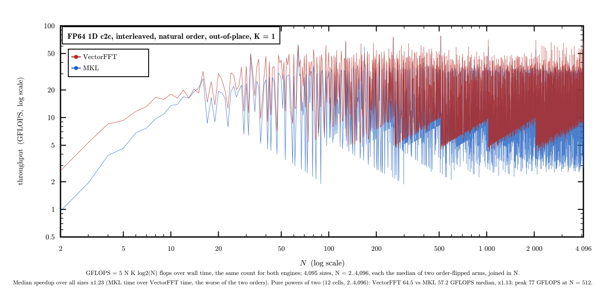

---

## Benchmark Results

> **Full performance record** — every gauntlet run, multi-threaded scaling, the
> 2D/3D tiers, accuracy and hardware caveats — is
> [`docs/performance/v1_0_results.md`](docs/performance/v1_0_results.md).
> The runs themselves (csv, calibration logs, banked wisdom) are in
> [`gauntlet/results/`](gauntlet/results/), and [`gauntlet/`](gauntlet/) is the
> tool that reproduces them on your own machine.

> **Platform:** Intel Core i9-14900KF (P-core, AVX2), DDR5, GCC 15.2, single thread  
> **Competitor:** Intel oneMKL 2025.3 (sequential, `mkl_set_num_threads(1)`)  
> **Contract:** 1D complex-to-complex FP64, interleaved, natural order, out of place, K = 1  
> **Cells:** every length N from 2 to 4,096 — 4,095 transforms, no size skipped

### 1D throughput, every N from 2 to 4,096 — VectorFFT vs Intel MKL

One line per engine, one point per length, joined in N. Each point is the median
of two timing arms with the engine order flipped; every ratio below takes the
**worse** of the two arms, so a win is never an artefact of order. The saw-tooth is
the arithmetic of the lengths themselves: powers of two and smooth composites reach
60-77 GFLOPS, primes and rough composites run at 5-10 GFLOPS on both engines, and on
those VectorFFT sits above MKL by a steady offset (log scale: equal speed ratios are
equal vertical gaps).

| Lengths | Cells | Median speedup | At or above parity | Best |
|---|---|---|---|---|
| 2..16 | 15 | 1.39x | 87% | 2.83x (N=2) |
| 17..64 | 48 | 1.53x | 94% | 4.18x (N=61) |
| 65..256 | 192 | 1.53x | 97% | 6.88x (N=89) |
| 257..1,024 | 768 | 1.28x | 90% | 4.02x (N=508) |
| 1,025..2,048 | 1,024 | 1.20x | 88% | 3.74x (N=1946) |
| 2,049..4,096 | 2,048 | 1.16x | 84% | 3.73x (N=3827) |
| **all, 2..4,096** | **4,095** | **1.23x** | **87%** | 6.88x (N=89) |

| Family | Cells | Median speedup | At or above parity |
|---|---|---|---|
| Powers of two | 12 | 1.13x | 75% |
| Primes | 563 | 1.17x | 87% |
| Other composites | 3,520 | 1.24x | 87% |

## Accuracy

Strict **roundtrip** error — `max |fwd→bwd / N − x| / max|x|`, the worst single element across all
N·K outputs after a full forward + backward — across all tested 1D cells. Errors track the theoretical
`O(log₂N · ε)` bound (FP64 ε = 2.2e-16); every cell holds ~14 correct digits.

| Category | Min Error | Max Error |
|----------|-----------|-----------|
| pow2 small (8-128) | 2.5e-16 | 1.3e-14 |
| pow2 (256-131K) | 7.9e-16 | 2.6e-14 |
| composite | 1.1e-14 | 5.7e-14 |
| prime powers (3,5,7) | 9.8e-15 | 7.1e-14 |
| genfft (R=11,13) | 1.5e-14 | 4.0e-14 |
| odd composites | 1.0e-14 | 3.5e-14 |
| mixed deep | 1.0e-14 | 3.7e-14 |

Overall: min 2.5e-16, **median 2.45e-14**, max 7.07e-14 — none exceed 1e-13. This is the *strictest*
honest statistic (per-element max, relative, full roundtrip); RMS or forward-only error runs ~10–40×
smaller. The errors grow ~log N exactly as a correct Cooley-Tukey decomposition should.

Rader and Bluestein prime cells use a convolution-based path; their roundtrip error (median ~3e-14,
max ~7e-14) sits in the same band, dominated by the inner FFT's accumulated rounding — well within FP64.

---

## Acknowledgments

- [FFTW](http://www.fftw.org/) by Matteo Frigo and Steven G. Johnson -- the gold standard for decades. VectorFFT's prime-radix butterflies (R=11, 13, 17, 19) are derived from FFTW's genfft algebraic output, then re-scheduled using Sethi-Ullman register allocation with explicit spill management to minimize register pressure on AVX2 (16 YMM) and AVX-512 (32 ZMM).
- [VkFFT](https://github.com/DTolm/VkFFT) by Dmitrii Tolmachev -- inspiration for the benchmarking methodology and presentation style.
