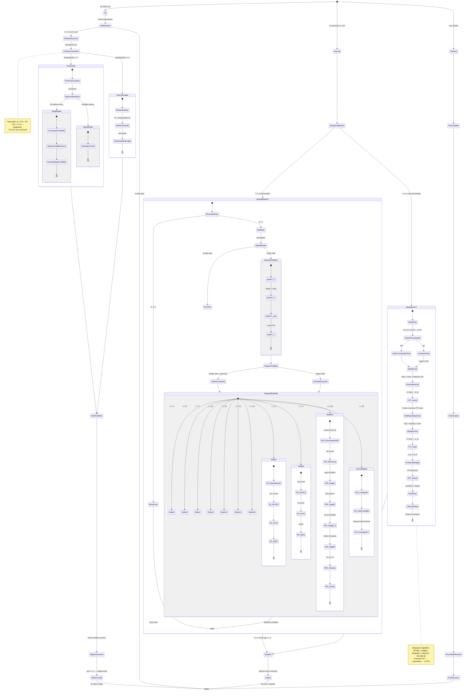

```mermaid
stateDiagram-v2
    [*] --> Init: fft_init(N, dir)
    
    Init --> ValidateInput: Check parameters
    
    ValidateInput --> AllocateStructure: N > 0, dir ∈ {±1}
    ValidateInput --> [*]: Invalid input
    
    AllocateStructure --> CheckFactorization: Allocate fft_set
    
    CheckFactorization --> Factorable: dividebyN(N) == 1
    CheckFactorization --> NonFactorable: dividebyN(N) == 0
    
    state Factorable {
        [*] --> PrimeFactorization
        PrimeFactorization --> DetermineRadices: factors(N)
        DetermineRadices --> SingleRadix: All radices equal
        DetermineRadices --> MixedRadix: Multiple radices
        
        state SingleRadix {
            [*] --> PrecomputeTwiddles
            PrecomputeTwiddles --> AllocateTwiddleFactors
            AllocateTwiddleFactors --> PopulateStageTwiddles
            PopulateStageTwiddles --> [*]
        }
        
        state MixedRadix {
            [*] --> CalculateScratch
            CalculateScratch --> [*]
        }
    }
    
    state NonFactorable {
        [*] --> BluesteinSetup
        BluesteinSetup --> PadToPowerOf2: M = nextpow2(2N-1)
        PadToPowerOf2 --> FactorPaddedLength: factors(M)
        FactorPaddedLength --> [*]
    }
    
    Factorable --> BuildTwiddles
    NonFactorable --> BuildTwiddles
    
    BuildTwiddles --> AdjustForInverse: build_twiddles_linear()
    AdjustForInverse --> ReturnConfig: sgn == -1 → negate imag
    ReturnConfig --> [*]: fft_object ready
    
    note right of CheckFactorization
        Factorable: N = 2^a × 3^b × 5^c × 7^d × ...
        Supported: 2,3,4,5,7,8,11,13,16,32
    end note
    
    [*] --> Execute: fft_exec(obj, in, out)
    
    Execute --> DispatchAlgorithm
    
    DispatchAlgorithm --> MixedRadixDIT: lt == 0 (factorable)
    DispatchAlgorithm --> BluesteinFFT: lt == 1 (non-factorable)
    
    state MixedRadixDIT {
        [*] --> RecursiveEntry
        
        RecursiveEntry --> BaseCase: N == 1
        RecursiveEntry --> GetRadix: N > 1
        
        BaseCase --> [*]: Copy input
        
        GetRadix --> ValidateRadix: factors[idx]
        ValidateRadix --> RecurseChildren: Radix valid
        ValidateRadix --> ErrorExit: Invalid radix
        
        state RecurseChildren {
            [*] --> SubFFT_0
            SubFFT_0 --> SubFFT_1: Stride × radix
            SubFFT_1 --> SubFFT_dots: ...
            SubFFT_dots --> SubFFT_r: r sub-FFTs
            SubFFT_r --> [*]
        }
        
        RecurseChildren --> PrepareTwiddles
        
        PrepareTwiddles --> UsePrecomputed: Single radix + precomp
        PrepareTwiddles --> GenerateDynamic: Mixed radix
        
        UsePrecomputed --> DispatchButterfly
        GenerateDynamic --> DispatchButterfly
        
        state DispatchButterfly {
            [*] --> Radix2: r == 2
            [*] --> Radix3: r == 3
            [*] --> Radix4: r == 4
            [*] --> Radix5: r == 5
            [*] --> Radix7: r == 7
            [*] --> Radix8: r == 8
            [*] --> Radix11: r == 11
            [*] --> Radix13: r == 13
            [*] --> Radix16: r == 16
            [*] --> Radix32: r == 32
            [*] --> GeneralRadix: r > 32
            
            state Radix2 {
                [*] --> R2_SpecialCases
                R2_SpecialCases --> R2_AVX512: k=0, k=N/4
                R2_AVX512 --> R2_AVX2
                R2_AVX2 --> R2_SSE2
                R2_SSE2 --> [*]
            }
            
            state Radix4 {
                [*] --> R4_AVX512: 16x unroll
                R4_AVX512 --> R4_AVX2: 8x unroll
                R4_AVX2 --> R4_SSE2: scalar
                R4_SSE2 --> [*]
            }
            
            state Radix32 {
                [*] --> R32_PrecomputeW32: Cache all W_32
                R32_PrecomputeW32 --> R32_MainLoop: 16x unroll
                R32_MainLoop --> R32_Stage1: Input twiddles
                R32_Stage1 --> R32_Stage2: First radix-4
                R32_Stage2 --> R32_Stage2_5: W_32 twiddles
                R32_Stage2_5 --> R32_Stage3: Radix-8 octaves
                R32_Stage3 --> R32_Cleanup: 8x, 4x, 2x
                R32_Cleanup --> R32_Scalar
                R32_Scalar --> [*]
            }
            
            state GeneralRadix {
                [*] --> GR_LoadInputs
                GR_LoadInputs --> GR_ApplyTwiddles
                GR_ApplyTwiddles --> GR_ComputeDFT: General radix formula
                GR_ComputeDFT --> [*]
            }
        }
        
        DispatchButterfly --> [*]: Butterfly complete
    }
    
    state BluesteinFFT {
        [*] --> BuildChirp
        
        BuildChirp --> CheckPrecomputed: N ∈ {17,19,23,...,127}?
        CheckPrecomputed --> UsePrecomputedChirp: Yes
        CheckPrecomputed --> ComputeChirp: No
        
        UsePrecomputedChirp --> BuildKernel
        ComputeChirp --> BuildKernel: exp(πi·n²/N)
        
        BuildKernel --> PreScaleKernel: B[n] = chirp*, scaled by 1/M
        PreScaleKernel --> FFT_Kernel: FFT(B) → B_fft
        
        FFT_Kernel --> BuildInputSequence: Create recursive FFT plan
        BuildInputSequence --> MultiplyChirp: A[n] = input[n] × chirp
        
        MultiplyChirp --> FFT_Input: FFT(A) → A_fft
        FFT_Input --> PointwiseMultiply: A_fft × B_fft
        
        PointwiseMultiply --> IFFT_Result: IFFT(product)
        IFFT_Result --> FinalChirp: result[n] × chirp[n]
        
        FinalChirp --> CleanupPlans
        CleanupPlans --> [*]: Output N samples
    }
    
    MixedRadixDIT --> SwapFix: N == 15 && sgn == -1
    BluesteinFFT --> SwapFix
    
    SwapFix --> Output: Special case correction
    Output --> [*]: fft_exec complete
    
    note right of BluesteinFFT
        Bluestein's Algorithm:
        DFT[k] = chirp[k] × Σ(input[n] × chirp*[n] × kernel[k-n])
        Converts DFT → convolution → 3 FFTs
    end note
    
    [*] --> Cleanup: free_fft(obj)
    Cleanup --> FreeTwiddles
    FreeTwiddles --> FreeScratch
    FreeScratch --> FreeTwiddleFactors
    FreeTwiddleFactors --> FreeStructure
    FreeStructure --> [*]

```
