# vfft_create: validation, the layout fork, the tiers

Generated by `src/tools/archgraph.py`. Do not edit.

What `vfft_create` (`vfft.c`, line 1950) calls, 3 levels deep. A solid arrow is a direct call; a
dashed arrow is a function passed or stored by name (a thread-pool task, a dispatch
table entry, a plan's function pointer). `+N` on a node: N more callees not drawn
(see `functions.md`, or run `python src/tools/archgraph.py --calls NAME`).

```mermaid
flowchart LR
    subgraph n_f__core_["src/core"]
        n_fn__bundle_load["_bundle_load +7<br/>vfft.c"]
        n_fn__bundle_paths["_bundle_paths<br/>vfft.c"]
        n_fn__default_wisdom["_default_wisdom<br/>vfft.c"]
        n_fn__oddr_build["_oddr_build<br/>vfft.c"]
        n_fn__pad_ladder["_pad_ladder +4<br/>vfft.c"]
        n_fn__registry["_registry<br/>vfft.c"]
        n_fn__tc_clone_equiv["_tc_clone_equiv<br/>vfft.c"]
        n_fn__tc_inner_mt_safe["_tc_inner_mt_safe<br/>vfft.c"]
        n_fn__tc_mt_decide["_tc_mt_decide<br/>vfft.c"]
        n_fn__tc_mt_race_arm["_tc_mt_race_arm<br/>vfft.c"]
        n_fn__tc_mt_reseed["_tc_mt_reseed<br/>vfft.c"]
        n_fn__vfft_create_inner["_vfft_create_inner<br/>vfft.c"]
        n_fn_vfft_create["vfft_create<br/>vfft.c"]:::entry
    end
    subgraph n_f_bridge["bridge"]
        n_fn__real_finish["_real_finish<br/>real_bridge.h"]
        n_fn__real_oddr_race["_real_oddr_race +3<br/>real_bridge.h"]
        n_fn__vfft_create_real["_vfft_create_real<br/>real_bridge.h"]
    end
    subgraph n_f_common_math["common/math"]
        n_fn_vfft_is_radix_smooth["vfft_is_radix_smooth<br/>numtheory.h"]
    end
    subgraph n_f_common_support["common/support"]
        n_fn_vfft_env_init["vfft_env_init<br/>env.h"]
    end
    subgraph n_f_il["il"]
        n_fn__k1x_fs["_k1x_fs +1<br/>il_execute.h"]
        n_fn__k1x_il2p["_k1x_il2p +2<br/>il_execute.h"]
        n_fn__k1x_il3p["_k1x_il3p +2<br/>il_execute.h"]
        n_fn__k1x_ilfd["_k1x_ilfd +1<br/>il_execute.h"]
        n_fn__k1x_ilpr["_k1x_ilpr +2<br/>il_execute.h"]
        n_fn__k1x_mono["_k1x_mono<br/>il_execute.h"]
        n_fn__k1x_ztt["_k1x_ztt +1<br/>il_execute.h"]
        n_fn__vfft_il_create["_vfft_il_create<br/>il_create.h"]
        n_fn__vfft_k1_bind_exec["_vfft_k1_bind_exec<br/>il_execute.h"]
    end
    subgraph n_f_il_rank1["il/rank1"]
        n_fn__c2c_ip_create_il["_c2c_ip_create_il +7<br/>c2c_ip_create_il.h"]
        n_fn__vfft_create_c2c_oop_il["_vfft_create_c2c_oop_il +2<br/>c2c_oop_create_il.h"]
    end
    subgraph n_f_il_rank2["il/rank2"]
        n_fn__il2d_blu_m_chain["_il2d_blu_m_chain +5<br/>il2d_tier.h"]
        n_fn__vfft_create_2d_il["_vfft_create_2d_il +20<br/>fft2d_create_il.h"]
        n_fn__vfft_create_2d_pq_il["_vfft_create_2d_pq_il +1<br/>fft2d_create_il.h"]
    end
    subgraph n_f_il_rank3["il/rank3"]
        n_fn__vfft_create_rank34_il["_vfft_create_rank34_il +1<br/>fftnd_il.h"]
    end
    subgraph n_f_il_real["il/real"]
        n_fn__vfft_create_real_il["_vfft_create_real_il +1<br/>real_create_il.h"]
    end
    subgraph n_f_split["split"]
        n_fn__vfft_split_create["_vfft_split_create<br/>split_create.h"]
    end
    subgraph n_f_split_rank1["split/rank1"]
        n_fn__batch_alloc_ex["_batch_alloc_ex<br/>vfft_batch.h"]
        n_fn__batch_alloc_oop["_batch_alloc_oop<br/>vfft_batch.h"]
        n_fn__batch_plane["_batch_plane<br/>vfft_batch.h"]
        n_fn__own_batch_for["_own_batch_for<br/>vfft_batch.h"]
        n_fn__own_batch_free["_own_batch_free<br/>vfft_batch.h"]
        n_fn__pad_stride_c2c["_pad_stride_c2c<br/>vfft_batch.h"]
        n_fn__vfft_create_c2c_ip_split["_vfft_create_c2c_ip_split +23<br/>c2c_ip_create_split.h"]
        n_fn__vfft_create_c2c_oop_split["_vfft_create_c2c_oop_split +11<br/>c2c_oop_create_split.h"]
    end
    subgraph n_f_split_rank2["split/rank2"]
        n_fn__vfft_create_2d_split["_vfft_create_2d_split +17<br/>fft2d_create_split.h"]
    end
    subgraph n_f_split_rank3["split/rank3"]
        n_fn__vfft_create_rank34_split["_vfft_create_rank34_split +7<br/>fftnd_create_split.h"]
    end
    subgraph n_f_split_real["split/real"]
        n_fn__vfft_create_real_split["_vfft_create_real_split +11<br/>real_create_split.h"]
    end
    subgraph n_f_split_trig["split/trig"]
        n_fn__vfft_create_trig["_vfft_create_trig +1<br/>trig_create.h"]
    end
    subgraph n_f_split_wisdom["split/wisdom"]
        n_fn_vw2_stride_bank_tcmt["vw2_stride_bank_tcmt +3<br/>wisdom2_stride_reader.h"]
        n_fn_vw2_stride_lookup_tcmt["vw2_stride_lookup_tcmt +1<br/>wisdom2_stride_reader.h"]
    end
    n_fn__batch_alloc_ex --> n_fn__batch_plane
    n_fn__batch_alloc_ex --> n_fn__own_batch_free
    n_fn__batch_alloc_oop --> n_fn__batch_plane
    n_fn__batch_alloc_oop --> n_fn__own_batch_free
    n_fn__default_wisdom --> n_fn__bundle_load
    n_fn__default_wisdom --> n_fn__bundle_paths
    n_fn__own_batch_for --> n_fn__batch_alloc_ex
    n_fn__own_batch_for --> n_fn__batch_alloc_oop
    n_fn__own_batch_for --> n_fn__pad_stride_c2c
    n_fn__pad_stride_c2c --> n_fn__default_wisdom
    n_fn__pad_stride_c2c --> n_fn__pad_ladder
    n_fn__pad_stride_c2c --> n_fn__registry
    n_fn__tc_mt_decide --> n_fn__default_wisdom
    n_fn__tc_mt_decide -.-> n_fn__tc_mt_race_arm
    n_fn__tc_mt_decide -.-> n_fn__tc_mt_reseed
    n_fn__tc_mt_decide --> n_fn_vw2_stride_bank_tcmt
    n_fn__tc_mt_decide --> n_fn_vw2_stride_lookup_tcmt
    n_fn__vfft_create_inner --> n_fn__default_wisdom
    n_fn__vfft_create_inner --> n_fn__oddr_build
    n_fn__vfft_create_inner --> n_fn__registry
    n_fn__vfft_create_inner --> n_fn__tc_clone_equiv
    n_fn__vfft_create_inner --> n_fn__tc_inner_mt_safe
    n_fn__vfft_create_inner --> n_fn__tc_mt_decide
    n_fn__vfft_create_inner --> n_fn__vfft_create_real
    n_fn__vfft_create_inner --> n_fn__vfft_il_create
    n_fn__vfft_create_inner --> n_fn__vfft_k1_bind_exec
    n_fn__vfft_create_inner --> n_fn__vfft_split_create
    n_fn__vfft_create_inner --> n_fn_vfft_env_init
    n_fn__vfft_create_real --> n_fn__oddr_build
    n_fn__vfft_create_real --> n_fn__real_finish
    n_fn__vfft_create_real --> n_fn__real_oddr_race
    n_fn__vfft_create_real --> n_fn__vfft_create_real_il
    n_fn__vfft_create_real --> n_fn__vfft_create_real_split
    n_fn__vfft_create_real --> n_fn_vfft_is_radix_smooth
    n_fn__vfft_il_create --> n_fn__c2c_ip_create_il
    n_fn__vfft_il_create -.-> n_fn__il2d_blu_m_chain
    n_fn__vfft_il_create --> n_fn__vfft_create_2d_il
    n_fn__vfft_il_create --> n_fn__vfft_create_2d_pq_il
    n_fn__vfft_il_create --> n_fn__vfft_create_c2c_oop_il
    n_fn__vfft_il_create --> n_fn__vfft_create_rank34_il
    n_fn__vfft_k1_bind_exec -.-> n_fn__k1x_fs
    n_fn__vfft_k1_bind_exec -.-> n_fn__k1x_il2p
    n_fn__vfft_k1_bind_exec -.-> n_fn__k1x_il3p
    n_fn__vfft_k1_bind_exec -.-> n_fn__k1x_ilfd
    n_fn__vfft_k1_bind_exec -.-> n_fn__k1x_ilpr
    n_fn__vfft_k1_bind_exec -.-> n_fn__k1x_mono
    n_fn__vfft_k1_bind_exec -.-> n_fn__k1x_ztt
    n_fn__vfft_split_create --> n_fn__vfft_create_2d_split
    n_fn__vfft_split_create --> n_fn__vfft_create_c2c_ip_split
    n_fn__vfft_split_create --> n_fn__vfft_create_c2c_oop_split
    n_fn__vfft_split_create --> n_fn__vfft_create_rank34_split
    n_fn__vfft_split_create --> n_fn__vfft_create_trig
    n_fn_vfft_create --> n_fn__own_batch_for
    n_fn_vfft_create --> n_fn__own_batch_free
    n_fn_vfft_create --> n_fn__vfft_create_inner
    classDef entry stroke-width:3px
```

Shared helpers left out (6 or more callers each): `_vfft_plan_threads`, `_vfft_pool_arm`, `_vfft_tname`, `_vfft_warn`, `_vw2_lay_of`, `_vw2_persist`, `vfft_aligned_free`, `vfft_create`, `vfft_destroy`, `vfft_is_prime`, `vfft_policy_ord_k1`, `vfft_race_run`.

Best effort: calls through function pointers and macros are not followed; both
sides of every `#if` are read.
