# the INTERLEAVED side of the create fork

Generated by `src/tools/archgraph.py`. Do not edit.

What `_vfft_il_create` (`il/il_create.h`, line 32) calls, 2 levels deep. A solid arrow is a direct call; a
dashed arrow is a function passed or stored by name (a thread-pool task, a dispatch
table entry, a plan's function pointer). `+N` on a node: N more callees not drawn
(see `functions.md`, or run `python src/tools/archgraph.py --calls NAME`).

```mermaid
flowchart LR
    subgraph n_f_il["il"]
        n_fn__vfft_il_create["_vfft_il_create<br/>il_create.h"]:::entry
    end
    subgraph n_f_il_isa["il/isa"]
        n_fn_vfft_il_n1ccs_fn["vfft_il_n1ccs_fn<br/>il_solo_registry.h"]
        n_fn_vfft_k1_mono_ilc_fn["vfft_k1_mono_ilc_fn<br/>il_solo_registry.h"]
    end
    subgraph n_f_il_planning["il/planning"]
        n_fn_vfft_policy_k1_engine_present["vfft_policy_k1_engine_present<br/>policy_il.h"]
        n_fn_vfft_policy_rankn_axis_nat["vfft_policy_rankn_axis_nat<br/>policy_il.h"]
    end
    subgraph n_f_il_rank1["il/rank1"]
        n_fn__c2c_ip_create_il["_c2c_ip_create_il<br/>c2c_ip_create_il.h"]
        n_fn__c2c_ip_finish_il["_c2c_ip_finish_il +2<br/>c2c_ip_create_il.h"]
        n_fn__c2c_oop_create_k1_il["_c2c_oop_create_k1_il +20<br/>c2c_oop_create_il.h"]
        n_fn__c2c_oop_finish_il["_c2c_oop_finish_il +3<br/>c2c_oop_create_il.h"]
        n_fn__ilprime_create_banked["_ilprime_create_banked +10<br/>k1_commit.h"]
        n_fn__ip_order_is_nat["_ip_order_is_nat<br/>c2c_ip_create_il.h"]
        n_fn__k1_il_candidate["_k1_il_candidate +25<br/>k1_commit.h"]
        n_fn__k1_il_mono_candidate["_k1_il_mono_candidate +1<br/>k1_commit.h"]
        n_fn__vfft_create_c2c_oop_il["_vfft_create_c2c_oop_il<br/>c2c_oop_create_il.h"]
        n_fn_vfft_ztt_bind["vfft_ztt_bind<br/>ztt.h"]
    end
    subgraph n_f_il_rank2["il/rank2"]
        n_fn__il2d_axis_race["_il2d_axis_race +8<br/>il2d_tier.h"]
        n_fn__il2d_blu_m_chain["_il2d_blu_m_chain<br/>il2d_tier.h"]
        n_fn__il2d_c2c_build_clone_sets_all["_il2d_c2c_build_clone_sets_all +1<br/>il2d_tier.h"]
        n_fn__il2d_c2c_build_clones["_il2d_c2c_build_clones +1<br/>il2d_tier.h"]
        n_fn__il2d_c2c_drop_unneeded_clones["_il2d_c2c_drop_unneeded_clones +1<br/>il2d_tier.h"]
        n_fn__il2d_c2c_mt_race["_il2d_c2c_mt_race +10<br/>il2d_tier.h"]
        n_fn__il2d_chain_prod["_il2d_chain_prod<br/>il2d_cols.h"]
        n_fn__il2d_col_build["_il2d_col_build +9<br/>il2d_tier.h"]
        n_fn__il2d_enum_rec["_il2d_enum_rec +1<br/>il2d_cols.h"]
        n_fn__il2d_forms_serve_key["_il2d_forms_serve_key +5<br/>il2d_tier.h"]
        n_fn__il2d_nat_sscr_build["_il2d_nat_sscr_build +2<br/>il2d_tier.h"]
        n_fn__il2d_race_chains["_il2d_race_chains +2<br/>il2d_tier.h"]
        n_fn__il2d_rb2_rows["_il2d_rb2_rows<br/>il2d_tier.h"]
        n_fn__il2d_real_colmt_race["_il2d_real_colmt_race +2<br/>il2d_tier.h"]
        n_fn__il2d_real_rowrace["_il2d_real_rowrace +4<br/>il2d_tier.h"]
        n_fn__il2d_rowloop_twin["_il2d_rowloop_twin<br/>il2d_tier.h"]
        n_fn__il2d_rowsplit_build["_il2d_rowsplit_build<br/>il2d_tier.h"]
        n_fn__pq_mt_replay_or_race["_pq_mt_replay_or_race +2<br/>plane_queue.h"]
        n_fn__vfft_create_2d_il["_vfft_create_2d_il<br/>fft2d_create_il.h"]
        n_fn__vfft_create_2d_pq_il["_vfft_create_2d_pq_il<br/>fft2d_create_il.h"]
    end
    subgraph n_f_il_rank3["il/rank3"]
        n_fn__vfft_create_fftnd_il["_vfft_create_fftnd_il +30<br/>fftnd_il.h"]
        n_fn__vfft_create_rank34_il["_vfft_create_rank34_il<br/>fftnd_il.h"]
    end
    subgraph n_f_il_wisdom["il/wisdom"]
        n_fn_vw2_2d_forms_bank["vw2_2d_forms_bank +1<br/>wisdom2_2d_il_reader.h"]
        n_fn_vw2_2d_forms_rebank["vw2_2d_forms_rebank +1<br/>wisdom2_2d_il_reader.h"]
        n_fn_vw2_2d_il_tok_geti["vw2_2d_il_tok_geti<br/>wisdom2_2d_il_reader.h"]
        n_fn_vw2_2d_rl_bank["vw2_2d_rl_bank +1<br/>wisdom2_2d_il_reader.h"]
        n_fn_vw2_2d_rl_lookup["vw2_2d_rl_lookup +1<br/>wisdom2_2d_il_reader.h"]
        n_fn_vw2_ilcol_chain_bank["vw2_ilcol_chain_bank<br/>wisdom2_2d_il_reader.h"]
    end
    n_fn__c2c_ip_create_il --> n_fn__c2c_ip_finish_il
    n_fn__c2c_ip_create_il --> n_fn__ilprime_create_banked
    n_fn__c2c_ip_create_il --> n_fn__ip_order_is_nat
    n_fn__c2c_ip_create_il --> n_fn__k1_il_candidate
    n_fn__c2c_ip_create_il --> n_fn__k1_il_mono_candidate
    n_fn__c2c_ip_create_il --> n_fn_vfft_policy_k1_engine_present
    n_fn__c2c_ip_create_il --> n_fn_vfft_ztt_bind
    n_fn__il2d_blu_m_chain --> n_fn__il2d_chain_prod
    n_fn__il2d_blu_m_chain --> n_fn__il2d_enum_rec
    n_fn__il2d_blu_m_chain --> n_fn__il2d_forms_serve_key
    n_fn__il2d_blu_m_chain --> n_fn__il2d_race_chains
    n_fn__il2d_blu_m_chain --> n_fn_vw2_ilcol_chain_bank
    n_fn__vfft_create_2d_il --> n_fn__il2d_axis_race
    n_fn__vfft_create_2d_il --> n_fn__il2d_c2c_build_clone_sets_all
    n_fn__vfft_create_2d_il --> n_fn__il2d_c2c_build_clones
    n_fn__vfft_create_2d_il --> n_fn__il2d_c2c_drop_unneeded_clones
    n_fn__vfft_create_2d_il --> n_fn__il2d_c2c_mt_race
    n_fn__vfft_create_2d_il --> n_fn__il2d_col_build
    n_fn__vfft_create_2d_il --> n_fn__il2d_nat_sscr_build
    n_fn__vfft_create_2d_il --> n_fn__il2d_rb2_rows
    n_fn__vfft_create_2d_il --> n_fn__il2d_real_colmt_race
    n_fn__vfft_create_2d_il --> n_fn__il2d_real_rowrace
    n_fn__vfft_create_2d_il --> n_fn__il2d_rowloop_twin
    n_fn__vfft_create_2d_il --> n_fn__il2d_rowsplit_build
    n_fn__vfft_create_2d_il --> n_fn_vfft_il_n1ccs_fn
    n_fn__vfft_create_2d_il --> n_fn_vfft_k1_mono_ilc_fn
    n_fn__vfft_create_2d_il --> n_fn_vfft_policy_rankn_axis_nat
    n_fn__vfft_create_2d_il --> n_fn_vw2_2d_forms_bank
    n_fn__vfft_create_2d_il --> n_fn_vw2_2d_forms_rebank
    n_fn__vfft_create_2d_il --> n_fn_vw2_2d_il_tok_geti
    n_fn__vfft_create_2d_il --> n_fn_vw2_2d_rl_bank
    n_fn__vfft_create_2d_il --> n_fn_vw2_2d_rl_lookup
    n_fn__vfft_create_2d_pq_il --> n_fn__pq_mt_replay_or_race
    n_fn__vfft_create_c2c_oop_il --> n_fn__c2c_oop_create_k1_il
    n_fn__vfft_create_c2c_oop_il --> n_fn__c2c_oop_finish_il
    n_fn__vfft_create_rank34_il --> n_fn__vfft_create_fftnd_il
    n_fn__vfft_il_create --> n_fn__c2c_ip_create_il
    n_fn__vfft_il_create -.-> n_fn__il2d_blu_m_chain
    n_fn__vfft_il_create --> n_fn__vfft_create_2d_il
    n_fn__vfft_il_create --> n_fn__vfft_create_2d_pq_il
    n_fn__vfft_il_create --> n_fn__vfft_create_c2c_oop_il
    n_fn__vfft_il_create --> n_fn__vfft_create_rank34_il
    classDef entry stroke-width:3px
```

Shared helpers left out (6 or more callers each): `_il2d_build_tables`, `_il2d_resolve`, `_vfft_plan_threads`, `_vfft_tname`, `_vfft_warn`, `_vw2_persist`, `thread_pool_workers_for`, `vfft_aligned_alloc`, `vfft_create`, `vfft_destroy`, `vfft_execute`, `vfft_il2p_destroy`, `vfft_il3p_destroy`, `vfft_ilfd_destroy`, `vfft_ilprime_destroy`, `vfft_k1fs_destroy`, `vfft_policy_ord_rankn`, `vfft_ztt_destroy`.

Best effort: calls through function pointers and macros are not followed; both
sides of every `#if` are read.
