# the 1D real create (through the bridge)

Generated by `src/tools/archgraph.py`. Do not edit.

What `_vfft_create_real` (`bridge/real_bridge.h`, line 173) calls, 3 levels deep. A solid arrow is a direct call; a
dashed arrow is a function passed or stored by name (a thread-pool task, a dispatch
table entry, a plan's function pointer). `+N` on a node: N more callees not drawn
(see `functions.md`, or run `python src/tools/archgraph.py --calls NAME`).

```mermaid
flowchart LR
    subgraph n_f__core_["src/core"]
        n_fn__c2r_route_decide["_c2r_route_decide<br/>vfft.c"]
        n_fn__calibrate_c2c["_calibrate_c2c<br/>vfft.c"]
        n_fn__oddr_build["_oddr_build<br/>vfft.c"]
        n_fn__r2c_route_decide["_r2c_route_decide<br/>vfft.c"]
        n_fn__rfft_registry["_rfft_registry<br/>vfft.c"]
    end
    subgraph n_f_bridge["bridge"]
        n_fn__oddr_arm_exec["_oddr_arm_exec<br/>real_bridge.h"]
        n_fn__real_finish["_real_finish<br/>real_bridge.h"]
        n_fn__real_oddr_race["_real_oddr_race<br/>real_bridge.h"]
        n_fn__vfft_create_real["_vfft_create_real<br/>real_bridge.h"]:::entry
    end
    subgraph n_f_common_math["common/math"]
        n_fn_vfft_is_radix_smooth["vfft_is_radix_smooth<br/>numtheory.h"]
    end
    subgraph n_f_common_support["common/support"]
        n_fn_thread_pool_resize["thread_pool_resize +2<br/>threads.h"]
    end
    subgraph n_f_common_wisdom["common/wisdom"]
        n_fn_vfft_oop_wisdom_lookup_zr2c["vfft_oop_wisdom_lookup_zr2c<br/>wisdom2_oop_legacy.h"]
    end
    subgraph n_f_il_real["il/real"]
        n_fn__bank_zr2c["_bank_zr2c +1<br/>zr2c_build.h"]
        n_fn__exec_zr2c["_exec_zr2c +2<br/>zr2c_build.h"]
        n_fn__vfft_create_real_il["_vfft_create_real_il<br/>real_create_il.h"]
        n_fn__zr2c_arm_run["_zr2c_arm_run<br/>zr2c_build.h"]
        n_fn__zr2c_build["_zr2c_build<br/>zr2c_build.h"]
        n_fn__zr2c_build_route["_zr2c_build_route +1<br/>zr2c_build.h"]
    end
    subgraph n_f_il_wisdom["il/wisdom"]
        n_fn_vfft_zr2c_kv_get["vfft_zr2c_kv_get<br/>wisdom2_oop_il.h"]
        n_fn_vfft_zr2c_kv_slot["vfft_zr2c_kv_slot<br/>wisdom2_oop_il.h"]
        n_fn_vw2__oddr_key["vw2__oddr_key<br/>wisdom2_oddr.h"]
        n_fn_vw2_oddr_route_bank["vw2_oddr_route_bank<br/>wisdom2_oddr.h"]
        n_fn_vw2_oddr_route_lookup["vw2_oddr_route_lookup<br/>wisdom2_oddr.h"]
        n_fn_vw2_oop_lookup_zr2c["vw2_oop_lookup_zr2c +2<br/>wisdom2_oop_il.h"]
    end
    subgraph n_f_split_planning["split/planning"]
        n_fn_vfft_proto_dp_destroy["vfft_proto_dp_destroy<br/>dp_planner.h"]
        n_fn_vfft_proto_dp_init["vfft_proto_dp_init<br/>dp_planner.h"]
        n_fn_vfft_proto_dp_plan_measure["vfft_proto_dp_plan_measure +10<br/>measure.h"]
        n_fn_vfft_proto_dp_set_patient["vfft_proto_dp_set_patient<br/>dp_planner.h"]
        n_fn_vfft_proto_exhaustive_search["vfft_proto_exhaustive_search +6<br/>exhaustive_plan.h"]
        n_fn_vfft_proto_wisdom_set["vfft_proto_wisdom_set<br/>wisdom_reader.h"]
    end
    subgraph n_f_split_real["split/real"]
        n_fn__c2r_race_arms["_c2r_race_arms +1<br/>real_route_race.h"]
        n_fn__r2c_build_arm["_r2c_build_arm +2<br/>real_route_race.h"]
        n_fn__r2c_race_arms["_r2c_race_arms +1<br/>real_route_race.h"]
        n_fn__vfft_create_real_split["_vfft_create_real_split<br/>real_create_split.h"]
        n_fn__vfft_rfft_enum["_vfft_rfft_enum<br/>rfft_calibrate.h"]
        n_fn_c2r_plan_destroy["c2r_plan_destroy<br/>c2r.h"]
        n_fn_rfft_execute_fwd_packed["rfft_execute_fwd_packed +1<br/>rfft.h"]
        n_fn_rfft_plan_create_ex["rfft_plan_create_ex +1<br/>rfft.h"]
        n_fn_rfft_plan_destroy["rfft_plan_destroy +1<br/>rfft.h"]
        n_fn_vfft_c2r_disp_create["vfft_c2r_disp_create +2<br/>c2r_dispatch.h"]
        n_fn_vfft_c2r_disp_create_auto["vfft_c2r_disp_create_auto +1<br/>c2r_dispatch.h"]
        n_fn_vfft_c2r_disp_destroy["vfft_c2r_disp_destroy<br/>c2r_dispatch.h"]
        n_fn_vfft_r2c_dispatch_set_c2c_wisdom["vfft_r2c_dispatch_set_c2c_wisdom<br/>r2c_dispatch.h"]
        n_fn_vfft_r2c_dispatch_set_wisdom["vfft_r2c_dispatch_set_wisdom<br/>r2c_dispatch.h"]
        n_fn_vfft_r2c_plan_create["vfft_r2c_plan_create +2<br/>r2c_dispatch.h"]
        n_fn_vfft_r2c_plan_destroy["vfft_r2c_plan_destroy<br/>r2c_dispatch.h"]
        n_fn_vfft_rfft_calibrate["vfft_rfft_calibrate<br/>rfft_calibrate.h"]
    end
    subgraph n_f_split_wisdom["split/wisdom"]
        n_fn_vw2_real_route_bank["vw2_real_route_bank +2<br/>wisdom2_real_reader.h"]
        n_fn_vw2_real_route_lookup["vw2_real_route_lookup +6<br/>wisdom2_real_reader.h"]
        n_fn_vw2_stride_bank_entry["vw2_stride_bank_entry<br/>wisdom2_stride_reader.h"]
        n_fn_vw2_stride_bank_entry_t["vw2_stride_bank_entry_t +2<br/>wisdom2_stride_reader.h"]
    end
    n_fn__c2r_route_decide --> n_fn__c2r_race_arms
    n_fn__c2r_route_decide --> n_fn__rfft_registry
    n_fn__c2r_route_decide --> n_fn_thread_pool_resize
    n_fn__c2r_route_decide --> n_fn_vfft_c2r_disp_create
    n_fn__c2r_route_decide --> n_fn_vfft_c2r_disp_create_auto
    n_fn__c2r_route_decide --> n_fn_vfft_c2r_disp_destroy
    n_fn__c2r_route_decide --> n_fn_vw2_real_route_bank
    n_fn__c2r_route_decide --> n_fn_vw2_real_route_lookup
    n_fn__calibrate_c2c --> n_fn_vfft_proto_dp_destroy
    n_fn__calibrate_c2c --> n_fn_vfft_proto_dp_init
    n_fn__calibrate_c2c --> n_fn_vfft_proto_dp_plan_measure
    n_fn__calibrate_c2c --> n_fn_vfft_proto_dp_set_patient
    n_fn__calibrate_c2c --> n_fn_vfft_proto_exhaustive_search
    n_fn__r2c_route_decide --> n_fn__r2c_build_arm
    n_fn__r2c_route_decide --> n_fn__r2c_race_arms
    n_fn__r2c_route_decide --> n_fn__rfft_registry
    n_fn__r2c_route_decide --> n_fn_thread_pool_resize
    n_fn__r2c_route_decide --> n_fn_vfft_r2c_plan_create
    n_fn__r2c_route_decide --> n_fn_vfft_r2c_plan_destroy
    n_fn__r2c_route_decide --> n_fn_vw2_real_route_bank
    n_fn__r2c_route_decide --> n_fn_vw2_real_route_lookup
    n_fn__real_oddr_race -.-> n_fn__oddr_arm_exec
    n_fn__real_oddr_race --> n_fn__oddr_build
    n_fn__real_oddr_race --> n_fn_vw2_oddr_route_bank
    n_fn__real_oddr_race --> n_fn_vw2_oddr_route_lookup
    n_fn__vfft_create_real --> n_fn__oddr_build
    n_fn__vfft_create_real --> n_fn__real_finish
    n_fn__vfft_create_real --> n_fn__real_oddr_race
    n_fn__vfft_create_real --> n_fn__vfft_create_real_il
    n_fn__vfft_create_real --> n_fn__vfft_create_real_split
    n_fn__vfft_create_real --> n_fn_vfft_is_radix_smooth
    n_fn__vfft_create_real_il --> n_fn__zr2c_build
    n_fn__vfft_create_real_split --> n_fn__c2r_route_decide
    n_fn__vfft_create_real_split --> n_fn__calibrate_c2c
    n_fn__vfft_create_real_split --> n_fn__r2c_route_decide
    n_fn__vfft_create_real_split --> n_fn__rfft_registry
    n_fn__vfft_create_real_split --> n_fn_vfft_c2r_disp_destroy
    n_fn__vfft_create_real_split --> n_fn_vfft_proto_wisdom_set
    n_fn__vfft_create_real_split --> n_fn_vfft_r2c_dispatch_set_c2c_wisdom
    n_fn__vfft_create_real_split --> n_fn_vfft_r2c_dispatch_set_wisdom
    n_fn__vfft_create_real_split --> n_fn_vfft_r2c_plan_destroy
    n_fn__vfft_create_real_split --> n_fn_vfft_rfft_calibrate
    n_fn__vfft_create_real_split --> n_fn_vw2_stride_bank_entry
    n_fn__zr2c_build --> n_fn__bank_zr2c
    n_fn__zr2c_build --> n_fn__exec_zr2c
    n_fn__zr2c_build -.-> n_fn__zr2c_arm_run
    n_fn__zr2c_build --> n_fn__zr2c_build_route
    n_fn__zr2c_build --> n_fn_vfft_oop_wisdom_lookup_zr2c
    n_fn__zr2c_build --> n_fn_vfft_zr2c_kv_get
    n_fn__zr2c_build --> n_fn_vfft_zr2c_kv_slot
    n_fn__zr2c_build --> n_fn_vw2_oop_lookup_zr2c
    n_fn_vfft_c2r_disp_destroy --> n_fn_c2r_plan_destroy
    n_fn_vfft_r2c_plan_destroy --> n_fn_rfft_plan_destroy
    n_fn_vfft_rfft_calibrate --> n_fn__vfft_rfft_enum
    n_fn_vfft_rfft_calibrate --> n_fn_rfft_execute_fwd_packed
    n_fn_vfft_rfft_calibrate --> n_fn_rfft_plan_create_ex
    n_fn_vfft_rfft_calibrate --> n_fn_rfft_plan_destroy
    n_fn_vw2_oddr_route_bank --> n_fn_vw2__oddr_key
    n_fn_vw2_oddr_route_lookup --> n_fn_vw2__oddr_key
    n_fn_vw2_stride_bank_entry --> n_fn_vw2_stride_bank_entry_t
    classDef entry stroke-width:3px
```

Shared helpers left out (6 or more callers each): `_vfft_plan_threads`, `_vfft_tname`, `_vfft_warn`, `_vw2_lay_of`, `_vw2_persist`, `stride_plan_destroy`, `thread_pool_size`, `vfft_aligned_alloc`, `vfft_aligned_free`, `vfft_create`, `vfft_destroy`, `vfft_execute`, `vfft_now_ns`, `vfft_proto_wisdom_add`, `vfft_proto_wisdom_lookup`, `vfft_race_run`, `vw2_bank`, `vw2_lookup`, `vw2_rec_free`, `vw2_rec_get`, `vw2_rec_set`, `vw2_stride_lookup`.

Best effort: calls through function pointers and macros are not followed; both
sides of every `#if` are read.
