# the INTERLEAVED side of the execute fork

Generated by `src/tools/archgraph.py`. Do not edit.

What `_vfft_il_execute` (`il/il_execute.h`, line 160) calls, 2 levels deep. A solid arrow is a direct call; a
dashed arrow is a function passed or stored by name (a thread-pool task, a dispatch
table entry, a plan's function pointer). `+N` on a node: N more callees not drawn
(see `functions.md`, or run `python src/tools/archgraph.py --calls NAME`).

```mermaid
flowchart LR
    subgraph n_f_common_move["common/move"]
        n_fn__vfft_k1_transpose["_vfft_k1_transpose<br/>k1_transpose.h"]
    end
    subgraph n_f_il["il"]
        n_fn__ilfd_serve["_ilfd_serve<br/>il_execute.h"]
        n_fn__k1x_fs["_k1x_fs<br/>il_execute.h"]
        n_fn__tc_mt_tramp["_tc_mt_tramp<br/>il_execute.h"]
        n_fn__vfft_il_execute["_vfft_il_execute<br/>il_execute.h"]:::entry
        n_fn__ztt_serve["_ztt_serve<br/>il_execute.h"]
    end
    subgraph n_f_il_rank1["il/rank1"]
        n_fn__ilprime_exec_bluestein["_ilprime_exec_bluestein +3<br/>il_prime.h"]
        n_fn__ilprime_exec_rader["_ilprime_exec_rader +3<br/>il_prime.h"]
        n_fn__vfft_il3p_vtw2_recs["_vfft_il3p_vtw2_recs +1<br/>il2p.h"]
        n_fn_vfft_il2p_execute_bwd["vfft_il2p_execute_bwd<br/>il2p.h"]
        n_fn_vfft_il2p_execute_bwd_fdiag["vfft_il2p_execute_bwd_fdiag<br/>il2p.h"]
        n_fn_vfft_il2p_execute_bwd_t2t["vfft_il2p_execute_bwd_t2t<br/>il2p.h"]
        n_fn_vfft_il2p_execute_fwd["vfft_il2p_execute_fwd<br/>il2p.h"]
        n_fn_vfft_il2p_planes_disjoint["vfft_il2p_planes_disjoint<br/>il2p.h"]
        n_fn_vfft_il3p_execute_bwd["vfft_il3p_execute_bwd<br/>il2p.h"]
        n_fn_vfft_il3p_execute_fwd["vfft_il3p_execute_fwd<br/>il2p.h"]
        n_fn_vfft_ilfd_execute_bwd["vfft_ilfd_execute_bwd +2<br/>il_flatdit.h"]
        n_fn_vfft_ilfd_execute_mt["vfft_ilfd_execute_mt +2<br/>il_flatdit_mt.h"]
        n_fn_vfft_ilprime_execute_bwd["vfft_ilprime_execute_bwd<br/>il_prime.h"]
        n_fn_vfft_ilprime_execute_fwd["vfft_ilprime_execute_fwd<br/>il_prime.h"]
        n_fn_vfft_k1fs_execute["vfft_k1fs_execute +2<br/>k1_fourstep.h"]
        n_fn_vfft_ztt_execute_bwd["vfft_ztt_execute_bwd +2<br/>ztt.h"]
        n_fn_vfft_ztt_execute_fwd["vfft_ztt_execute_fwd +2<br/>ztt.h"]
        n_fn_vfft_ztt_execute_mt["vfft_ztt_execute_mt +5<br/>ztt_mt.h"]
    end
    subgraph n_f_il_rank2["il/rank2"]
        n_fn__il2d_blu_cols["_il2d_blu_cols<br/>il2d_cols.h"]
        n_fn__il2d_blu_cols_range["_il2d_blu_cols_range +2<br/>il2d_cols.h"]
        n_fn__il2d_c2c_mt["_il2d_c2c_mt<br/>il2d_tier.h"]
        n_fn__il2d_c2c_mt_phase["_il2d_c2c_mt_phase +1<br/>il2d_tier.h"]
        n_fn__il2d_cmt_tramp["_il2d_cmt_tramp +1<br/>il2d_tier.h"]
        n_fn__il2d_col_exec["_il2d_col_exec<br/>il2d_tier.h"]
        n_fn__il2d_col_stages2["_il2d_col_stages2<br/>il2d_cols.h"]
        n_fn__il2d_csk_exec["_il2d_csk_exec<br/>il2d_tier.h"]
        n_fn__il2d_csk_exec_mt["_il2d_csk_exec_mt<br/>il2d_tier.h"]
        n_fn__il2d_nat_leaf_blocks["_il2d_nat_leaf_blocks<br/>il2d_tier.h"]
        n_fn__il2d_nat_leaf_range["_il2d_nat_leaf_range +1<br/>il2d_cols.h"]
        n_fn__il2d_nat_stage_of["_il2d_nat_stage_of<br/>il2d_tier.h"]
        n_fn__il2d_nat_stage_out["_il2d_nat_stage_out +1<br/>il2d_cols.h"]
        n_fn__il2d_phlog_on["_il2d_phlog_on<br/>il2d_tier.h"]
        n_fn__il2d_real_cols["_il2d_real_cols<br/>il2d_tier.h"]
        n_fn__il2d_real_cols_mt["_il2d_real_cols_mt<br/>il2d_tier.h"]
        n_fn__il2d_real_rows_bwd["_il2d_real_rows_bwd<br/>il2d_tier.h"]
        n_fn__il2d_real_rows_fwd["_il2d_real_rows_fwd<br/>il2d_tier.h"]
        n_fn__il2d_row_extend["_il2d_row_extend<br/>fft2d_real_il.h"]
        n_fn__il2d_row_promote["_il2d_row_promote<br/>fft2d_real_il.h"]
        n_fn__il2d_row_re["_il2d_row_re<br/>fft2d_real_il.h"]
        n_fn__il2d_rows_exec["_il2d_rows_exec<br/>il2d_tier.h"]
        n_fn__il2d_rows_exec2["_il2d_rows_exec2 +3<br/>il2d_tier.h"]
        n_fn__il2d_stage_digits_mt["_il2d_stage_digits_mt +1<br/>il2d_tier.h"]
        n_fn__il2d_tpc_cols_range["_il2d_tpc_cols_range<br/>il2d_tier.h"]
        n_fn__il2d_tpc_turn_in["_il2d_tpc_turn_in<br/>il2d_tier.h"]
        n_fn__il2d_tpc_turn_out["_il2d_tpc_turn_out<br/>il2d_tier.h"]
        n_fn__il2d_transpose_zip["_il2d_transpose_zip<br/>fft2d_real_il.h"]
        n_fn__il2d_turn_back["_il2d_turn_back +1<br/>il2d_tier.h"]
        n_fn__il2d_turn_exec["_il2d_turn_exec<br/>il2d_tier.h"]
        n_fn__il2d_turn_exec_mt["_il2d_turn_exec_mt<br/>il2d_tier.h"]
        n_fn__il2d_unzip_transpose["_il2d_unzip_transpose<br/>fft2d_real_il.h"]
        n_fn__pq_execute["_pq_execute<br/>plane_queue.h"]
        n_fn__pq_tramp["_pq_tramp<br/>plane_queue.h"]
    end
    subgraph n_f_il_rank3["il/rank3"]
        n_fn__ilnd_execute_mt["_ilnd_execute_mt +4<br/>fftnd_il.h"]
        n_fn__ilnd_execute_st["_ilnd_execute_st +4<br/>fftnd_il.h"]
        n_fn_vfft_ilnd_execute["vfft_ilnd_execute<br/>fftnd_il.h"]
    end
    subgraph n_f_split_real["split/real"]
        n_fn_vfft_c2r_disp_execute_rowz["vfft_c2r_disp_execute_rowz +1<br/>c2r_dispatch.h"]
        n_fn_vfft_r2c_execute_fwd_rowz["vfft_r2c_execute_fwd_rowz +2<br/>r2c_dispatch.h"]
    end
    n_fn__il2d_blu_cols --> n_fn__il2d_blu_cols_range
    n_fn__il2d_c2c_mt --> n_fn__il2d_blu_cols
    n_fn__il2d_c2c_mt --> n_fn__il2d_c2c_mt_phase
    n_fn__il2d_c2c_mt --> n_fn__il2d_csk_exec_mt
    n_fn__il2d_c2c_mt --> n_fn__il2d_nat_leaf_blocks
    n_fn__il2d_c2c_mt --> n_fn__il2d_nat_stage_of
    n_fn__il2d_c2c_mt --> n_fn__il2d_phlog_on
    n_fn__il2d_c2c_mt --> n_fn__il2d_stage_digits_mt
    n_fn__il2d_c2c_mt --> n_fn__il2d_turn_exec_mt
    n_fn__il2d_csk_exec --> n_fn__il2d_rows_exec2
    n_fn__il2d_nat_leaf_blocks --> n_fn__il2d_nat_leaf_range
    n_fn__il2d_nat_leaf_blocks --> n_fn__il2d_nat_stage_of
    n_fn__il2d_nat_leaf_blocks --> n_fn__il2d_nat_stage_out
    n_fn__il2d_nat_leaf_blocks --> n_fn__il2d_rows_exec
    n_fn__il2d_real_cols --> n_fn__il2d_col_exec
    n_fn__il2d_real_cols_mt -.-> n_fn__il2d_cmt_tramp
    n_fn__il2d_real_cols_mt --> n_fn__il2d_stage_digits_mt
    n_fn__il2d_real_rows_bwd --> n_fn__il2d_row_extend
    n_fn__il2d_real_rows_bwd --> n_fn__il2d_row_re
    n_fn__il2d_real_rows_bwd --> n_fn__il2d_unzip_transpose
    n_fn__il2d_real_rows_bwd --> n_fn__vfft_k1_transpose
    n_fn__il2d_real_rows_bwd --> n_fn_vfft_c2r_disp_execute_rowz
    n_fn__il2d_real_rows_fwd --> n_fn__il2d_row_promote
    n_fn__il2d_real_rows_fwd --> n_fn__il2d_transpose_zip
    n_fn__il2d_real_rows_fwd --> n_fn__vfft_k1_transpose
    n_fn__il2d_real_rows_fwd --> n_fn_vfft_r2c_execute_fwd_rowz
    n_fn__il2d_rows_exec --> n_fn__il2d_rows_exec2
    n_fn__il2d_tpc_cols_range --> n_fn__il2d_tpc_turn_in
    n_fn__il2d_tpc_cols_range --> n_fn__il2d_tpc_turn_out
    n_fn__il2d_turn_exec --> n_fn__il2d_turn_back
    n_fn__ilfd_serve --> n_fn_vfft_ilfd_execute_bwd
    n_fn__ilfd_serve --> n_fn_vfft_ilfd_execute_mt
    n_fn__k1x_fs --> n_fn_vfft_k1fs_execute
    n_fn__pq_execute -.-> n_fn__pq_tramp
    n_fn__vfft_il_execute --> n_fn__il2d_blu_cols
    n_fn__vfft_il_execute --> n_fn__il2d_c2c_mt
    n_fn__vfft_il_execute --> n_fn__il2d_col_stages2
    n_fn__vfft_il_execute --> n_fn__il2d_csk_exec
    n_fn__vfft_il_execute --> n_fn__il2d_nat_leaf_blocks
    n_fn__vfft_il_execute --> n_fn__il2d_nat_stage_of
    n_fn__vfft_il_execute --> n_fn__il2d_real_cols
    n_fn__vfft_il_execute --> n_fn__il2d_real_cols_mt
    n_fn__vfft_il_execute --> n_fn__il2d_real_rows_bwd
    n_fn__vfft_il_execute --> n_fn__il2d_real_rows_fwd
    n_fn__vfft_il_execute --> n_fn__il2d_rows_exec
    n_fn__vfft_il_execute --> n_fn__il2d_tpc_cols_range
    n_fn__vfft_il_execute --> n_fn__il2d_turn_exec
    n_fn__vfft_il_execute --> n_fn__ilfd_serve
    n_fn__vfft_il_execute --> n_fn__k1x_fs
    n_fn__vfft_il_execute --> n_fn__pq_execute
    n_fn__vfft_il_execute -.-> n_fn__tc_mt_tramp
    n_fn__vfft_il_execute --> n_fn__ztt_serve
    n_fn__vfft_il_execute --> n_fn_vfft_il2p_execute_bwd
    n_fn__vfft_il_execute --> n_fn_vfft_il2p_execute_fwd
    n_fn__vfft_il_execute --> n_fn_vfft_il3p_execute_bwd
    n_fn__vfft_il_execute --> n_fn_vfft_il3p_execute_fwd
    n_fn__vfft_il_execute --> n_fn_vfft_ilnd_execute
    n_fn__vfft_il_execute --> n_fn_vfft_ilprime_execute_bwd
    n_fn__vfft_il_execute --> n_fn_vfft_ilprime_execute_fwd
    n_fn__ztt_serve --> n_fn_vfft_ztt_execute_bwd
    n_fn__ztt_serve --> n_fn_vfft_ztt_execute_fwd
    n_fn__ztt_serve --> n_fn_vfft_ztt_execute_mt
    n_fn_vfft_il2p_execute_bwd --> n_fn_vfft_il2p_execute_bwd_fdiag
    n_fn_vfft_il2p_execute_bwd --> n_fn_vfft_il2p_execute_bwd_t2t
    n_fn_vfft_il2p_execute_fwd --> n_fn_vfft_il2p_planes_disjoint
    n_fn_vfft_il3p_execute_bwd --> n_fn__vfft_il3p_vtw2_recs
    n_fn_vfft_il3p_execute_fwd --> n_fn__vfft_il3p_vtw2_recs
    n_fn_vfft_ilnd_execute --> n_fn__ilnd_execute_mt
    n_fn_vfft_ilnd_execute --> n_fn__ilnd_execute_st
    n_fn_vfft_ilprime_execute_bwd --> n_fn__ilprime_exec_bluestein
    n_fn_vfft_ilprime_execute_bwd --> n_fn__ilprime_exec_rader
    n_fn_vfft_ilprime_execute_fwd --> n_fn__ilprime_exec_bluestein
    n_fn_vfft_ilprime_execute_fwd --> n_fn__ilprime_exec_rader
    classDef entry stroke-width:3px
```

Shared helpers left out (6 or more callers each): `_il2d_col_pass`, `_il2d_col_pass_nat`, `_il2d_col_stages`, `_vfft_pool_arm`, `_vfft_warn`, `thread_pool_run`, `thread_pool_workers_for`, `vfft_execute`, `vfft_ilfd_execute_fwd`, `vfft_now_ns`.

Best effort: calls through function pointers and macros are not followed; both
sides of every `#if` are read.
