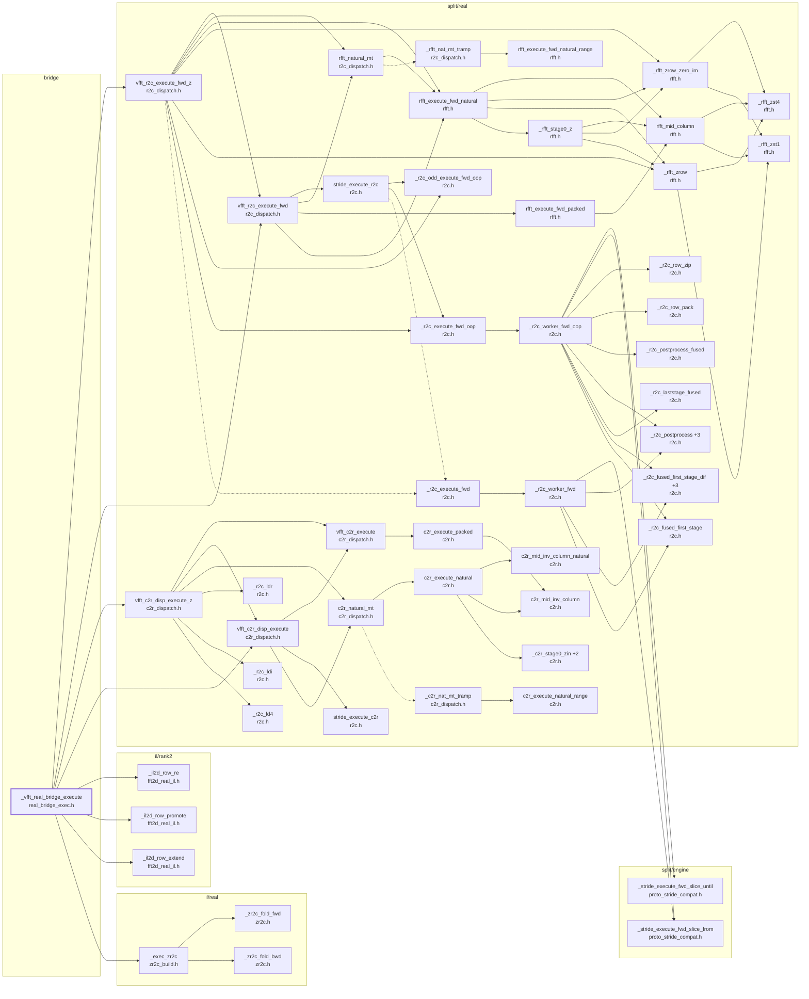

# the 1D real execute (through the bridge)

Generated by `src/tools/archgraph.py`. Do not edit.

What `_vfft_real_bridge_execute` (`bridge/real_bridge_exec.h`, line 16) calls, 4 levels deep. A solid arrow is a direct call; a
dashed arrow is a function passed or stored by name (a thread-pool task, a dispatch
table entry, a plan's function pointer). `+N` on a node: N more callees not drawn
(see `functions.md`, or run `python src/tools/archgraph.py --calls NAME`).

Shared helpers left out (6 or more callers each): `_r2c_execute_bwd`, `_vfft_pool_arm`, `stride_execute_fwd_serial`, `thread_pool_run`, `thread_pool_size`, `thread_pool_workers_for`, `vfft_execute`, `vfft_now_ns`.

Best effort: calls through function pointers and macros are not followed; both
sides of every `#if` are read.
