# the SPLIT side of the execute fork

Generated by `src/tools/archgraph.py`. Do not edit.

What `_vfft_split_execute` (`split/split_execute.h`, line 55) calls, 3 levels deep. A solid arrow is a direct call; a
dashed arrow is a function passed or stored by name (a thread-pool task, a dispatch
table entry, a plan's function pointer). `+N` on a node: N more callees not drawn
(see `functions.md`, or run `python src/tools/archgraph.py --calls NAME`).

```mermaid
flowchart LR
    subgraph n_f__core_["src/core"]
        n_fn__exec_c2c_inplace["_exec_c2c_inplace<br/>vfft.c"]
        n_fn__natorder_2d["_natorder_2d<br/>vfft.c"]
        n_fn__natorder_mt["_natorder_mt<br/>vfft.c"]
    end
    subgraph n_f_common_move["common/move"]
        n_fn__vfft_k1_transpose_perm["_vfft_k1_transpose_perm<br/>k1_transpose.h"]
    end
    subgraph n_f_split["split"]
        n_fn__exec_k1_split["_exec_k1_split<br/>split_execute.h"]
        n_fn__vfft_split_execute["_vfft_split_execute<br/>split_execute.h"]:::entry
    end
    subgraph n_f_split_engine["split/engine"]
        n_fn__c2c_mt["_c2c_mt<br/>mt_execute.h"]
        n_fn__ip_tramp["_ip_tramp<br/>mt_execute.h"]
        n_fn_vfft_proto_execute_bwd_generic["vfft_proto_execute_bwd_generic +1<br/>executor_generic.h"]
    end
    subgraph n_f_split_natorder["split/natorder"]
        n_fn__nat_range_tramp["_nat_range_tramp<br/>natorder_mt.h"]
        n_fn__natorder_reorder_mt["_natorder_reorder_mt<br/>natorder_mt.h"]
        n_fn__scr_fwd_mt["_scr_fwd_mt<br/>natorder_mt.h"]
        n_fn__scr_modeb_tramp["_scr_modeb_tramp<br/>natorder_mt.h"]
        n_fn__scr_term_tramp["_scr_term_tramp +1<br/>natorder_mt.h"]
        n_fn_natorder_scr_fwd["natorder_scr_fwd +1<br/>natorder_scatter.h"]
        n_fn_vfft_natorder_cycle_pass_inv["vfft_natorder_cycle_pass_inv +1<br/>natorder_exec.h"]
        n_fn_vfft_natorder_cycle_range["vfft_natorder_cycle_range +1<br/>natorder_exec.h"]
        n_fn_vfft_natorder_pair_range["vfft_natorder_pair_range +1<br/>natorder_exec.h"]
    end
    subgraph n_f_split_oop["split/oop"]
        n_fn__oop_mt["_oop_mt<br/>oop_mt.h"]
        n_fn__oop_mt_tramp["_oop_mt_tramp<br/>oop_mt.h"]
        n_fn__oop_slice_bwd["_oop_slice_bwd<br/>oop_mt.h"]
        n_fn__oop_slice_fwd["_oop_slice_fwd<br/>oop_mt.h"]
        n_fn_vfft_oop_execute_bwd["vfft_oop_execute_bwd<br/>oop_plan.h"]
        n_fn_vfft_oop_execute_fwd_2pa["vfft_oop_execute_fwd_2pa<br/>oop_plan.h"]
        n_fn_vfft_oop_execute_fwd_2pa_twl["vfft_oop_execute_fwd_2pa_twl<br/>oop_plan.h"]
        n_fn_vfft_oop_execute_fwd_2pb["vfft_oop_execute_fwd_2pb<br/>oop_plan.h"]
        n_fn_vfft_oop_execute_fwd_ccol["vfft_oop_execute_fwd_ccol<br/>oop_plan.h"]
        n_fn_vfft_proto_execute_fwd_oop["vfft_proto_execute_fwd_oop<br/>oop_execute.h"]
    end
    subgraph n_f_split_rank2["split/rank2"]
        n_fn__f2d_sr2c_bwd_rows["_f2d_sr2c_bwd_rows +1<br/>fft2d_r2c.h"]
        n_fn__f2d_sr2c_fwd_rows["_f2d_sr2c_fwd_rows +1<br/>fft2d_r2c.h"]
        n_fn__fft2d_r2c_execute_bwd_oop["_fft2d_r2c_execute_bwd_oop<br/>fft2d_r2c.h"]
        n_fn__fft2d_r2c_execute_fwd_oop["_fft2d_r2c_execute_fwd_oop<br/>fft2d_r2c.h"]
        n_fn__fft2d_r2c_tiled_bwd_mt["_fft2d_r2c_tiled_bwd_mt +4<br/>fft2d_r2c.h"]
        n_fn__fft2d_r2c_tiled_fwd_mt["_fft2d_r2c_tiled_fwd_mt +4<br/>fft2d_r2c.h"]
        n_fn__stw_c2r_bwd["_stw_c2r_bwd +3<br/>strided_tw.h"]
        n_fn__stw_r2c_fwd["_stw_r2c_fwd +3<br/>strided_tw.h"]
        n_fn_stride_execute_2d_c2r["stride_execute_2d_c2r<br/>fft2d_r2c.h"]
        n_fn_stride_execute_2d_r2c["stride_execute_2d_r2c<br/>fft2d_r2c.h"]
    end
    subgraph n_f_split_rank3["split/rank3"]
        n_fn__fndr_axis_mt["_fndr_axis_mt<br/>fftnd_r2c.h"]
        n_fn__fndr_axis_range["_fndr_axis_range<br/>fftnd_r2c.h"]
        n_fn__fndr_axis_tramp["_fndr_axis_tramp<br/>fftnd_r2c.h"]
        n_fn__fndr_execute_bwd_oop["_fndr_execute_bwd_oop<br/>fftnd_r2c.h"]
        n_fn__fndr_execute_fwd_oop["_fndr_execute_fwd_oop<br/>fftnd_r2c.h"]
        n_fn__fndr_pack["_fndr_pack<br/>fftnd_r2c.h"]
        n_fn__fndr_rows_bwd_range["_fndr_rows_bwd_range +2<br/>fftnd_r2c.h"]
        n_fn__fndr_rows_fwd_range["_fndr_rows_fwd_range +2<br/>fftnd_r2c.h"]
        n_fn__fndr_rows_mt["_fndr_rows_mt<br/>fftnd_r2c.h"]
        n_fn__fndr_sim["_fndr_sim<br/>fftnd_r2c.h"]
        n_fn__fndr_sre["_fndr_sre<br/>fftnd_r2c.h"]
        n_fn__fndr_tile_tramp["_fndr_tile_tramp<br/>fftnd_r2c.h"]
        n_fn__fndr_unpack["_fndr_unpack<br/>fftnd_r2c.h"]
    end
    subgraph n_f_split_trig["split/trig"]
        n_fn_stride_execute_dct1["stride_execute_dct1<br/>dct1.h"]
        n_fn_stride_execute_dct2["stride_execute_dct2<br/>dct.h"]
        n_fn_stride_execute_dct3["stride_execute_dct3<br/>dct.h"]
        n_fn_stride_execute_dct4["stride_execute_dct4<br/>dct4.h"]
        n_fn_stride_execute_dht["stride_execute_dht<br/>dht.h"]
        n_fn_stride_execute_dst1["stride_execute_dst1<br/>dct1.h"]
        n_fn_stride_execute_dst2["stride_execute_dst2<br/>dst.h"]
        n_fn_stride_execute_dst3["stride_execute_dst3<br/>dst.h"]
    end
    n_fn__c2c_mt -.-> n_fn__ip_tramp
    n_fn__exec_c2c_inplace --> n_fn__c2c_mt
    n_fn__exec_c2c_inplace --> n_fn__natorder_mt
    n_fn__exec_c2c_inplace --> n_fn__scr_fwd_mt
    n_fn__exec_k1_split --> n_fn_vfft_oop_execute_fwd_2pa
    n_fn__exec_k1_split --> n_fn_vfft_oop_execute_fwd_2pa_twl
    n_fn__exec_k1_split --> n_fn_vfft_oop_execute_fwd_2pb
    n_fn__exec_k1_split --> n_fn_vfft_oop_execute_fwd_ccol
    n_fn__fft2d_r2c_execute_bwd_oop --> n_fn__f2d_sr2c_bwd_rows
    n_fn__fft2d_r2c_execute_bwd_oop --> n_fn__fft2d_r2c_tiled_bwd_mt
    n_fn__fft2d_r2c_execute_bwd_oop --> n_fn__stw_c2r_bwd
    n_fn__fft2d_r2c_execute_fwd_oop --> n_fn__f2d_sr2c_fwd_rows
    n_fn__fft2d_r2c_execute_fwd_oop --> n_fn__fft2d_r2c_tiled_fwd_mt
    n_fn__fft2d_r2c_execute_fwd_oop --> n_fn__stw_r2c_fwd
    n_fn__fndr_axis_mt --> n_fn__fndr_axis_range
    n_fn__fndr_axis_mt -.-> n_fn__fndr_axis_tramp
    n_fn__fndr_axis_mt --> n_fn_vfft_natorder_cycle_pass_inv
    n_fn__fndr_execute_bwd_oop --> n_fn__fndr_axis_mt
    n_fn__fndr_execute_bwd_oop --> n_fn__fndr_pack
    n_fn__fndr_execute_bwd_oop --> n_fn__fndr_rows_mt
    n_fn__fndr_execute_fwd_oop --> n_fn__fndr_axis_mt
    n_fn__fndr_execute_fwd_oop --> n_fn__fndr_rows_mt
    n_fn__fndr_execute_fwd_oop --> n_fn__fndr_unpack
    n_fn__fndr_rows_mt --> n_fn__f2d_sr2c_bwd_rows
    n_fn__fndr_rows_mt --> n_fn__f2d_sr2c_fwd_rows
    n_fn__fndr_rows_mt --> n_fn__fndr_rows_bwd_range
    n_fn__fndr_rows_mt --> n_fn__fndr_rows_fwd_range
    n_fn__fndr_rows_mt --> n_fn__fndr_sim
    n_fn__fndr_rows_mt --> n_fn__fndr_sre
    n_fn__fndr_rows_mt -.-> n_fn__fndr_tile_tramp
    n_fn__natorder_2d --> n_fn__natorder_reorder_mt
    n_fn__natorder_mt --> n_fn__natorder_reorder_mt
    n_fn__natorder_reorder_mt -.-> n_fn__nat_range_tramp
    n_fn__natorder_reorder_mt --> n_fn_vfft_natorder_cycle_range
    n_fn__natorder_reorder_mt --> n_fn_vfft_natorder_pair_range
    n_fn__oop_mt -.-> n_fn__oop_mt_tramp
    n_fn__oop_mt --> n_fn_vfft_oop_execute_bwd
    n_fn__oop_mt_tramp --> n_fn__oop_slice_bwd
    n_fn__oop_mt_tramp --> n_fn__oop_slice_fwd
    n_fn__scr_fwd_mt -.-> n_fn__scr_modeb_tramp
    n_fn__scr_fwd_mt -.-> n_fn__scr_term_tramp
    n_fn__scr_fwd_mt --> n_fn_natorder_scr_fwd
    n_fn__vfft_split_execute --> n_fn__exec_c2c_inplace
    n_fn__vfft_split_execute --> n_fn__exec_k1_split
    n_fn__vfft_split_execute --> n_fn__fndr_execute_bwd_oop
    n_fn__vfft_split_execute --> n_fn__fndr_execute_fwd_oop
    n_fn__vfft_split_execute --> n_fn__natorder_2d
    n_fn__vfft_split_execute --> n_fn__oop_mt
    n_fn__vfft_split_execute --> n_fn_stride_execute_2d_c2r
    n_fn__vfft_split_execute --> n_fn_stride_execute_2d_r2c
    n_fn__vfft_split_execute --> n_fn_stride_execute_dct1
    n_fn__vfft_split_execute --> n_fn_stride_execute_dct2
    n_fn__vfft_split_execute --> n_fn_stride_execute_dct3
    n_fn__vfft_split_execute --> n_fn_stride_execute_dct4
    n_fn__vfft_split_execute --> n_fn_stride_execute_dht
    n_fn__vfft_split_execute --> n_fn_stride_execute_dst1
    n_fn__vfft_split_execute --> n_fn_stride_execute_dst2
    n_fn__vfft_split_execute --> n_fn_stride_execute_dst3
    n_fn_stride_execute_2d_c2r --> n_fn__fft2d_r2c_execute_bwd_oop
    n_fn_stride_execute_2d_r2c --> n_fn__fft2d_r2c_execute_fwd_oop
    n_fn_vfft_oop_execute_bwd --> n_fn_vfft_proto_execute_bwd_generic
    n_fn_vfft_oop_execute_fwd_ccol --> n_fn__vfft_k1_transpose_perm
    n_fn_vfft_oop_execute_fwd_ccol --> n_fn_vfft_proto_execute_fwd_oop
    classDef entry stroke-width:3px
```

Shared helpers left out (6 or more callers each): `_vfft_pool_arm`, `_vfft_warn`, `stride_execute_bwd`, `stride_execute_fwd`, `thread_pool_run`, `thread_pool_size`, `thread_pool_workers_for`, `vfft_natorder_cycle_pass`, `vfft_oop_execute_fwd`, `vfft_proto_execute_bwd`, `vfft_proto_execute_fwd`.

Best effort: calls through function pointers and macros are not followed; both
sides of every `#if` are read.
