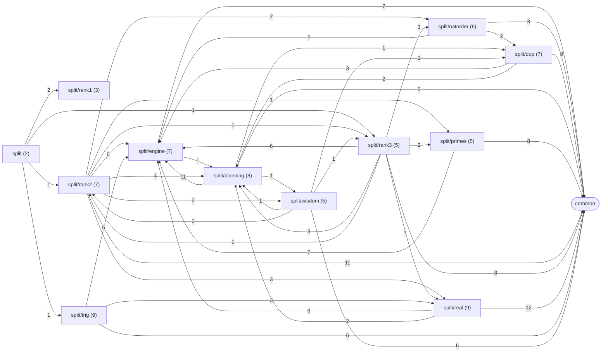
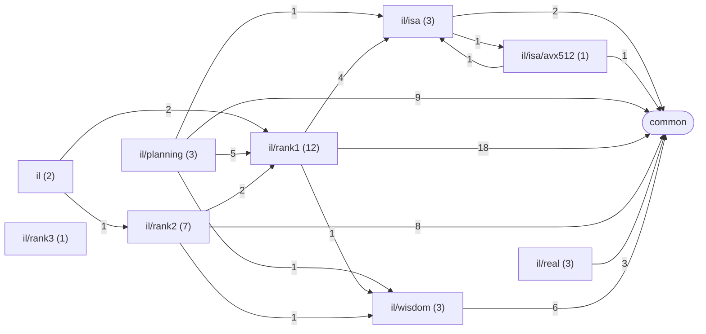
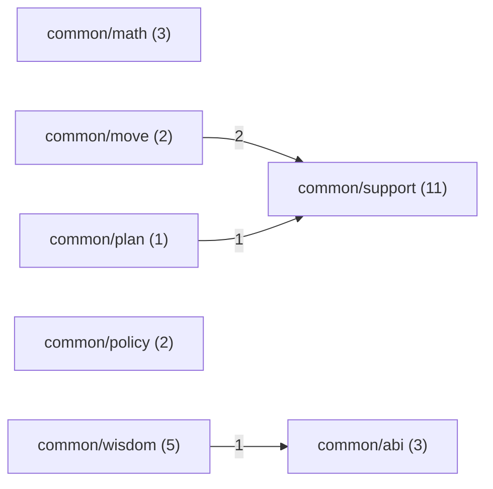
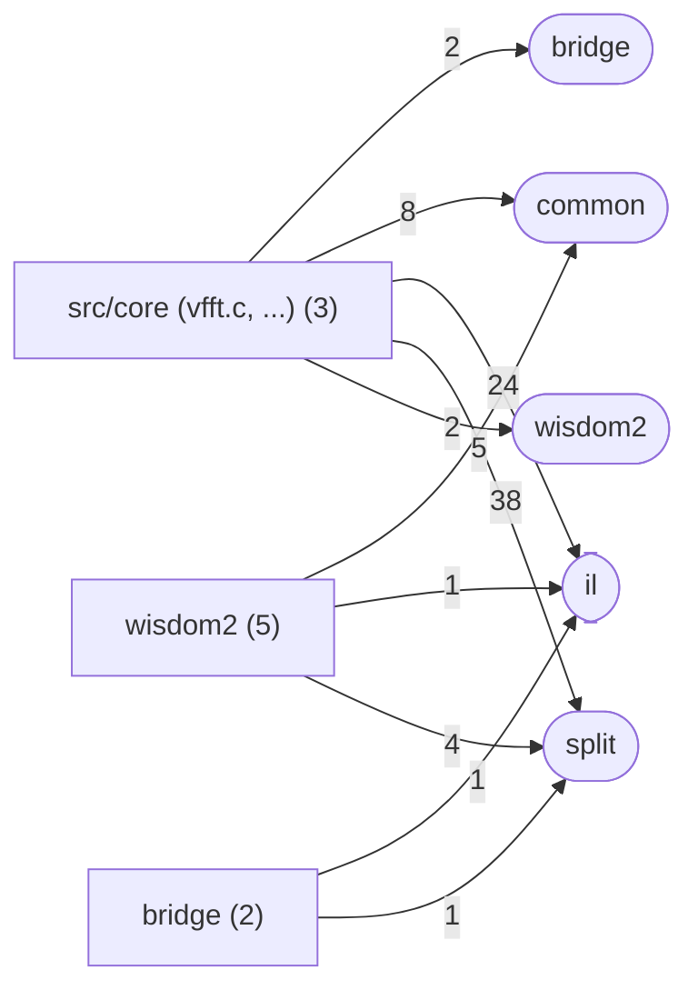

# Folders

Generated by `src/tools/archgraph.py`. Do not edit.

One diagram per zone. A box is a folder of `src/core` (with its file count); an
edge A --> B means files in A include files in B, labelled with the number of
includes. Includes that leave the zone end in a rounded node for the target zone.
Per-folder file diagrams are in `folders/`, the full lists in `map.md`.

## split

## il

## common

## bridge, wisdom2 and the front door

