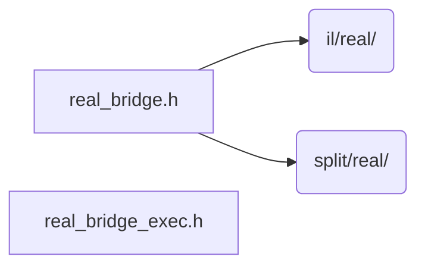

# src/core/bridge

Generated by `src/tools/archgraph.py`. Do not edit. Zone: `bridge`.

Files of this folder and their includes. Includes of files in other folders are
collapsed to that folder (a rounded node); the full lists are in `../map.md`.

- `real_bridge.h`: the 1D r2c / c2r CREATE: where the two layouts still meet.
- `real_bridge_exec.h`: the 1D r2c / c2r EXECUTE: where the layouts still meet.

