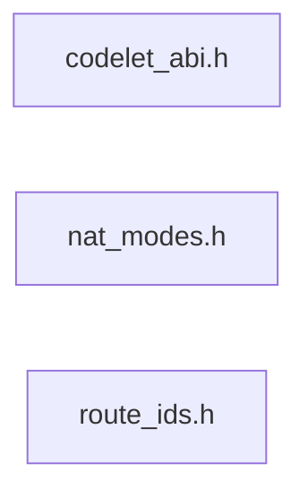

# src/core/common/abi

Generated by `src/tools/archgraph.py`. Do not edit. Zone: `common`.

Files of this folder and their includes. Includes of files in other folders are
collapsed to that folder (a rounded node); the full lists are in `../map.md`.

- `codelet_abi.h`: the 11-argument codelet signature both layouts share.
- `nat_modes.h`: the natural-order mode ids stored in split @nat wisdom rows.
- `route_ids.h`: the K=1 route ids of BOTH layouts and the OOP wisdom/plan kinds.

