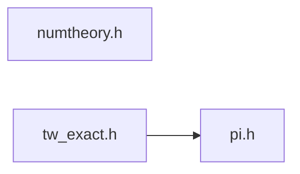

# src/core/common/math

Generated by `src/tools/archgraph.py`. Do not edit. Zone: `common`.

Files of this folder and their includes. Includes of files in other folders are
collapsed to that folder (a rounded node); the full lists are in `../map.md`.

- `numtheory.h`: the small integer helpers both prime engines need, once.
- `pi.h`: THE value of pi, once (the utilities merge, 2026-09-27).
- `tw_exact.h`: cos/sin(2*pi*p/n) rounded ONCE to double, from the integers.

