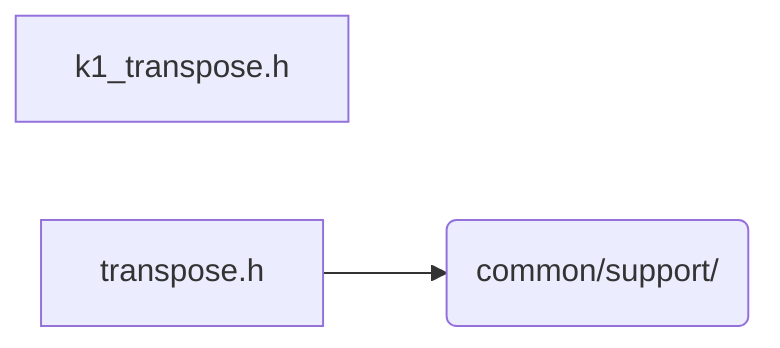

# src/core/common/move

Generated by `src/tools/archgraph.py`. Do not edit. Zone: `common`.

Files of this folder and their includes. Includes of files in other folders are
collapsed to that folder (a rounded node); the full lists are in `../map.md`.

- `k1_transpose.h`: the plane transposes of the K=1 four-step passes.
- `transpose.h`: Multi-regime cache-oblivious SIMD matrix transpose

