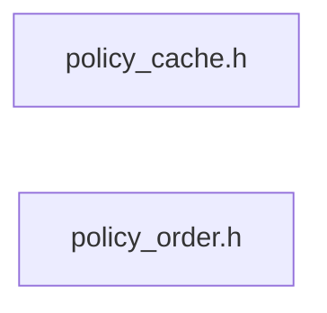

# src/core/common/policy

Generated by `src/tools/archgraph.py`. Do not edit. Zone: `common`.

Files of this folder and their includes. Includes of files in other folders are
collapsed to that folder (a rounded node); the full lists are in `../map.md`.

- `policy_cache.h`: L8, a working set against the cache the CPU reports.
- `policy_order.h`: L4, the ORDER law, and the CELL: layout-neutral policy.

