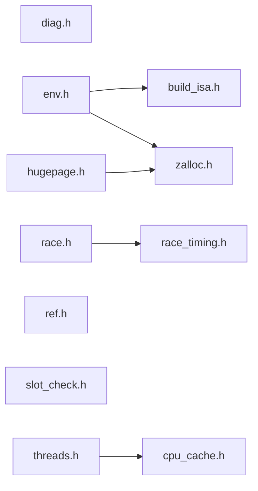

# src/core/common/support

Generated by `src/tools/archgraph.py`. Do not edit. Zone: `common`.

Files of this folder and their includes. Includes of files in other folders are
collapsed to that folder (a rounded node); the full lists are in `../map.md`.

- `build_isa.h`: THE build's ISA, decided once.
- `cpu_cache.h`: cache capacities and SMT width, discovered once at PLAN time.
- `diag.h`: the loud-refusal helpers.
- `env.h`: the runtime environment. Two parts:
- `hugepage.h`: 2 MB pages for big data planes: vfft_alloc_huge / vfft_free_huge.
- `race.h`: the one race body shared by the in-process racers.
- `race_timing.h`: THE monotonic clock: every racer and planner times with it.
- `ref.h`: the benchmark reference-backend interface.
- `slot_check.h`: the one SLOT-INVARIANT walk, shared by the form checkers.
- `threads.h`: the thread pool.
- `zalloc.h`: THE allocator: 64-byte-aligned memory for every buffer, table and scratch arena in the library (the utilities merge, 2026-09-27).

