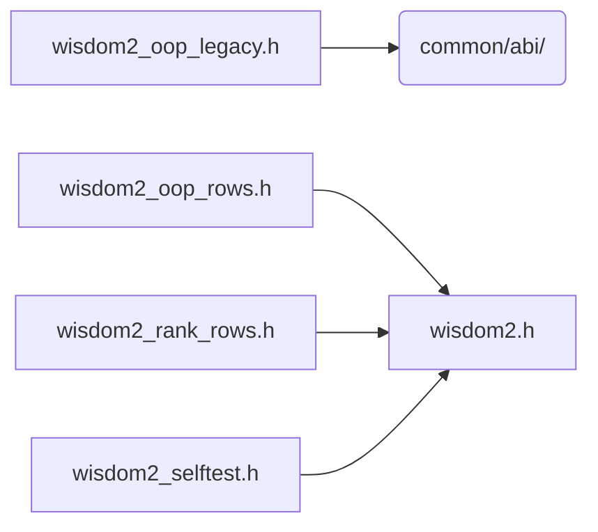

# src/core/common/wisdom

Generated by `src/tools/archgraph.py`. Do not edit. Zone: `common`.

Files of this folder and their includes. Includes of files in other folders are
collapsed to that folder (a rounded node); the full lists are in `../map.md`.

- `wisdom2.h`: THE VectorFFT wisdom store: the only parser and the only writer of the @vw2 grammar, everywhere (library, calibrators, benches, gates).
- `wisdom2_oop_legacy.h`: the FROZEN legacy oop_wisdom.txt format: its dual entry struct, table, loader and lookups.
- `wisdom2_oop_rows.h`: the OOP family's row MECHANICS, shared by both layouts' codecs: token parsing, the engine tag, the date stamp, the kind-3 (K=1) row scan by layout, and the existence queries.
- `wisdom2_rank_rows.h`: the rank>=2 row helpers both layouts' 2D/3D codecs use: the canonical request key, the record key, the MEASURE/provenance tail and the fill-only bank.
- `wisdom2_selftest.h`: the unit gates for the wisdom2 module, OWNED BY THE MODULE (the thin-driver law): bench files only make calls; every scenario, assertion, and helper lives here beside the code i...

