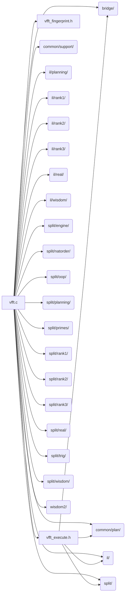

# src/core (top level)

Generated by `src/tools/archgraph.py`. Do not edit. Zone: `front`.

Files of this folder and their includes. Includes of files in other folders are
collapsed to that folder (a rounded node); the full lists are in `../map.md`.

- `vfft.c`: the vfft_create / vfft_execute front door: resolve wisdom -> calibrate-on-miss at the chosen rigor -> build -> execute.
- `vfft_execute.h`: THE execute entry point.
- `vfft_fingerprint.h`: the create-time PLAN FINGERPRINT.

