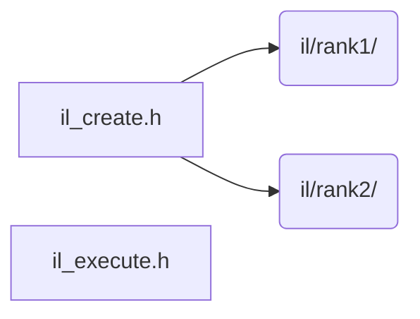

# src/core/il

Generated by `src/tools/archgraph.py`. Do not edit. Zone: `il`.

Files of this folder and their includes. Includes of files in other folders are
collapsed to that folder (a rounded node); the full lists are in `../map.md`.

- `il_create.h`: the INTERLEAVED create: the IL side of vfft_create's one fork.
- `il_execute.h`: the INTERLEAVED execute: the IL side of vfft_execute's one fork.

