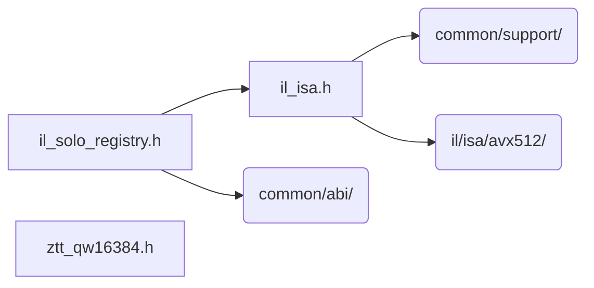

# src/core/il/isa

Generated by `src/tools/archgraph.py`. Do not edit. Zone: `il`.

Files of this folder and their includes. Includes of files in other folders are
collapsed to that folder (a rounded node); the full lists are in `../map.md`.

- `il_isa.h`: the IL (interleaved-complex, zil) family at the build's ISA.
- `il_solo_registry.h`: the interleaved K=1 SOLO tier's kernels and resolvers.
- `ztt_qw16384.h`: ZTURN-T's BAKED QUARTER-WAVE: sin(2*pi*k/16384), k = 0..4096, 4097 doubles (32776 B of .rodata), generated by zt_bake_qw.c (hex-float, exact).

