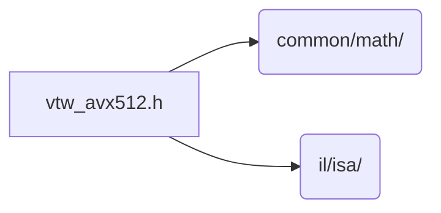

# src/core/il/isa/avx512

Generated by `src/tools/archgraph.py`. Do not edit. Zone: `il`.

Files of this folder and their includes. Includes of files in other folders are
collapsed to that folder (a rounded node); the full lists are in `../map.md`.

- `vtw_avx512.h`: every AVX-512 twiddle table of the IL runtime, and nothing else.

