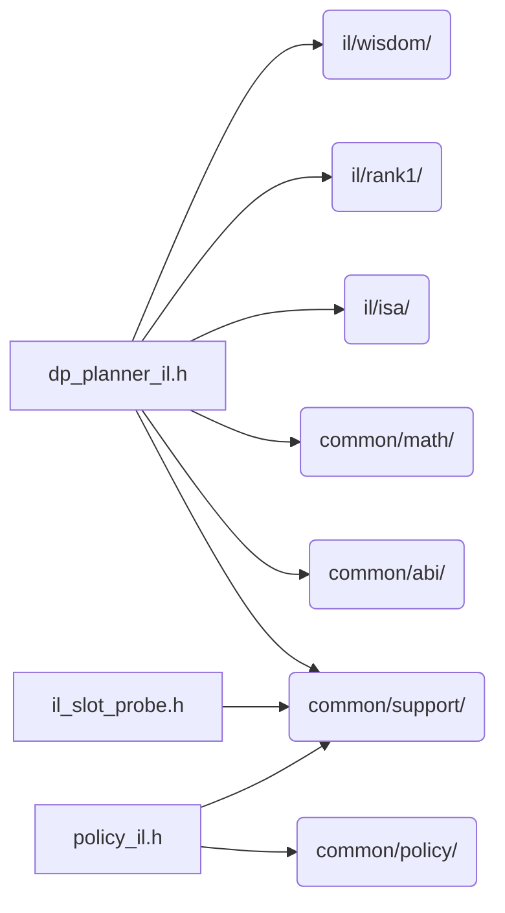

# src/core/il/planning

Generated by `src/tools/archgraph.py`. Do not edit. Zone: `il`.

Files of this folder and their includes. Includes of files in other folders are
collapsed to that folder (a rounded node); the full lists are in `../map.md`.

- `dp_planner_il.h`: measured plan search for the INTERLEAVED (IL) K=1 axis.
- `il_slot_probe.h`: the INTERLEAVED PAIR tier's half of the slot invariant: which slots exist, and how to build and check one.
- `policy_il.h`: THE planning policy: the one place a law about a REQUEST is written (docs/design/planning_policy_design.md).

