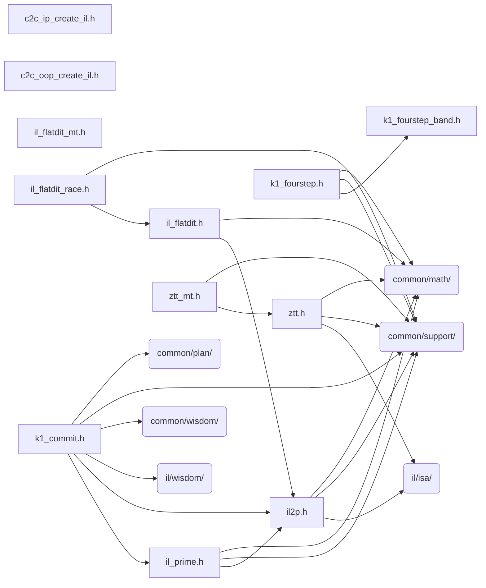

# src/core/il/rank1

Generated by `src/tools/archgraph.py`. Do not edit. Zone: `il`.

Files of this folder and their includes. Includes of files in other folders are
collapsed to that folder (a rounded node); the full lists are in `../map.md`.

- `c2c_ip_create_il.h`: the c2c IN-PLACE create, interleaved tier.
- `c2c_oop_create_il.h`: the c2c OUT-OF-PLACE create, interleaved tier.
- `il2p.h`: PURE-IL two-pass K=1 route (bailey2 shape, interleaved end to end).
- `il_flatdit.h`: the FLAT mixed-radix DIT chain, un-turned: the generic-N engine on the pure-IL kinds.
- `il_flatdit_mt.h`: the FLAT mixed-radix DIT's intra-transform threading (docs/design/3D_mt_il_strategy.md declares the method).
- `il_flatdit_race.h`: the flat DIT's create-time races on the shared race body.
- `il_prime.h`: PRIME-N K=1 route on the PURE-IL machinery (OOP, NATURAL, interleaved z->z, both directions).
- `k1_commit.h`: the K=1 plan's replay, race, and commit.
- `k1_fourstep.h`: the K=1 INTERLEAVED four-step above ZTURN-T's ceiling (docs/design/k1_fourstep_design.md): the standard method at 256k and above.
- `k1_fourstep_band.h`: the K=1 interleaved four-step's BAND (docs/design/ k1_fourstep_design.md): the sizes the engine serves and the side ladder its splits draw from.
- `ztt.h`: ZTURN-T: the RUN-CONTIGUOUS DIT engine for K=1 interleaved c2c, 16 <= N <= 262144, route VFFT_K1_IL_ZTT.
- `ztt_mt.h`: ZTURN-T's THREADED arm: the staged walk, sectioned (docs/design/ztt_mt_design.md).

