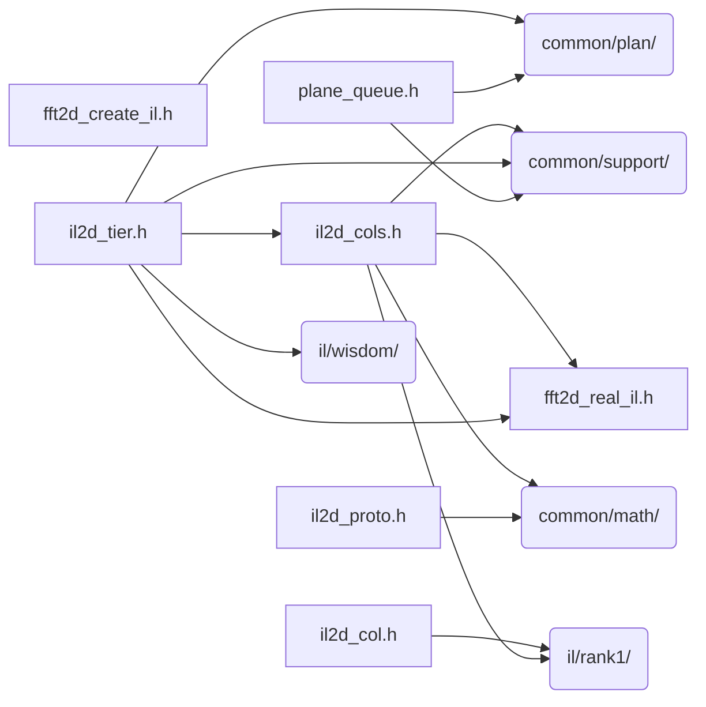

# src/core/il/rank2

Generated by `src/tools/archgraph.py`. Do not edit. Zone: `il`.

Files of this folder and their includes. Includes of files in other folders are
collapsed to that folder (a rounded node); the full lists are in `../map.md`.

- `fft2d_create_il.h`: the rank-2 CREATE, interleaved tier.
- `fft2d_real_il.h`: the native IL 2D REAL tier's execution kernels (docs/roadmap/fft2d_real_il_design.md; the row-pass drivers live in il2d_tier.h — this header holds the kernel-grade data movement...
- `il2d_col.h`: THE COLUMN-AXIS PASS DESCRIPTOR.
- `il2d_cols.h`: native IL 2D: the column-chain machinery.
- `il2d_proto.h`: SCALAR SIMULATOR for the native IL 2D c2c tier's stage maps (docs/roadmap/fft2d_il_c2c_design.md).
- `il2d_tier.h`: the native interleaved 2D tier.
- `plane_queue.h`: the 2D plane queue (howmany > 1).

