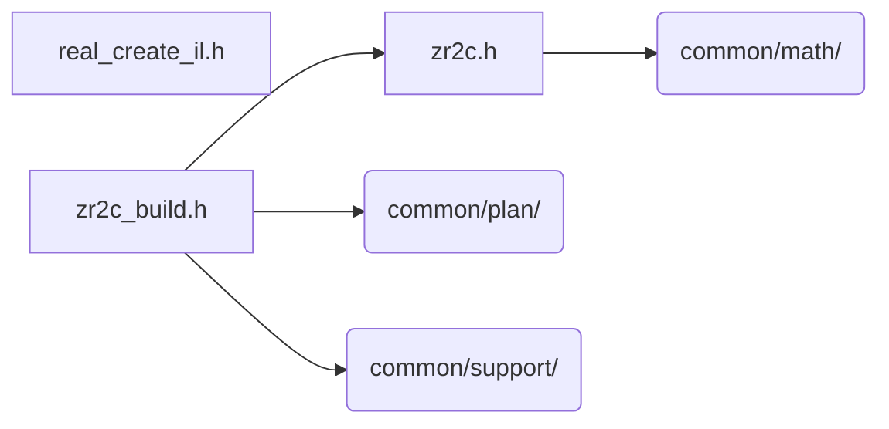

# src/core/il/real

Generated by `src/tools/archgraph.py`. Do not edit. Zone: `il`.

Files of this folder and their includes. Includes of files in other folders are
collapsed to that folder (a rounded node); the full lists are in `../map.md`.

- `real_create_il.h`: the r2c / c2r CREATE, interleaved tier.
- `zr2c.h`: INTERLEAVED (z) real-transform folds: the "CCE-mirror IL" route's two hand-written passes (measured −30…−59% vs the K-axis fold).
- `zr2c_build.h`: the interleaved-CCE real route ("kind 5").

