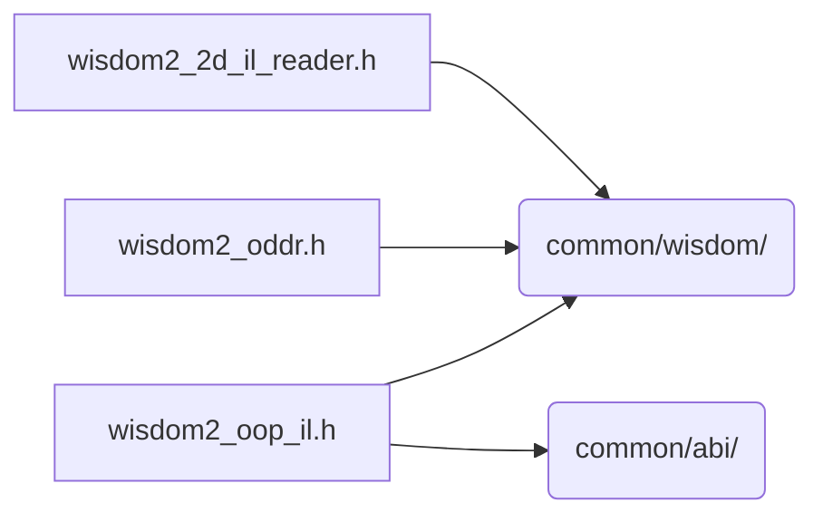

# src/core/il/wisdom

Generated by `src/tools/archgraph.py`. Do not edit. Zone: `il`.

Files of this folder and their includes. Includes of files in other folders are
collapsed to that folder (a rounded node); the full lists are in `../map.md`.

- `wisdom2_2d_il_reader.h`: the INTERLEAVED rank>=2 cell codec: the lay=il rows of the native IL 2D tier (column chains, forms, axis races), the IL 2D real rows and the rank-3 IL (ilnd) tokens.
- `wisdom2_oddr.h`: the ODD-REAL route verdict row (lay=il component row).
- `wisdom2_oop_il.h`: the INTERLEAVED library's OOP-family wisdom: its K=1 record and codec.

