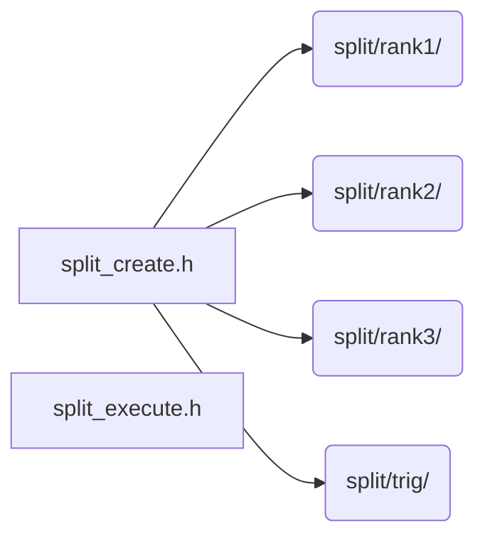

# src/core/split

Generated by `src/tools/archgraph.py`. Do not edit. Zone: `split`.

Files of this folder and their includes. Includes of files in other folders are
collapsed to that folder (a rounded node); the full lists are in `../map.md`.

- `split_create.h`: the SPLIT create: the split side of vfft_create's one fork.
- `split_execute.h`: the SPLIT execute: the split side of vfft_execute's one fork.

