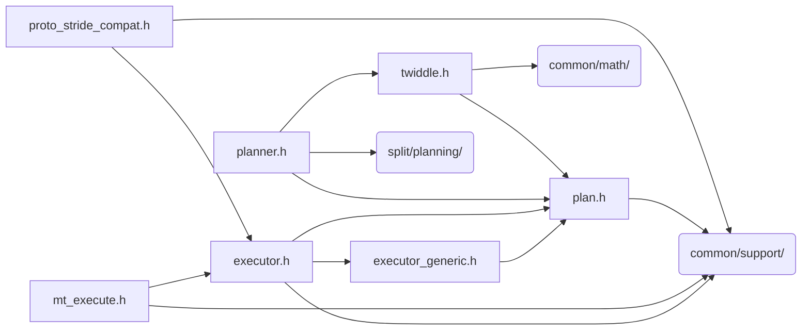

# src/core/split/engine

Generated by `src/tools/archgraph.py`. Do not edit. Zone: `split`.

Files of this folder and their includes. Includes of files in other folders are
collapsed to that folder (a rounded node); the full lists are in `../map.md`.

- `executor.h`: single-threaded, in-place 1D C2C execution dispatch.
- `executor_generic.h`: cold-cell fallback executor for 1D C2C.
- `mt_execute.h`: the generic K-split multithreaded executor.
- `plan.h`: the entry point for stride_plan_t / stride_stage_t (1D C2C).
- `planner.h`: 1D C2C plan construction (the in-place stride engine).
- `proto_stride_compat.h`: the stride_* API over the vfft_proto_* engine.
- `twiddle.h`: per-stage layout + twiddle compute for 1D C2C plans (the in-place stride engine).

