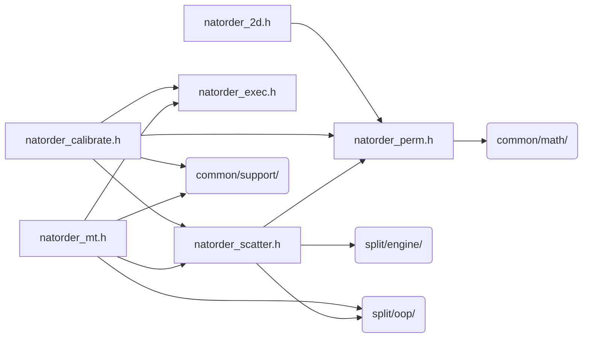

# src/core/split/natorder

Generated by `src/tools/archgraph.py`. Do not edit. Zone: `split`.

Files of this folder and their includes. Includes of files in other folders are
collapsed to that folder (a rounded node); the full lists are in `../map.md`.

- `natorder_2d.h`: shared 2D natural-order axis reorder-tape builder.
- `natorder_calibrate.h`: the ORDER_NATURAL per-cell verdict race: PURE (floor) vs injected-chain PSWAP vs SCR scatter terminator.
- `natorder_exec.h`: execute-time reorder passes for VFFT_ORDER_NATURAL.
- `natorder_mt.h`: the natural-order reorder passes, multithreaded.
- `natorder_perm.h`: plan-time permutation machinery for VFFT_ORDER_NATURAL (in-place 1D c2c).
- `natorder_scatter.h`: SCR (scatter terminator) mode for VFFT_ORDER_NATURAL (in-place 1D c2c).

