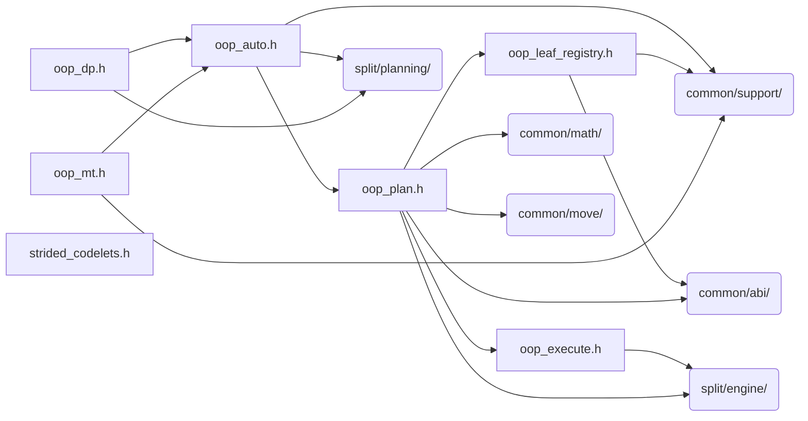

# src/core/split/oop

Generated by `src/tools/archgraph.py`. Do not edit. Zone: `split`.

Files of this folder and their includes. Includes of files in other folders are
collapsed to that folder (a rounded node); the full lists are in `../map.md`.

- `oop_auto.h`: wisdom-backed auto plan creation and the divisor-pair tuner.
- `oop_dp.h`: DP-planner-backed OOP c2c plan creation.
- `oop_execute.h`: Mode B out-of-place execution on the stride executor (plan.h / executor_generic.h path).
- `oop_leaf_registry.h`: hand-written registry for the OOP codelet families (11-arg generic ABI) and the K=1 mono/solo kernels on the same ABI.
- `oop_mt.h`: out-of-place c2c, multithreaded by lane slice.
- `oop_plan.h`: the split-layout OOP plan kinds.
- `strided_codelets.h`: the typed registry for the strided (Design C, 2D row) codelet family.

