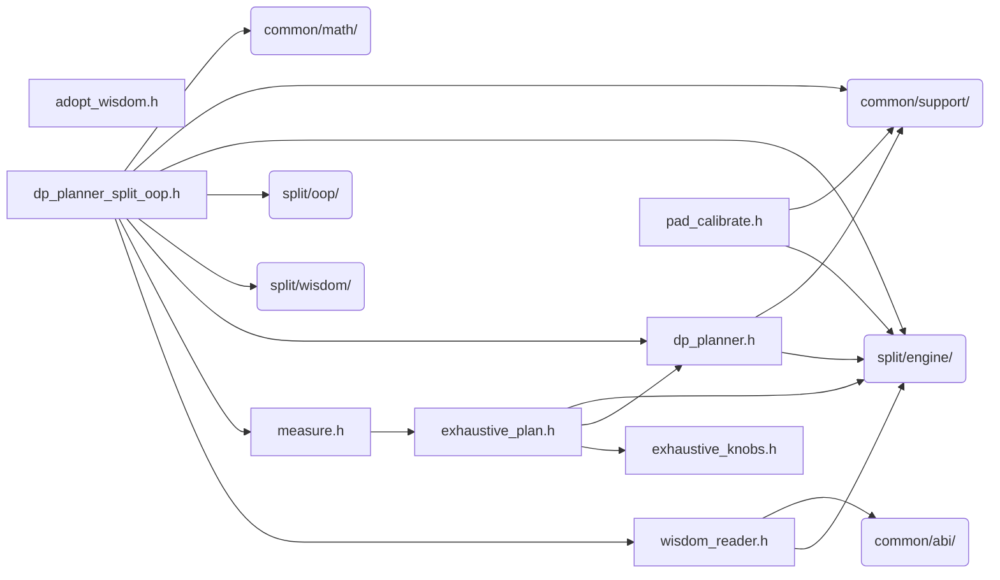

# src/core/split/planning

Generated by `src/tools/archgraph.py`. Do not edit. Zone: `split`.

Files of this folder and their includes. Includes of files in other folders are
collapsed to that folder (a rounded node); the full lists are in `../map.md`.

- `adopt_wisdom.h`: persisted strided-adoption decisions.
- `dp_planner.h`: Recursive dynamic programming planner
- `dp_planner_split_oop.h`: the SPLIT-OOP-engine planner (kind-3 sp fields).
- `exhaustive_knobs.h`: the split EXHAUSTIVE planner's depth / prune knobs.
- `exhaustive_plan.h`: exhaustive measurement-based planner (stride engine).
- `measure.h`: VFFT_MEASURE: top-K + variant-aware (DIT/DIF) planner.
- `pad_calibrate.h`: the pad-vs-tail calibrator.
- `wisdom_reader.h`: the stride engine's c2c wisdom table (text format).

