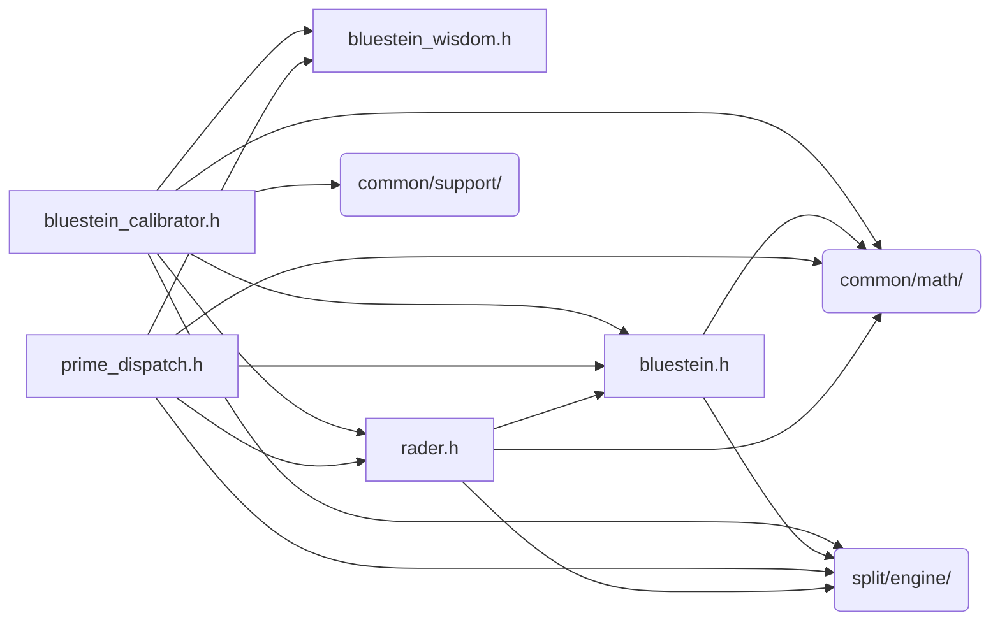

# src/core/split/primes

Generated by `src/tools/archgraph.py`. Do not edit. Zone: `split`.

Files of this folder and their includes. Includes of files in other folders are
collapsed to that folder (a rounded node); the full lists are in `../map.md`.

- `bluestein.h`: Bluestein's algorithm for arbitrary-size FFT
- `bluestein_calibrator.h`: Bluestein/Rader (M, B) parameter calibration.
- `bluestein_wisdom.h`: Per-(N, K) wisdom for Bluestein/Rader prime cells.
- `prime_dispatch.h`: prime-N planning for the stride engine (Rader, Bluestein).
- `rader.h`: Rader's algorithm for prime-size FFT

