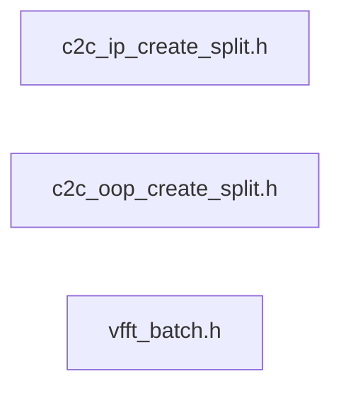

# src/core/split/rank1

Generated by `src/tools/archgraph.py`. Do not edit. Zone: `split`.

Files of this folder and their includes. Includes of files in other folders are
collapsed to that folder (a rounded node); the full lists are in `../map.md`.

- `c2c_ip_create_split.h`: the c2c IN-PLACE create, split tier.
- `c2c_oop_create_split.h`: the c2c OUT-OF-PLACE create, split tier.
- `vfft_batch.h`: the OWNED-BATCH allocator (migration step 28).

