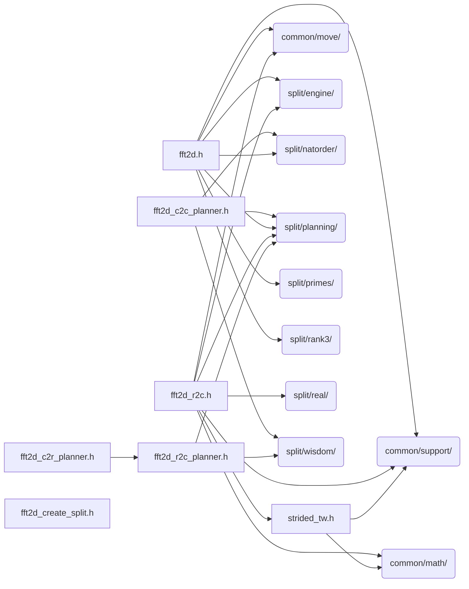

# src/core/split/rank2

Generated by `src/tools/archgraph.py`. Do not edit. Zone: `split`.

Files of this folder and their includes. Includes of files in other folders are
collapsed to that folder (a rounded node); the full lists are in `../map.md`.

- `fft2d.h`: split-complex 2D FFT with two methods: tiled and Bailey
- `fft2d_c2c_planner.h`: dedicated 2D C2C planner (one (N1,N2) cell).
- `fft2d_c2r_planner.h`: dedicated 2D C2R planner (one (N1,N2) cell).
- `fft2d_create_split.h`: the rank-2 CREATE, split tier.
- `fft2d_r2c.h`: 2D Real-to-Complex / Complex-to-Real FFT
- `fft2d_r2c_planner.h`: dedicated 2D R2C planner (one (N1,N2) cell).
- `strided_tw.h`: the strided TWIDDLE-STAGE row engine.

