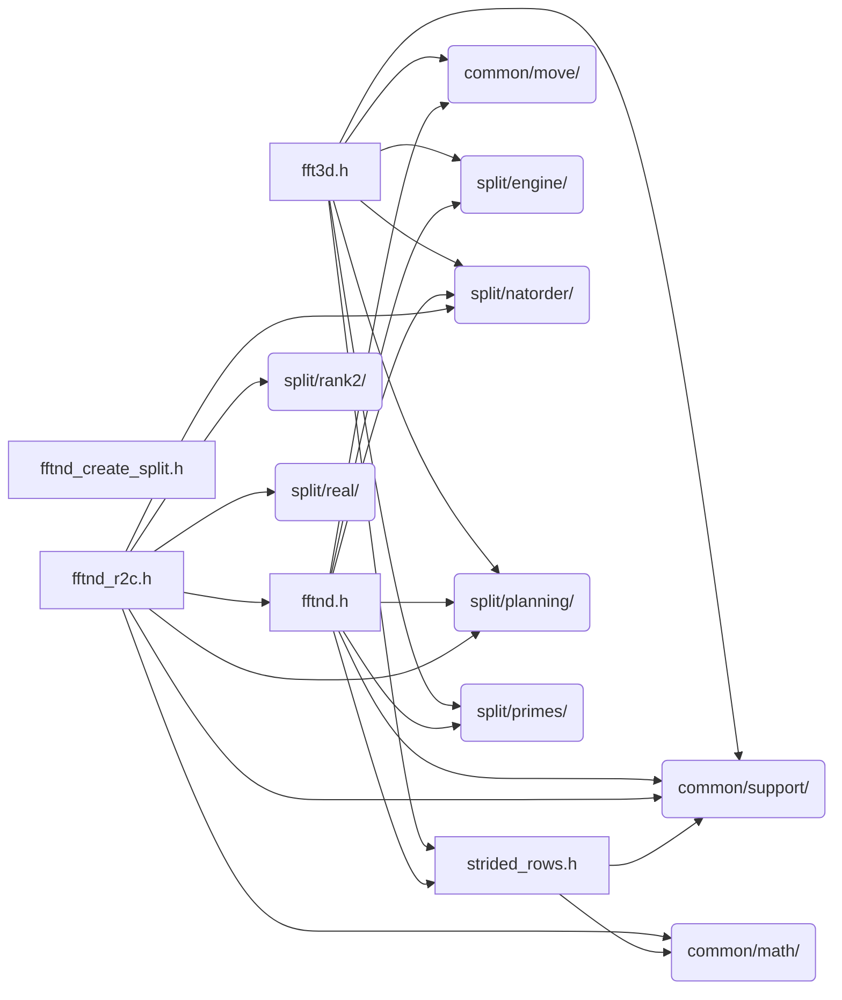

# src/core/split/rank3

Generated by `src/tools/archgraph.py`. Do not edit. Zone: `split`.

Files of this folder and their includes. Includes of files in other folders are
collapsed to that folder (a rounded node); the full lists are in `../map.md`.

- `fft3d.h`: 3D c2c FFT: three tensor-factor passes over a row-major cube.
- `fftnd.h`: rank-general (2..4D) c2c FFT: unfused leading passes + a fused trailing group
- `fftnd_create_split.h`: the rank-3 and rank-4 SPLIT create tiers.
- `fftnd_r2c.h`: rank-general (2..4D) real-to-complex / complex-to-real, reducing along the LAST axis (the usual convention).
- `strided_rows.h`: OPT-IN STRIDED ROW PASS (define VFFT_STRIDED_ROWS) The strided mono n1 codelets (codelets/strided/, "Design C, 2D rows") load VW CONSECUTIVE rows in their natural contiguous lay...

