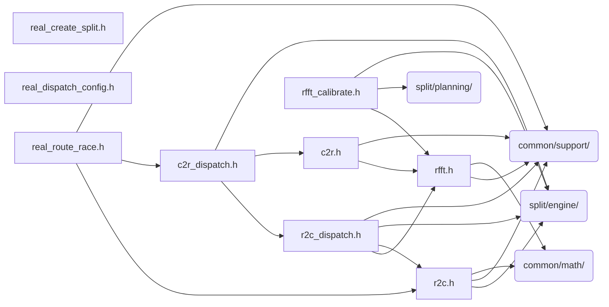

# src/core/split/real

Generated by `src/tools/archgraph.py`. Do not edit. Zone: `split`.

Files of this folder and their includes. Includes of files in other folders are
collapsed to that folder (a rounded node); the full lists are in `../map.md`.

- `c2r.h`: backward real transform (halfcomplex -> real), the inverse of rfft.h's forward cascade.
- `c2r_dispatch.h`: wisdom-first entry point for the backward real FFT (c2r).
- `r2c.h`: Real-to-Complex (R2C) and Complex-to-Real (C2R) FFT
- `r2c_dispatch.h`: top-level real-to-complex (r2c) entry point.
- `real_create_split.h`: the r2c / c2r CREATE, split tier.
- `real_dispatch_config.h`: INTERNAL. Cross-TU setters for the r2c/c2r dispatch knobs.
- `real_route_race.h`: the r2c/c2r route racers.
- `rfft.h`: native real mixed-radix FFT (r2hc), forward
- `rfft_calibrate.h`: measured calibration of the rfft (real-FFT forward) axis.

