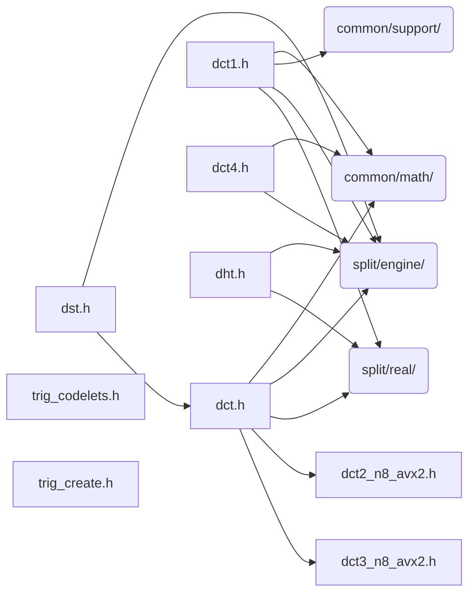

# src/core/split/trig

Generated by `src/tools/archgraph.py`. Do not edit. Zone: `split`.

Files of this folder and their includes. Includes of files in other folders are
collapsed to that folder (a rounded node); the full lists are in `../map.md`.

- `dct.h`: Discrete Cosine Transforms II and III (real-to-real)
- `dct1.h`: DCT-I and DST-I shells (the even/odd whole-sample forms).
- `dct2_n8_avx2.h`: DCT-II N=8 straight-line codelet.
- `dct3_n8_avx2.h`: DCT-III N=8 straight-line codelet (unnormalized).
- `dct4.h`: DCT-IV (real-to-real, unnormalized convention)
- `dht.h`: Discrete Hartley Transform (real-to-real)
- `dst.h`: Discrete Sine Transforms II and III (real-to-real)
- `trig_codelets.h`: ABI-typed registry struct for the trig (real-to-real) codelet family: DCT-I/II/III/IV, DST-I/II/III/IV, DHT.
- `trig_create.h`: the trig CREATE tier and its builders.

