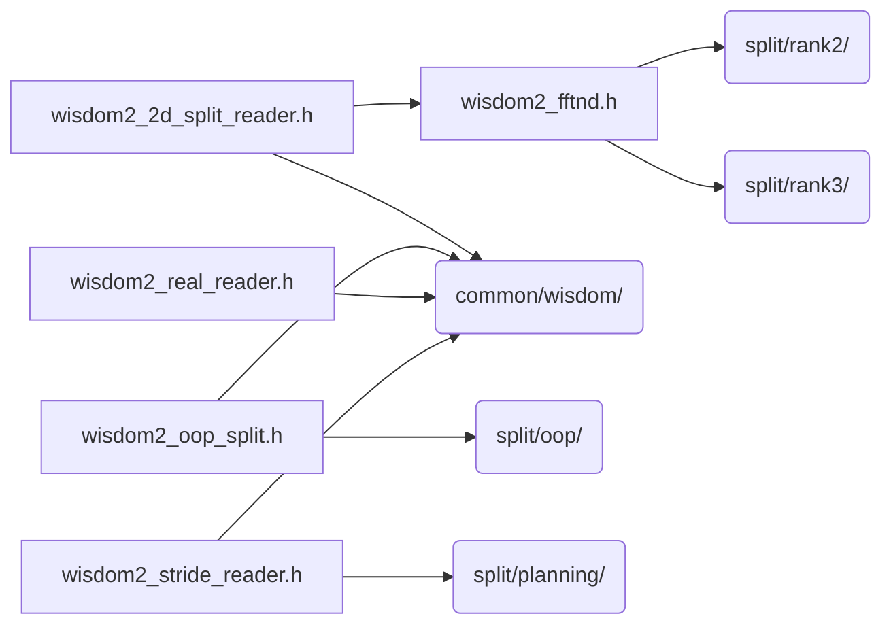

# src/core/split/wisdom

Generated by `src/tools/archgraph.py`. Do not edit. Zone: `split`.

Files of this folder and their includes. Includes of files in other folders are
collapsed to that folder (a rounded node); the full lists are in `../map.md`.

- `wisdom2_2d_split_reader.h`: the SPLIT rank>=2 (2D/3D) family codec: wisdom2 records <-> the EXACT legacy entry structs the plan constructors consume.
- `wisdom2_fftnd.h`: the rank>=2 (2D/3D) transform-recipe home: entry structs, recipe->plan builders, the 3D scratch table, and the LEGACY file machinery.
- `wisdom2_oop_split.h`: the SPLIT library's OOP wisdom: its record and codec.
- `wisdom2_real_reader.h`: the REAL-ROUTE family codec: which top-level route an r2c / c2r problem takes at a given cell.
- `wisdom2_stride_reader.h`: the stride (spike/rfft) family codec: wisdom2 records <-> the EXACT legacy entry structs (wisdom_reader.h) the plan constructors consume.

