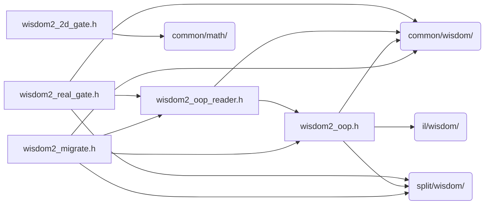

# src/core/wisdom2

Generated by `src/tools/archgraph.py`. Do not edit. Zone: `wisdom2`.

Files of this folder and their includes. Includes of files in other folders are
collapsed to that folder (a rounded node); the full lists are in `../map.md`.

- `wisdom2_2d_gate.h`: the 2D/3D store gate (module-owned; the bench is a thin driver).
- `wisdom2_migrate.h`: the one-shot LOSSLESS migrator: legacy wisdom files -> the wisdom2 store.
- `wisdom2_oop.h`: the front door's OOP-family wisdom include.
- `wisdom2_oop_reader.h`: the LEGACY (dual) half of the OOP-family codec, for the migrator and the vw2_off_oop kill switch only.
- `wisdom2_real_gate.h`: the store gate for the r2c/c2r ROUTE family.

