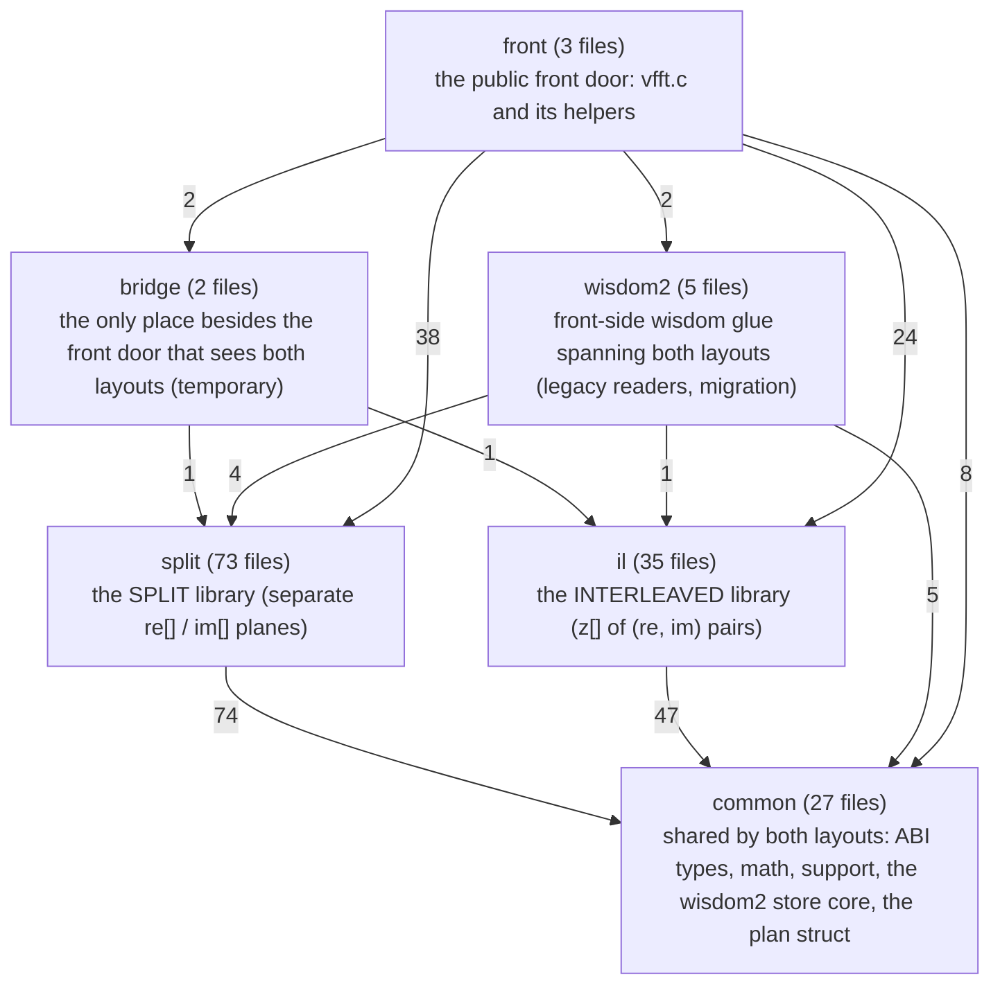

# Zones

Generated by `src/tools/archgraph.py` from the includes in `src/core`. Do not edit.

An edge A --> B means files of zone A include files of zone B; the label is the
number of such includes. The dependency rules (checked by
`src/tools/baseline/hygiene.py`): `common` includes only `common`; `split` and `il`
include themselves and `common` (`il` may also use `bridge/real_doors.h`); `bridge`
may include both layouts; `wisdom2` and the front door may include anything.

Rule violations: none.
