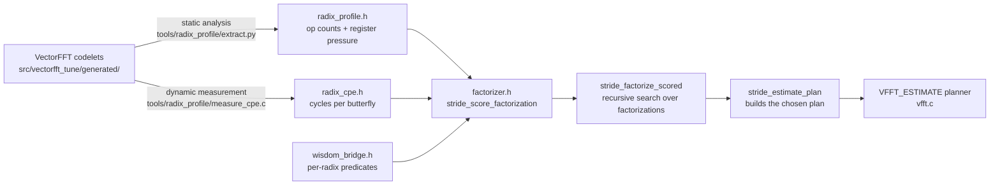

# 01 — Architecture

The cost model is a small piece of code (`src/core/factorizer.h`) that reads
two auto-generated tables and returns a unitless score for any candidate
factorization of `N`. The scored search picks the lowest-score factorization;
plan-build constructs that plan; the executor runs it.

## Data flow

Both `radix_profile.h` and `radix_cpe.h` live in `src/core/generated/` and
are committed to the repo. The generators (`extract.py`, `measure_cpe.c`)
live in `tools/radix_profile/`. The CSV files emitted by `extract.py`
(per-host raw measurements) stay in `tools/` as developer artifacts.

## Components in one line each

| Component | Role |
|-----------|------|
| `src/vectorfft_tune/generated/r{R}/` | Per-radix codelet headers — what gets timed |
| `tools/radix_profile/extract.py` | Counts SIMD intrinsics in each codelet → emits `radix_profile.h` |
| `tools/radix_profile/measure_cpe.c` | Times each codelet on the calibration host → emits `radix_cpe.h` |
| `src/core/generated/radix_profile.h` | Per-(R, variant, ISA) op counts — committed |
| `src/core/generated/radix_cpe.h` | Per-(R, variant, ISA) cycles/butterfly — committed |
| `src/core/wisdom_bridge.h` | `stride_prefer_t1s`/`stride_prefer_dit_log3` predicates — pulled from per-radix wisdom |
| `src/core/factorizer.h:_radix_butterfly_cost` | Picks the right CPE row for a stage based on the predicates |
| `src/core/factorizer.h:stride_score_factorization` | Sums per-stage cost × cache penalty + twiddle penalty → unitless score |
| `src/core/factorizer.h:stride_factorize_scored` | Recursively enumerates factorizations of `N`, returns lowest-score |
| `src/core/planner.h:stride_estimate_plan` | Top-level entry; calls the search, builds the plan |

## Why two tables (profile + CPE)?

The two tables answer different questions:

| Table | Question it answers | Source |
|-------|--------------------|--------|
| `radix_profile.h` | *How many SIMD instructions does this codelet have?* | Static — parsed from C source |
| `radix_cpe.h` | *How long does it actually run?* | Dynamic — measured on real hardware |

Static op counts are deterministic, host-portable, and cheap to regenerate.
They're the fallback when CPE numbers are missing for a (R, variant, ISA)
slot — the cost model uses `n_total_ops / SIMD_width` as a sane default.

Cycle counts are host-specific (calibrated on one machine, may not match
another exactly), but they capture the bottlenecks static op counts
miss — decoder pressure on huge codelets, DTLB capacity overflow on
R=32/64, dependency chains in Winograd radixes. The bench
(`bench_estimate_vs_wisdom.c`) showed mean estimate-vs-wisdom ratio
1.85× → 1.19× when we replaced ops-based scoring with CPE-based
scoring.

## Two generation steps, two regeneration triggers

| Trigger | Affected output | Tool |
|---------|----------------|------|
| Codelet code changed (intrinsics added/removed) | `radix_profile.h` | `python tools/radix_profile/extract.py` |
| Hardware changed OR codelets changed | `radix_cpe.h` | `tools/radix_profile/measure_cpe.exe` (preferably under `orchestrator.py --phase cpe_measure`) |

Op counts depend only on source. Cycles depend on source + hardware. So
`radix_profile.h` regenerates portably; `radix_cpe.h` requires a
calibration-grade host.

## What the cost model does NOT do

- **Does not measure.** Measurement is for `VFFT_MEASURE`/`VFFT_EXHAUSTIVE`
  via the calibrator. The cost model is closed-form arithmetic over
  pre-computed tables.
- **Does not load files at runtime.** Both tables are compiled in.
  Runtime fallback (a small in-process probe at `vfft_init()` if the
  compiled-in tables are empty) is a planned safety net (step #3 in the
  v1.0 plan), not yet implemented.
- **Does not track the K-blocked executor.** The cost formula assumes
  the standard executor. Plan-time `use_blocked` decisions are wisdom-
  driven, outside the estimate path.
- **Does not consider DIF orientation.** The whole-plan DIF flag
  (`use_dif_forward`) is set by the wisdom-driven calibrator. Estimate
  plans are DIT-only.

## See also

- [02_static_profile.md](02_static_profile.md) for what `extract.py` measures
- [03_dynamic_cpe.md](03_dynamic_cpe.md) for the CPE measurement methodology
- [04_factorizer.md](04_factorizer.md) for the cost formula
