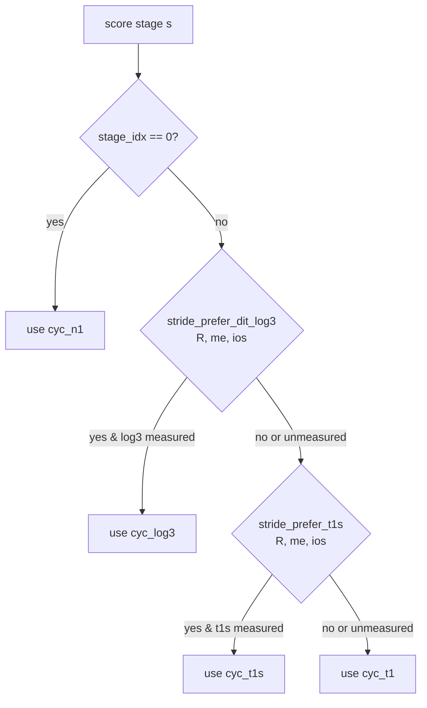

# 05 — Variant selection

How the cost model picks between the `n1`, `t1`, `t1s`, and `log3` codelet
variants — and why the choice has to mirror what `_stride_build_plan`
does at plan-construction time.

## The four variants

| Variant | When the executor uses it | Codelet header pattern |
|---------|--------------------------|------------------------|
| **n1** | Stage 0 of every DIT plan (no twiddle) | `radix{R}_n1_fwd_{isa}` |
| **t1** | Stages 1+, the default twiddled codelet | `radix{R}_t1_dit_fwd_{isa}` |
| **t1s** | Stages 1+, scalar-broadcast twiddle (eliminates the (R-1)·K twiddle table) | `radix{R}_t1s_dit_fwd_{isa}` |
| **log3** | Stages 1+, derives twiddles via cmul chains from a small base set | `radix{R}_t1_dit_log3_fwd_{isa}` |

`n1` is unconditional at stage 0. The other three are alternatives at
stages 1+ — only one runs per stage.

## Why the cost model needs to mirror plan-build

The same plan struct is built for both `VFFT_ESTIMATE` and `VFFT_MEASURE`
paths via `_stride_build_plan`. That function consults two predicates
from `wisdom_bridge.h` to decide which codelet to wire into each stage:

```c
if (stride_prefer_dit_log3(R, me, ios) && reg->t1_fwd_log3[R]) {
    /* log3 wins — use t1_fwd_log3, skip t1s overlay */
}
else if (stride_prefer_t1s(R, me, ios) && reg->t1s_fwd[R]) {
    /* t1s wins — use t1s_fwd alongside t1_fwd; executor prefers t1s */
}
else {
    /* default flat t1 */
}
```

So the **executor will run** whichever variant the predicate selected.
If the cost model scores every stage at `cyc_t1`, it predicts a runtime
that's too pessimistic for stages where t1s/log3 actually fire. That
biases the search toward shallower plans (fewer stages → fewer t1-priced
stages) when the real win was the variant.

The cost model has to call the same predicates on the same `(R, me, ios)`
tuple to predict the same variant the executor will pick.

## The selection order (mirrored exactly)

Both plan-build and the cost model follow this:



Three precedence levels at stages 1+:

1. **log3 first.** If `stride_prefer_dit_log3` returns 1 AND we have a
   measured `cyc_log3`, score this stage at the log3 cost.
2. **t1s second.** If log3 didn't fire OR has no measurement, fall to
   t1s. Same conditional structure.
3. **t1 default.** Either both predicates returned 0, or the slot was
   unmeasured. Score at `cyc_t1`.

If even `cyc_t1` is unmeasured (can happen for radixes with no t1 slot,
e.g. R=3), the lookup falls through to the static op count from
`radix_profile.h`.

## The `me, ios` parameters

The predicates take three arguments: `(R, me, ios)`. These are:

- **R** — the radix at the current stage
- **me** — the K parameter the codelet sees. In our executor this is
  always the input batch size `K`, identical at every stage.
- **ios** — the inter-output stride for this stage, in doubles. Computed
  as `K × Π factors[s+1 .. nf-1]`.

The cost model computes both before calling `_radix_butterfly_cost`:

```c
size_t stride = K;
for (int d = s + 1; d < nf; d++) stride *= factors[d];

double bf_cost = _radix_butterfly_cost(R, s, /*me=*/K, /*ios=*/stride,
                                        isa_avx512);
```

Inside `_radix_butterfly_cost`, the same `(R, K, stride)` triple is
passed to `stride_prefer_dit_log3` and `stride_prefer_t1s`. Plan-build
computes the same `ios_s` via `_stride_ios_at_stage(K, factors, nf, s)`.
**The two arrive at the same predicate inputs, so they pick the same
variant.** No drift.

## What the predicates actually do

`wisdom_bridge.h` is a thin dispatcher over per-radix prediction
functions:

```c
static inline int stride_prefer_t1s(int R, size_t me, size_t ios) {
    switch (R) {
        case 3:  return radix3_prefer_t1s(me, ios);
        case 4:  return radix4_prefer_t1s(me, ios);
        // ...
        default: return 0;
    }
}
```

Each `radix{R}_prefer_*` function lives in
`src/vectorfft_tune/generated/r{R}/vfft_r{R}_plan_wisdom.h` and is
emitted by the orchestrator's calibrator. It encodes "at these
`(me, ios)` cells, this variant won the bench."

For radixes without `plan_wisdom` (e.g. R=2 — bootstrap radix, no tuning
done), the dispatcher's default returns 0 and the cost model falls back
to t1. Same as the executor.

## Why log3 is the highest priority

When log3 wins on a given (R, me, ios), it does so by **eliminating the
twiddle table from L1/DTLB pressure** (it derives twiddles in registers
via cmul chains from a small base set). That structural win is bigger
than what t1s offers (which just removes per-K twiddle vector loads).
So when both predicates fire, log3 takes precedence — same as
plan-build.

In practice the predicates are designed to be exclusive: where log3
wins, t1s rarely also fires for the same cell.

## Why t1s usually wins (84% of stages 1+)

At every stage the wisdom calibrator measured, **t1s vs t1** is the
most common 2-way choice. T1S is cheaper because:

1. Eliminates the (R-1)·K twiddle table — K× less memory traffic
2. Frees ~half the load-µops in the codelet
3. Removes load→multiply dependency chains (twiddles broadcast from
   registers instead of loaded)

Across the production wisdom file (198 cells, 735 stages 1+):

- T1S wins **84%** of stages
- LOG3 wins **10%** (mostly R=13/17/25/32/64)
- FLAT t1 wins **6%** (mostly R=12/16/20 composites)

See [06_validation.md](06_validation.md) for the full breakdown.

## Edge cases

| Case | Behavior |
|------|----------|
| R has no `plan_wisdom` (e.g. R=2) | All `stride_prefer_*` return 0 → falls to t1 |
| Predicate fires but variant unmeasured | Falls through to next-priority variant |
| All variants unmeasured for this (R, isa) | Falls through to ops-based static profile |
| `cyc_t1 == 0` AND `cyc_t1s == 0` AND `cyc_log3 == 0` | Last-resort: `(double)R * 4.0` (linear-in-R fallback) |

The fall-through chain is structurally identical to what the executor
will do at runtime when the corresponding `_fwd` slot is NULL, so no
drift.

## Implementation

`src/core/factorizer.h:_radix_butterfly_cost`. The whole function is
~40 lines and reads top-to-bottom:

```c
static inline double _radix_butterfly_cost(int R, int stage_idx,
                                           size_t me, size_t ios,
                                           int isa_avx512)
{
    if (stage_idx == 0) { /* always n1 */ ... }

    if (stride_prefer_dit_log3(R, me, ios)) {
        double c = _radix_cpe_lookup(R, _CPE_VARIANT_LOG3, isa_avx512);
        if (c > 0.0) return c;
        /* fall through */
    }
    if (stride_prefer_t1s(R, me, ios)) {
        double c = _radix_cpe_lookup(R, _CPE_VARIANT_T1S, isa_avx512);
        if (c > 0.0) return c;
        /* fall through */
    }
    /* default flat t1 */
    ...
}
```

Mirroring plan-build is the single most important property of this
function. If a future change to plan-build adds a new variant or
reorders precedence, this function must change in lockstep.

## See also

- [`src/core/wisdom_bridge.h`](../../src/core/wisdom_bridge.h) — the predicates
- [`src/core/planner.h:_stride_build_plan`](../../src/core/planner.h) — plan-build's variant attachment loop
- [04_factorizer.md](04_factorizer.md) — the cost formula calling this function
