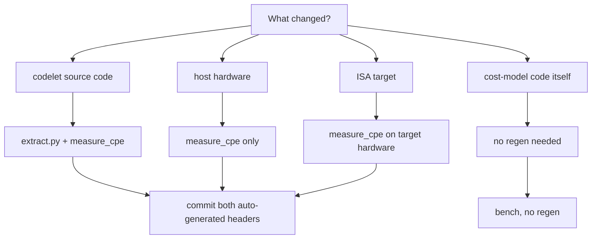

# 07 — Regeneration workflow

Concrete commands to rebuild the cost model's data inputs from scratch.

## Quick reference

| Trigger | Run | Wall time |
|---------|-----|-----------|
| Codelet code changed | `python tools/radix_profile/extract.py` | <1 s |
| Hardware changed | (calibration-grade) `python src/vectorfft_tune/common/orchestrator.py --phase cpe_measure --auto-performance` | ~15 s + preflight |
| Quick dev iteration on noisy machine | `tools/radix_profile/measure_cpe.exe --force` | ~13 s |
| Full codelet + CPE refresh | `python src/vectorfft_tune/common/orchestrator.py --phase all --auto-performance` | hours (codelet regen) + 15 s (CPE) |

## When to run what



## Static profile (`radix_profile.h`)

```
python tools/radix_profile/extract.py
```

What it does:

- Walks `src/vectorfft_tune/generated/r{R}/` for each registered radix
- For each `(R, variant, ISA)` finds the codelet definition by name
- Extracts the function body (between matching `{ ... }`)
- Counts SIMD intrinsics and macro-aliased load/store calls
- Counts `__m256d`/`__m512d` declarations as register-pressure proxy
- Writes `src/core/generated/radix_profile.h`
- Writes per-host CSV files to `tools/radix_profile/profile_{avx2,avx512}.csv`

Deterministic — re-running gives byte-identical output for the same
codelet tree. Safe to commit.

## Dynamic CPE (`radix_cpe.h`)

### Direct invocation (development iteration)

```
# build the harness
python build_tuned/build.py --src tools/radix_profile/measure_cpe.c

# run it (on a calibration-grade host)
tools/radix_profile/measure_cpe.exe
```

Default behavior:

- Runs ~13 s wall (51 batches × 5 ms × ~50 codelets)
- Detects effective CPU frequency via RDTSC over 50 ms
- Times each codelet variant at K=256, computes median + CV
- Refuses to overwrite the header if any CV > 5%

Useful flags:

| Flag | Effect |
|------|--------|
| `--force` | Ignore variance threshold; commit numbers anyway |
| `--no-emit` | Print results without writing the header |
| `--verbose` | Print per-radix cycles/butterfly summary at end |
| `--output=PATH` | Override default output path (`src/core/generated/radix_cpe.h`) |

### Via orchestrator (calibration-grade)

```
python src/vectorfft_tune/common/orchestrator.py --phase cpe_measure --auto-performance
```

What this adds on top of direct invocation:

- **Preflight** — verifies governor (Linux: `performance`) or active
  power plan (Windows: High Performance / Ultimate Performance)
- **`--auto-performance`** — captures current power plan, switches to
  high-perf, restores on exit. Linux requires root.
- **CPU pinning** — taskset on Linux, `SetProcessAffinityMask` on
  Windows; defaults to CPU 2 (first clean P-core on consumer Intel)
- **Signal-handler restore** — Ctrl-C / SIGTERM restores the original
  power plan via the on-disk backup at `bench_out/.power_state_backup`
- **Stale-backup detector** — if the previous run ungracefully exited
  in high-perf mode, next launch offers manual restore

The orchestrator phase is what we'd commit numbers from. Direct
`measure_cpe.exe --force` is fine for dev iteration but never for
committed headers.

### What gets committed

Two files, both in `src/core/generated/`:

```
radix_profile.h       # static, host-portable
radix_cpe.h           # dynamic, host-specific (with fingerprint comment)
```

The fingerprint comment in `radix_cpe.h` documents the calibration
host:

```c
/* Calibration fingerprint:
 * Host OS:    Windows 11 Home (build 26200)
 * Host CPU:   Intel(R) Core(TM) i9-14900KF
 * ISA tag:    avx2
 * Eff. freq:  5.690 GHz (RDTSC over 50ms wall)
 * Max CV:     2.34% (refuse threshold 5.00%)
 * Date (UTC): 2026-05-04 09:12
 */
```

When reviewing a PR that touches `radix_cpe.h`, check this block. A
header from a noisy host will show `Max CV` > 5% and the file will
have been forced through with `--force` — push back unless there's a
reason.

## Full pipeline (codelet regen + CPE)

```
python src/vectorfft_tune/common/orchestrator.py --phase all --auto-performance
```

Runs:

1. Per-radix `phase_generate` (Python codelet emit)
2. Per-radix `phase_compile` (build the per-radix benchmark harness)
3. Per-radix `phase_run` (informational benchmarks; no longer drives
   variant selection — see [05_variant_selection.md](05_variant_selection.md))
4. Per-radix `phase_validate` (correctness checks)
5. **Final step**: `cpe_measure` — single-shot CPE regen using the new
   codelets

The total wall is hours for the per-radix sweep + ~15 s for the CPE
phase. Don't run this just to update CPE — use `--phase cpe_measure`
alone.

## Verifying the regen worked

After any regen, confirm the bench ratio hasn't regressed:

```
python build_tuned/build.py --vfft --src build_tuned/bench_estimate_vs_wisdom.c
cd build_tuned
./bench_estimate_vs_wisdom.exe
```

Expected: mean ratio in the 1.0–1.3× band. A jump above 1.5× suggests
either a noisy CPE measurement (re-run on quieter conditions) or a real
regression (bisect against the last known-good headers).

## Sanity checks before committing

1. **Fingerprint block present** in `radix_cpe.h`?
2. **Max CV ≤ 5%** in the fingerprint?
3. **Bench mean ratio ≤ 1.30×** (consumer host) or ≤ 1.20× (calibration host)?
4. **No new outlier cells > 2.0×** in the bench?
5. **`extract.py` re-emits byte-identically** (no spurious churn)?

If 1–2 fail, the CPE numbers are noisy — re-run on a calibration host
or wait for the machine to quiet.

If 3–4 fail, something regressed — review the changes to
`factorizer.h` / `wisdom_bridge.h` / the codelets themselves.

If 5 fails, the codelet source has changed; that's expected if you
also re-ran the codelet generator.

## See also

- [`tools/radix_profile/README.md`](../../tools/radix_profile/README.md) — generator-side overview
- [`tools/radix_profile/measure_cpe.c`](../../tools/radix_profile/measure_cpe.c) — CPE harness source
- [`src/vectorfft_tune/common/orchestrator.py`](../../src/vectorfft_tune/common/orchestrator.py) — calibration orchestrator
- [06_validation.md](06_validation.md) — what "no regression" means in numbers
