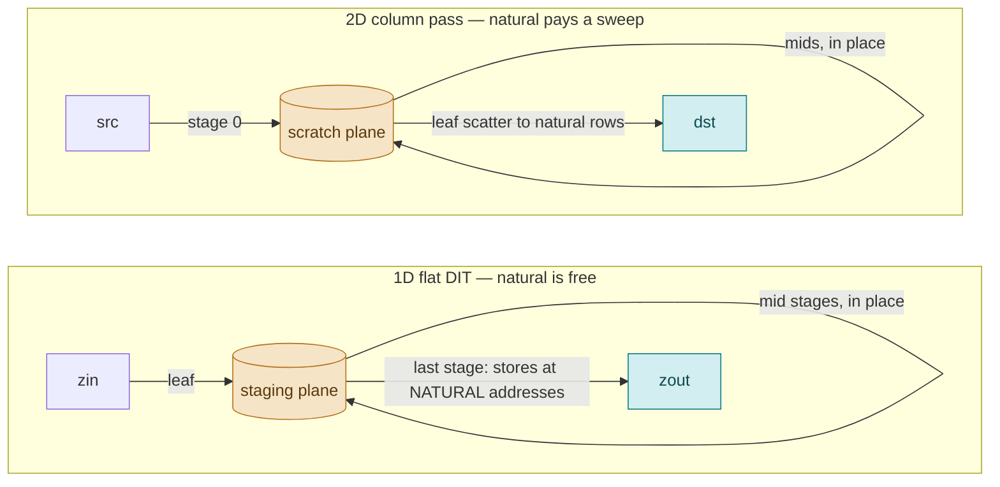
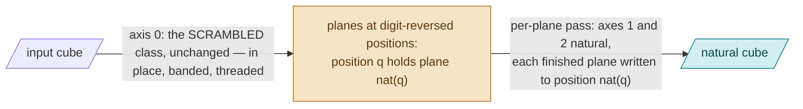
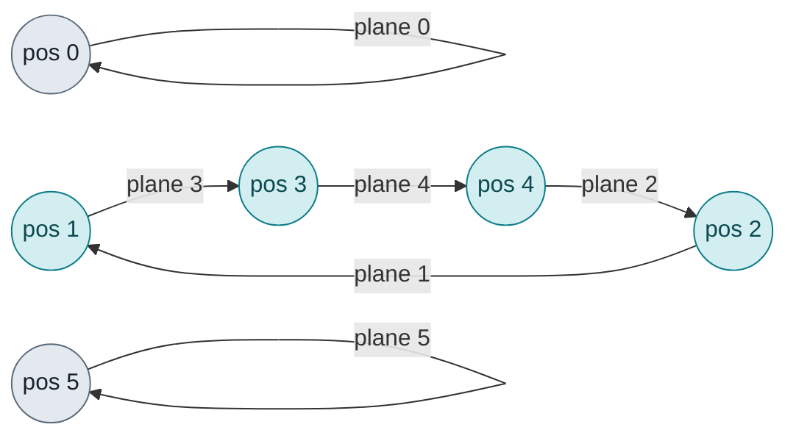
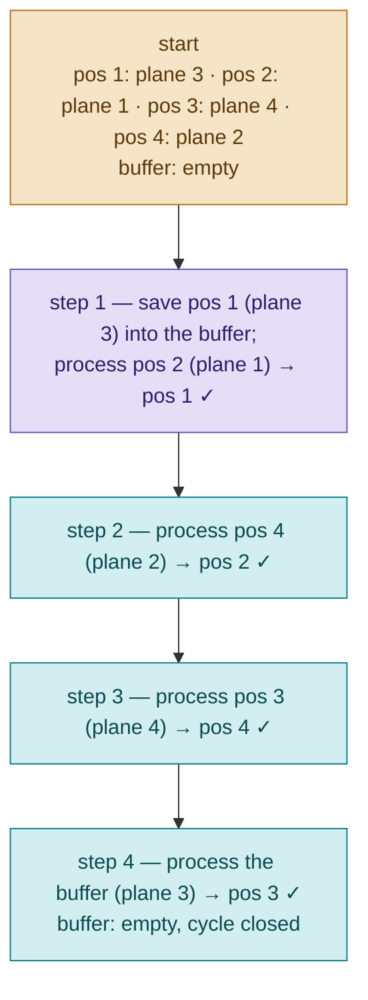
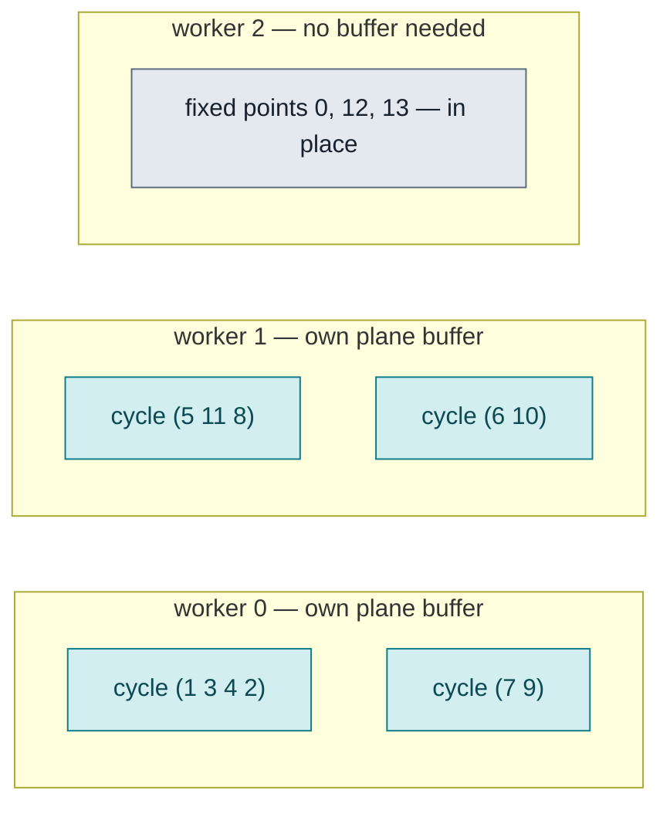

# Natural order at rank 3
### The per-plane pass as the permuting pass: no scratch cube, one plane of buffer

**Scope.** This paper declares how the 3D interleaved c2c tier
(`src/core/transforms/fftnd/fftnd_il.h`) serves `order=NATURAL`. Status:
design of record, agreed and SHIPPED 2026-09-07 (both placements, threaded,
its own `ord=nat` cell; `ilnd_probe` natural passes ALL OK on twelve cells).
Companions:
[`odd_n_engine.md`](odd_n_engine.md) §2.3 (the 1D natural class),
[`../roadmap/fft2d_il_c2c_design.md`](../roadmap/fft2d_il_c2c_design.md)
(the 2D natural class), [`3D_mt_il_strategy.md`](3D_mt_il_strategy.md)
(the threading method), [`../roadmap/fftnd_il_design.md`](../roadmap/fftnd_il_design.md)
(the tier). Nothing here applies to the split rank-N tier.

---

## 1. Why 1D natural is free and 2D pays a sweep

The flat DIT (odd N, K=1) runs its last stage out of place already: from the
staging plane into the output. Storing each block's outputs at natural
addresses changes only the store targets, so its natural class costs what
its scrambled class costs.

The 2D column pass runs in place on the destination plane, with no staging
plane. A natural last stage therefore needs a scratch plane (stage 0 into
scratch, the middle stages in place there, the leaf scatter from scratch
to the natural rows) and one more sweep over the data: measured 1% to 23%
over the scrambled class in 2D.

The scrambled 2D class goes `src → dst` with its middle stages in place on
`dst`; the natural class adds the scratch plane's write and read. The
difference is not the natural addressing. It is whether the pipeline
already had an out-of-place hop to hang it on.

## 2. At rank 3 the per-plane pass is that hop

Row-major with N3 contiguous, position q along axis 0 is a whole plane of
N2·N3 complex, and the axis-0 pass is the 2D column pass over a virtual
plane of N1 rows × (N2·N3) columns: a row of the virtual plane is a plane
of the cube, the same bytes. Permuting rows of the virtual plane is moving
whole, contiguous planes.

After a scrambled axis-0 pass, position q holds the plane whose natural
index is the digit reversal of q. The per-plane structure (axes 1 and 2:
the 2D child, or the flat axis-1 pass plus the row plan) reads every plane
and writes every plane. So:

| pass | what runs | order |
|---|---|---|
| axis 0 | the scrambled class, unchanged: in place on the destination, banded, threaded as today | planes land digit-reversed |
| per plane | the structure reads the plane at position q, finishes axes 1 and 2 NATURAL (the natural 2D child, or the natural axis-1 pass plus the natural row plan), and writes the finished plane to position nat(q) instead of back onto itself | natural |

Inside a plane, axes 1 and 2 are natural by the same machinery the 2D
natural class uses. Across planes, the write target does the ordering.

## 3. The moves close into cycles

N1 = 6 = 2·3, chain 2.3, nat = [0, 3, 1, 4, 2, 5]. Each arrow is one plane
processed out of place, from the position it sits at to the position it
belongs at:

| position q after axis 0 | holds plane | must move to position nat(q) |
|---|---|---|
| 0 | 0 | 0 (fixed) |
| 1 | 3 | 3 |
| 2 | 1 | 1 |
| 3 | 4 | 4 |
| 4 | 2 | 2 |
| 5 | 5 | 5 (fixed) |

The moves 1 → 3 → 4 → 2 → 1 form one cycle; 0 and 5 stay put. A digit
reversal always decomposes into cycles: bit reversal is swaps and fixed
points (N1 = 128: 56 swaps, 16 fixed), a mixed-radix reversal has longer
cycles, still many of them.

## 4. Walking a cycle with one plane of scratch

A position cannot receive a finished plane while it still holds an
unprocessed one, so the walk follows the cycle backwards: save the first
position's plane, fill each vacated position with the plane that belongs
there, let the saved plane close the cycle.

| step | pos 1 | pos 2 | pos 3 | pos 4 | buffer | action |
|---|---|---|---|---|---|---|
| start | plane 3 | plane 1 | plane 4 | plane 2 | empty | |
| 1 | **plane 1 ✓** | free | plane 4 | plane 2 | plane 3 | save pos 1; process pos 2 → pos 1 |
| 2 | plane 1 ✓ | **plane 2 ✓** | plane 4 | free | plane 3 | process pos 4 → pos 2 |
| 3 | plane 1 ✓ | plane 2 ✓ | free | **plane 4 ✓** | plane 3 | process pos 3 → pos 4 |
| 4 | plane 1 ✓ | plane 2 ✓ | **plane 3 ✓** | plane 4 ✓ | empty | process buffer → pos 3 |

✓ = a finished plane at its natural position. Four planes processed, four
written naturally, one plane copied into the buffer. In place by
construction: a source plane is consumed before its position is
overwritten, so the same walk serves both placements.

The processing step is the existing per-plane structure in its
out-of-place form: the natural 2D IL c2c plan created out of place, or the
natural axis-1 column pass with a distinct destination (its scratch plane
per worker) plus the K=1 row plan in place on the destination. Fixed
points run the same structure with source and destination equal; both
forms are alias-tolerant.

Backward: the plane pass runs first with the inverse permutation — out of
place a direct permuted copy per plane (no cycles), in place the inverse
cycle walk — then the scrambled axis-0 backward in place. Passes commute,
so this order is the mirror of the forward's.

## 5. Threading

Cycles are independent: no two touch the same position. Each worker owns
one plane buffer and a disjoint set of cycles (assigned longest first for
balance), so the plane pass threads with no exchange between workers
beyond the cold destination writes.

Axis 0 keeps its own arms (strips or bands) exactly as the scrambled class
has them. The raced arms and the banked verdict follow
`3D_mt_il_strategy.md` unchanged: the natural cell races serial against
its partitions at the plan's T and banks `cmt= cmtt= cmts=` on its own row.

## 6. What it costs, and what the race decides

| form | extra traffic over scrambled | scratch | keeps band fusion |
|---|---|---|---|
| 2D-style natural (scratch cube, leaf scatter at axis 0) | one cube write and one cube read | a whole cube | yes, through a natural banded walk |
| cycle natural (this design) | cold destination writes for the plane pass; one plane copy per cycle | one plane per worker | no: planes are visited in cycle order, not band order |

The cycle form shipped first. Measured 2026-09-07 (one thread, pinned,
paced, the scrambled cells under the same protocol in the same session):
the natural cell costs 0–9% over the scrambled cell at the small cubes
and the odd cells and 17–66% at the large and the long cells (64³ 1.42×,
64×128×32 1.66×), which is the band fusion it gives up — its width race
banks `wl=0` there because a band with nothing fused into it buys
nothing. Against MKL's natural output it wins at 5 of 11 cells at one
thread (36×20×28 1.64×, 32³ 1.31×, 81×27×27 1.26×, 45³ 1.25×, 27×9×15
1.15×), ties at the pow2 cubes and loses at the long-axis cells
(32×16×64 by 14%, the other two inside the control spread); threaded it
trails at most cells, for the same reason. The cycles-per-worker balance
is 0.75–1.0 of ideal at every probed cell and is not the cause.

Both levers were taken 2026-09-15 (`ilnd_natural_fused_design.md`). The
fused natural form (the scratch cube, band fusion kept) was built, gated
bitwise and raced at every cell: it LOST to this cycle form at every
one-thread cell by 3–27% and at 13 of 14 threaded cells, and was deleted —
the permuting plane pass is one extra cube sweep however it is arranged,
and this form pays it cheapest. The natural axis-1 pass's per-plane
scratch sweep is gone: out of place one plane is always dead (forward the
vacated source position, backward the destination), and the pass runs its
pre-leaf stages there; `natscr` serves only the fixed points. Measured
2026-09-15 by a same-session A/B (two builds, five alternated runs of the
small natural cells, one thread): 45³ 237 vs 273 µs and 81×27×27 133 vs
157 µs with the dead-plane scratch, neutral within spread at 16³, 32³,
64³, 27×9×15 and 36×20×28.

The form without the extra sweep exists since the same day: the STRIP
form (`ilnd_natural_strip_design.md`) — axis 0 in cache-resident column
strips through a strip-pitched scratch, the digit reversal resolved inside
the strip, natural order written back in place, then the planes in place.
Raced beside this cycle form as `nf=` × `nsw=`; it wins the threaded race
at 10 of 14 cells (32×32×4096 3.1 vs 5.1 ms at T=8) and the one-thread race
at the large pow2 cells (32×32×4096 15.0 vs 16.6 ms); this cycle form
keeps the cells whose cube fits L3.

## 7. Wisdom

The rank-3 row keyed `ord=nat`, in `wisdom2_3d.txt`, beside the `ord=scr`
row: its own chain, width, structure and threading verdicts, raced on
natural data and banked as the scrambled row's are (`chain= wl= s= cmt=
cmtt= cmts=`, the flat arm's `chain1=`), plus whatever the natural form
race adds. DEFAULT keeps meaning scrambled; NATURAL is requested
explicitly, the 2D contract. A natural verdict serves only natural
requests, and the two order cells are never compared.

## 8. Verification

- `ilnd_probe`, a natural pass per cell: the naive-DFT spot bin read at its
  natural position (no digit-reversal search), the DC identity, the
  roundtrip, replay bitwise on a warm store, in place bitwise the
  out-of-place output, threaded bitwise the serial output with the
  engagement counter moving.
- `api_matrix_gate`: "3D c2c OOP IL 16³ NATURAL" and "3D c2c IP IL odd
  9×15×27 NATURAL" are served.
- The bench's `--3dil` gains a natural column measured against MKL's
  natural output (which is its only output): like-for-like order, which
  the scrambled comparison is not.

## 9. File map

| file | role |
|---|---|
| `transforms/fftnd/fftnd_il.h` | the natural create branch (`ord=nat` key, natural structures), the cycle walk, the per-worker buffers, the cycle partition |
| `transforms/fft2d/il2d_tier.h`, `il2d_col.h` | lent unchanged: the column build and execute; the natural axis-1 pass for the flat arm |
| `wisdom2/wisdom2_2d_reader.h` | the `ord=nat` rank-3 row through the existing key builder |
| `vfft_execute.h` | dispatch unchanged (`h->ilnd`) |
