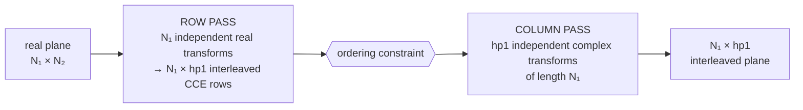
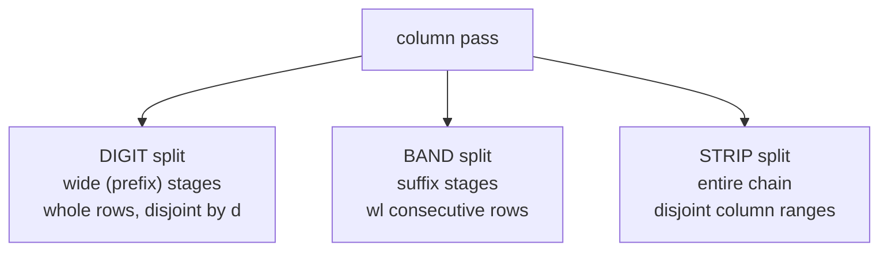
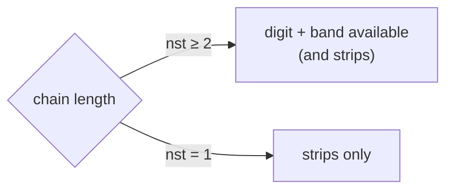
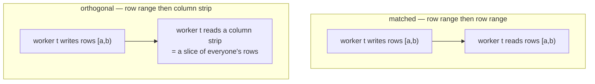
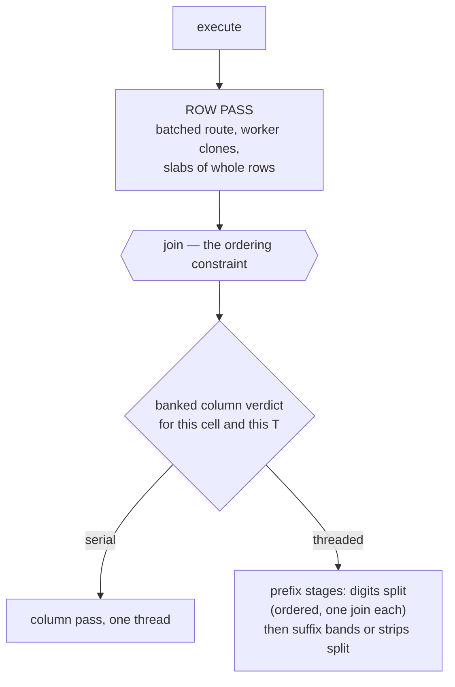

# Parallelizing a 2D Real FFT on Interleaved Data
### Architecture, decomposition, and the measurement methodology that selects it

**Scope.** This paper describes how the native interleaved 2D real
transform (r2c / c2r) is structured, how it is parallelized on a
shared-memory multicore, and — the part that generalizes — the
methodology by which every parallel decision is *selected by
measurement* rather than by rule. Implementation lives in
`src/core/vfft.c` and `src/core/transforms/`; companions:
[`rowsplit_rowmode.md`](rowsplit_rowmode.md),
[`../roadmap/fft2d_real_il_design.md`](../roadmap/fft2d_real_il_design.md).

---

## 1. The problem

Compute

$$X[k_1,k_2]=\sum_{n_1=0}^{N_1-1}\sum_{n_2=0}^{N_2-1} x[n_1,n_2]\,
  W_{N_1}^{n_1k_1} W_{N_2}^{n_2k_2},\qquad W_N=e^{-2\pi i/N}$$

for **real** input, with the output held as a half-spectrum
(`hp1 = N₂/2+1` complex bins per row) in **interleaved** layout —
`z[2i]` real part, `z[2i+1]` imaginary part — because that is the layout
the caller's data is already in. The transform must not convert to a
split (structure-of-arrays) representation internally: cross-layout
serving is prohibited, so a shape the tier cannot express refuses rather
than silently converting.

The target is one CPU socket: 8 performance cores, each with a **private
2 MB L2**, sharing a 36 MB L3 over a ring, AVX2 (no AVX-512).
Single-threaded, this tier already meets or beats a heavily tuned vendor
library on every benchmarked cell. Parallelization must therefore add
scaling *without* surrendering the single-thread advantage — a real risk,
because that advantage partly comes from cache residency that naive
threading destroys.

---

## 2. Architecture of the transform

### 2.1 Two passes, and a wall between them

The transform separates:



For c2r the order reverses: columns, then rows.

### 2.2 Why the passes cannot be interleaved

Each real row of length `N₂` is transformed by *reinterpreting* it as a
complex sequence of length `N₂/2`, running a complex FFT, and then
applying a **Hermitian fold** that recovers the real spectrum:

$$X[k]=\tfrac12\Big(Z[k]+\overline{Z[N/2-k]}\Big)
       -\tfrac{i}{2}W_N^{k}\Big(Z[k]-\overline{Z[N/2-k]}\Big)$$

The conjugation makes the fold **ℝ-linear but not ℂ-linear**. Column
stages are ℂ-linear. Since $\overline{A\mathbf{z}} \neq A\overline{\mathbf{z}}$
for complex $A$, the fold does not commute with a column stage: the row
pass must complete *entirely* before the first column stage (and, for
c2r, follow the last one).

This has a direct parallel consequence — **exactly one synchronization
point exists in the whole transform, and it is unavoidable.** Everything
else is a scheduling choice.

### 2.3 The column pass is a chain of stages

The length-`N₁` column transform is decomposed into stages. Stage *s*
has radix `R_s` over sub-length `L_s`, with `D_s = L_s / R_s`. Within a
block of `L_s` rows, the stage partitions rows into `D_s` **digits**;
digit *d* owns the row set

$$\{\,b\cdot L_s + d + j\cdot D_s \;:\; j=0..R_s-1\,\}$$

and applies an `R_s`-point butterfly to it, using a twiddle record that
depends **only on** *d* (and the leg index). Adjacent columns are
contiguous in memory, so a stage is vectorized along the *column* axis
while its butterfly legs are strided by rows.

---

## 3. The parallel decomposition

### 3.1 What is independent

Three independence facts follow directly from §2, and they are the whole
basis of the decomposition:

| axis | unit | independent because |
|---|---|---|
| **row** | one real row | rows are separate transforms in the row pass |
| **digit** | one digit *d* of a stage | digit row sets are disjoint; twiddle records are per-digit; no cross-digit data flow *within* a stage |
| **column** | one column *k* | the column pass is a batch of independent 1D transforms — columns never interact at any stage |

A fourth, derived axis matters in practice: a **band** of `wl`
consecutive rows is closed under every stage whose span divides `wl`, so
a *suffix* of the stage chain can run band-by-band.

### 3.2 The three usable partitions



Crucially, each is a **restriction of the loop the serial code already
runs**, not a re-implementation:

- **Digit split.** The kernel walks digits internally, advancing
  `twp += (R−1)·8` and `zin/zout += 2·Gs` per digit. Running digits
  `[d₀, d₀+n_d)` is therefore three pointer edits: base `+ 2·d₀·pitch`,
  table `+ d₀·(R−1)·8`, and `OGs = n_d`. The element `count` is
  untouched; no new kernel exists.
- **Band split.** Workers take disjoint band index ranges of the
  existing per-band loop.
- **Strip split.** Workers take disjoint column ranges; the stage loop
  is unchanged apart from its column bounds.

### 3.3 Availability is determined by the factorization

A cell whose chain is a single stage has `L₀ = N₁`: one block, and no
usable row axis — for those, **strips are the only partition**.
Multi-stage cells have both. The decomposition is therefore not a
preference expressed by the programmer; it is a property of the banked
factorization for that cell:



### 3.4 Bit-exactness is a theorem, not a tolerance

Every kernel is a pure map over the index space `(block, digit, column)`,
and the partial-vector tail executes the same dataflow graph in the same
FMA order as the full-width path. Consequently **any partition of that
index space yields bitwise-identical output**. This is stronger than the
usual "threaded result matches within tolerance", and it is what makes
the correctness gate exact: threaded output must equal serial output
*byte for byte*, per cell, per direction.

It also means the race can time the *serving* code path directly — the
measured arm and the deployed arm are the same function.

---

## 4. The memory-hierarchy argument

### 4.1 Partition matching

The row pass writes the intermediate plane; the column pass reads it.
If the two passes partition the plane along **different** axes, every
worker reads lines that another worker's private L2 owns dirty. If they
partition along the **same** axis, each worker re-reads what it just
wrote.



### 4.2 Measurement

Writing the plane across 8 cores by row range, then reading it back
three ways (own rows / column strips / single core), ns:

```
 cell        plane KB    write   read own   read strips   1-core read
 256x256        516       9500      3100        9200         23100
 512x512       2056      33300     11800       32000         92300
 1024x1024     8208      38600     46400      109000        368600
 4096x64       2112      25900     12100       42800         94800
 8192x64       4224      36700     24000       63500        190000
```

Reading your own rows scales **7.8–7.9×**; reading columns another core
wrote scales **2.9–3.4×**. Separately, a pool dispatch plus join costs
**100 ns** — negligible against every cell here.

### 4.3 Consequence

Barrier cost is *not* a design driver at these sizes; **data placement
is**. The band partition is exchange-free by construction because it
reads precisely the rows the row pass produced. The strip partition —
mandatory for single-stage cells — pays the full cross-core exchange, and
its ~3× ceiling is a property of the machine, not of the code.

Two corollaries worth recording:

- Rounding strip boundaries to cache lines does **not** help: `hp1` is
  always odd, so row starts rotate through line offsets; rounding neither
  eliminates split lines nor pays for itself, and it reduces parallel
  width (at `hp1 = 33`, from 8 usable workers to 5).
- Transposing the plane so columns become rows costs ~4× the streaming
  traffic of the exchange it removes — dead under any measured bandwidth.

---

## 5. Optimization methodology

This is the part that generalizes beyond this transform.

### 5.1 Measured serving

No performance-relevant choice is made by rule. For each problem cell,
candidate configurations are **raced at plan-creation time** and the
winner is **banked** in a persistent store, keyed by the cell. Later
plans for the same cell serve the banked verdict without re-racing.
Precedence is: environment override › banked verdict › race › structural
default. An environment override never writes to the store.

Applied here, the raced axes are the column factorization, the row route,
the band width, and — added for threading — *whether to thread the column
pass at all*.

**A banked "no" is a first-class result.** Two cells measured *slower*
with threaded columns and banked exactly that; a structural rule
("thread when there are ≥ T units") would have shipped those regressions
silently.

### 5.2 A verdict is only valid where it was measured

A threading verdict measured at 4 threads says nothing about 8. The
banked record therefore stores both the decision and the thread count it
was raced at; a mismatch re-races rather than serving. This is the
general principle that a verdict's key must include every variable it
depends on — expressed here as payload plus a validity check, to avoid
disturbing a key format shared by many readers.

### 5.3 Engagement must be proved, not assumed

Threading can silently fail to happen in two independent ways: worker
resources are never built (a safety gate declines), or work is never
dispatched (the problem falls under an engage threshold). Either
produces plausible timings, and a "threaded equals serial" correctness
check passes *perfectly* when nothing threaded — it is comparing the
serial path with itself.

The tier therefore exposes counters for both — workers constructed, and
dispatches actually taken — and the gate asserts that both moved. This
caught two real cases immediately: a plan holding 7 worker clones that
dispatched zero work (its cell had selected a different route), and a
cell whose workers were *correctly* refused because its inner transform
was not reentrant.

### 5.4 Parallelism by restriction

Every parallel arm here is a restriction of the serving loop over an
index range. This buys three properties at once: bitwise equality is
structural rather than tested-and-hoped; the race times the code that
will actually run; and no new kernels enter the corpus, so the emitter,
the codelet registry and their gates are untouched.

Where a restriction is not expressible — as with the row-band route
whose per-band state is shared plan-level scratch — the honest answer is
to refuse that arm rather than retrofit locking.

### 5.5 Hardware-derived gates, never tuned constants

Thresholds derived from one machine do not survive another. Where a gate
is genuinely needed, it is computed from **detected** hardware: cache
sizes and SMT width come from CPUID at plan time. Two concrete uses:
band widths are admitted against the measured private-L2 size, and the
thread pool's core-pinning stride is the *detected* SMT width — a
hard-coded stride silently leaves workers unpinned on a machine without
SMT, which voids every cache-locality argument the design rests on.

---

## 6. Implementation

### 6.1 Threading substrate and its invariants

A persistent pool of pinned workers; the calling thread participates as
worker 0 and must occupy the core the pool reserves for it — a collision
between the caller and a worker on one core anti-scales by one to two
orders of magnitude. Dispatch is a lock-free post plus a spin-wait join,
and each worker's control block occupies its own cache line so that
posting work to one worker does not invalidate a neighbour's spin
location.

**A plan may grow the pool but must never shrink it.** This invariant
exists because a plan builds inner plans, and an inner plan is
conventionally requested with one thread; if that request were applied to
the process-wide pool it would tear the pool down for every other
component. A plan instead records its *own* thread budget, and every
engine clamps its worker count by that plan-time snapshot — so a
single-threaded inner runs serially without disturbing anything global.

### 6.2 Per-worker state

Two ownership patterns are used, and choosing between them is a real
design decision:

| pattern | when | cost |
|---|---|---|
| **clone plans** — one plan instance per worker, verified output-equivalent at construction | the unit of work is a whole transform (the row pass) | memory + creation time per clone |
| **indexed scratch slots** — one shared plan, per-worker scratch indexed by worker id | the unit of work is a range within one transform | slot count fixed at plan time; workers must be capped by it |

Mixing them incorrectly is a silent-wrong-output hazard: any state a
plan mutates during execution must be either per-worker or provably
partitioned by the same index the work is partitioned by.

### 6.3 Control flow of one transform



---

## 7. Results

Speedup at 8 threads over the same plan at one thread, same process,
alternated arms, minimum of 20 runs, with engagement asserted:

| cell | r2c | c2r | column verdict |
|---|---|---|---|
| 128×64 | 1.45× | 1.64× | threaded (marginal) |
| 512×32 | 1.54× | 1.31× | **serial** (raced and banked) |
| 256×256 | 1.55× | 1.19× | marginal, run-dependent |
| 512×512 | **4.19×** | **6.34×** | threaded |
| 1024×1024 | **7.69×** | **7.70×** | threaded |

The progression is instructive about where the work actually was:

| configuration | 1024×1024 r2c |
|---|---|
| rows threaded only | 1.75× |
| rows + suffix bands / strips (prefix stage still serial) | 2.82× |
| **+ prefix stage split on the digit axis** | **7.69×** |

The full-plane prefix stage was the dominant serial residue; splitting it
on an axis that already existed inside the kernel — at the cost of three
pointer edits and no new code — moved the transform from ~3× to ~7.7×.
The column pass alone went from 796 µs to 113 µs.

These sit on top of a single-threaded implementation already at or above
vendor parity on every benchmarked cell.

---

## 8. Batching many transforms — the plane queue

Partitioning one transform has a floor: a cell whose chain is a single
stage has no row axis, its strips pay the full exchange, and below a few
tens of microseconds the joins outweigh the work. For those cells the
parallelism that *does* exist is across **transforms** — the workload is
many modest planes — so `howmany > 1` is served by a plane queue rather
than by partitioning harder.

### 8.1 Architecture

The handle wraps two kinds of plan instance, and the split is the
design:

- **One primary** plan, built with the caller's full thread budget. The
  serial serving mode is a loop of the primary over the planes — which
  therefore still runs intra-transform MT per its own banked verdicts.
  This is what guarantees the feature can never lose to what a caller
  could do by hand with a plane loop of their own.
- **T serial clones** for queue mode. Workers pull plane indices from a
  single atomic counter and execute their own clone on their own plane:
  plane-per-worker, zero barriers, and — because every instance a queue
  worker runs is serial — **no nested pool dispatch by construction**.
  The caller participates on clone slot 0, never on the primary, for
  the same reason.

Clones are wisdom-served from the verdicts the primary's creation just
banked, and each is **bitwise-verified against the primary on a probe
plane at create**; any mismatch tears the clone set down and the loop
serves. Loop-vs-queue is itself a **raced verdict** at create, per the
methodology of §5 — there is no plane-count threshold written anywhere.

### 8.2 Results

T=8 pool, min-of-15 alternated, queue == loop bitwise:

| cell | planes | queue vs loop |
|---|---|---|
| 64×64 r2c | 64 | **4.17×** |
| 64×256 r2c | 32 | 3.83× |
| 32×1024 r2c | 32 | 2.46× |
| 16×4096 r2c | 16 | 1.18× |
| 256×256 r2c | 16 | 3.92× |
| 256×256 c2c | 16 | **6.94×** |

The last row is the designed payoff: that cell's banked band width
equals its full row count, so it has **no intra-transform MT axis at
all** — and it now scales near-linearly through planes. The two
mechanisms are complements, not competitors: intra-transform MT covers
the large single plane, the queue covers the many small ones, and the
raced verdicts choose per cell without a constant anywhere.

## 9. Failure modes this methodology is designed to catch

| failure | why it is invisible | what catches it |
|---|---|---|
| nothing actually threaded | timings look plausible; correctness passes trivially | engagement counters for *both* resource construction and dispatch |
| a partition raced at one thread count served at another | results are merely suboptimal, never wrong | thread count stored with the verdict; mismatch re-races |
| a gate that never reaches the code it "covers" | the gate passes green | verify the test cell's geometry actually reaches the branch — a forced-on switch is not coverage |
| an engagement assertion depending on a **live raced axis** | the gate flakes: a raced parameter (a band width equal to the row count) can remove the parallel axis on one run and not the next | the gate pins every raced axis its assertion depends on; env pins never bank |
| threading a cell that regresses | the average still improves | race per cell and bank the negative result |
| shared mutable plan state under partitioned work | wrong output, not slow output | per-worker ownership by construction; refuse arms that cannot express it |
| a global resource mutated by a component | another component silently loses capability | plans may grow shared resources, never shrink them |

---

## 10. Limitations and open problems

- **Single-stage cells running alone** (one plane, `howmany == 1`) keep
  the strip ceiling of §4 — the plane queue of §8 answers the batched
  case, but a lone small plane has no second transform to parallelize
  across.
- **Loop and queue are the only two batch arms.** A caller with few
  large planes (say two 1024² planes on eight cores) might want a
  hybrid — two workers each running a four-thread column pass — which
  needs a nested thread-budget mechanism the pool does not yet have.
- **Plane strides are the canonical contiguous defaults**; custom
  `idist`/`odist` and a pointer-array (`execute_many`) shape are not yet
  expressible.
- **Row width verdicts are not yet re-raced at threaded row counts.** A
  width selected when one worker owned all rows can be *illegal*, not
  merely suboptimal, when each worker owns a fraction of them.
- **The exchange itself remains unpaid-for** on strip cells; eliminating
  it requires making the row pass produce the plane in the order the
  column pass consumes it, which trades one memory-traffic term for
  another and has not yet been shown to win.
- **The engage decision is per-cell but not per-call**: a plan serves one
  verdict regardless of system load at execution time.
